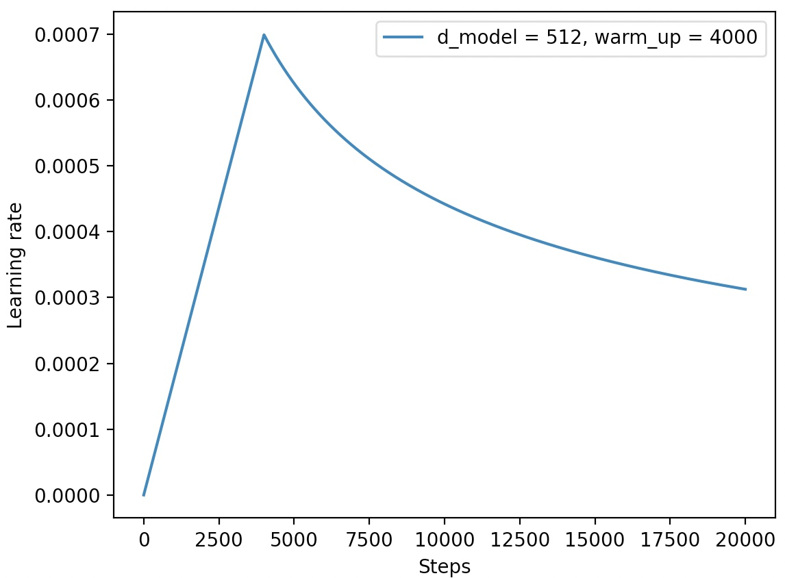

## A Transformer Framework Based Couplet Task
### 一个基于Transformer网络结构的对联生成模型


## 1. 环境准备
* Python==3.x
* PyTorch>=1.5.0
* torchtext==0.6.0

## 2. 使用方法
* STEP 1. 直接下载或克隆本项目：https://github.com/moon-hotel/TransformerCouplet
* STEP 2. 可自定义修改配置文件`config.py`中的配置参数，也可以保持默认
### 2.1 训练
直接执行如下命令即可进行模型训练：
```
python train.py
```
训练过程：
```python
-- INFO: Epoch: 0, Batch[29/3010], Train loss : 8.965, Train acc: 0.094
-- INFO: Epoch: 0, Batch[59/3010], Train loss : 8.618, Train acc: 0.098
-- INFO: Epoch: 0, Batch[89/3010], Train loss : 8.366, Train acc: 0.099
-- INFO: Epoch: 0, Batch[119/3010], Train loss : 8.137, Train acc: 0.109
...
```
学习率变化：



## 2.2 预测（inference）
直接运行如下命令即可：

```
python couplet.py
```

示例结果：

```python
上联：晚风摇树树还挺
 AI: 朝露沾花花更红
下联：晨露润花花更红

上联：忽忽几晨昏，离别间之，疾病间之，不及终年同静好
 AI：茕茕小儿女，孱羸若此，娇憨若此，更烦二老费精神
下联：茕茕小儿女，孱羸若此，娇憨若此，更烦二老费精神

上联：风声、雨声、读书声，声声入耳
 AI：山色、水色、烟霞色，色色宜人
下联：家事、国事、天下事，事事关心

上联：上海自来水来自海上
 AI：中山落叶松叶落山中
```
## 3. 结果
bleu评测结果


