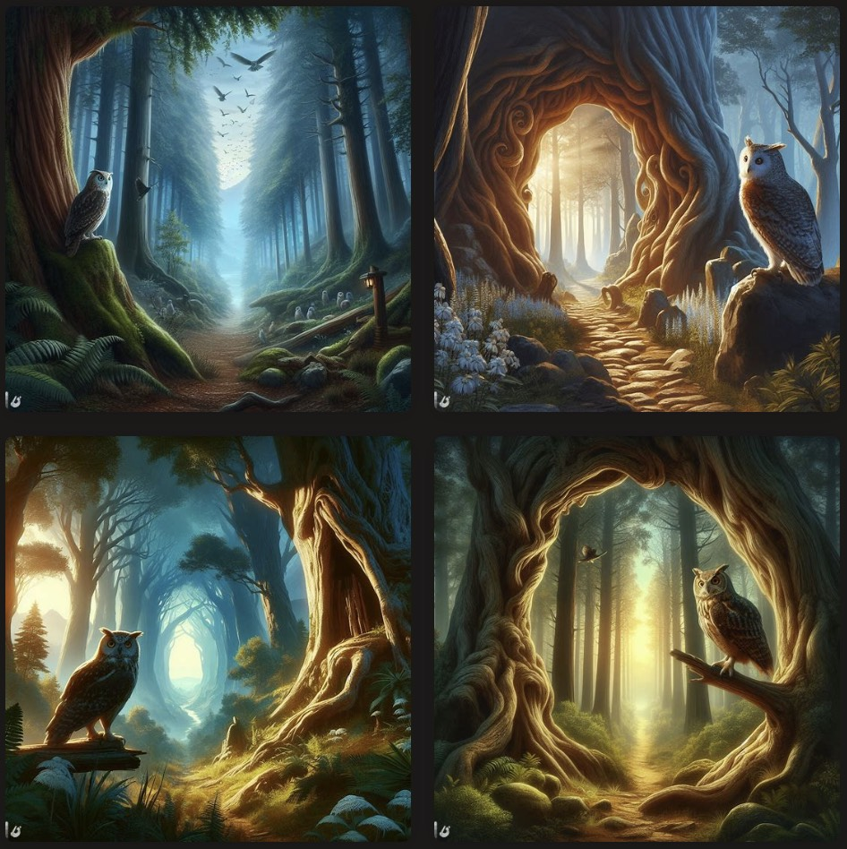
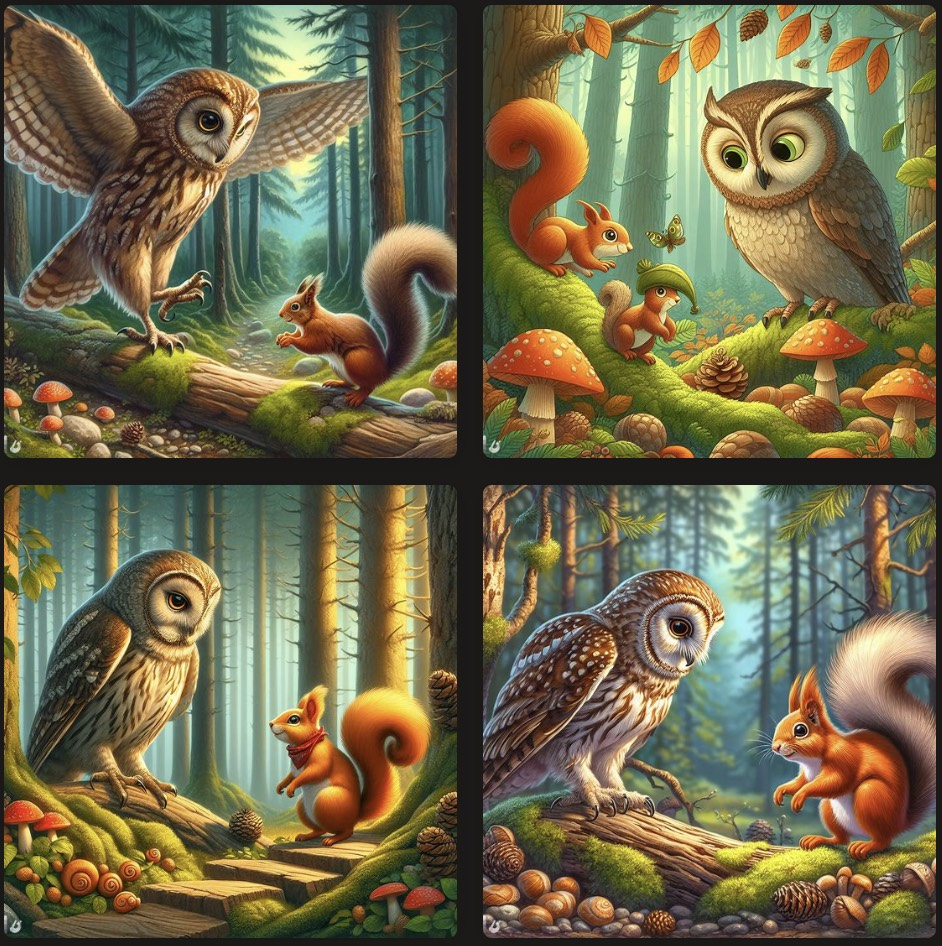
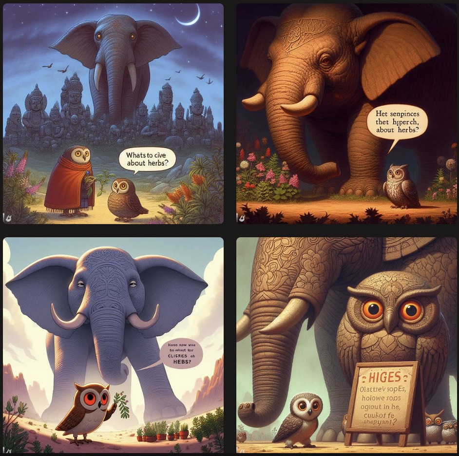
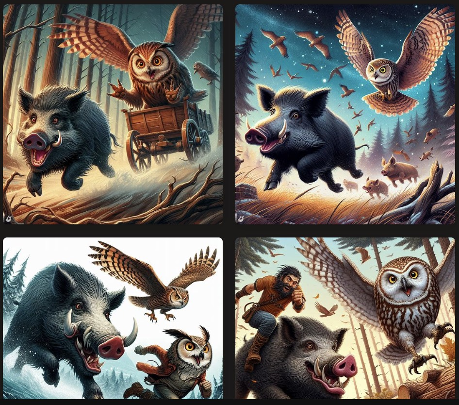
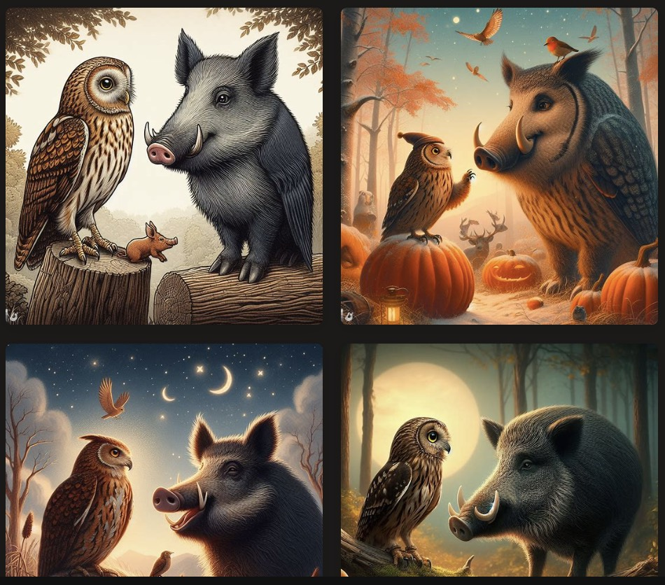
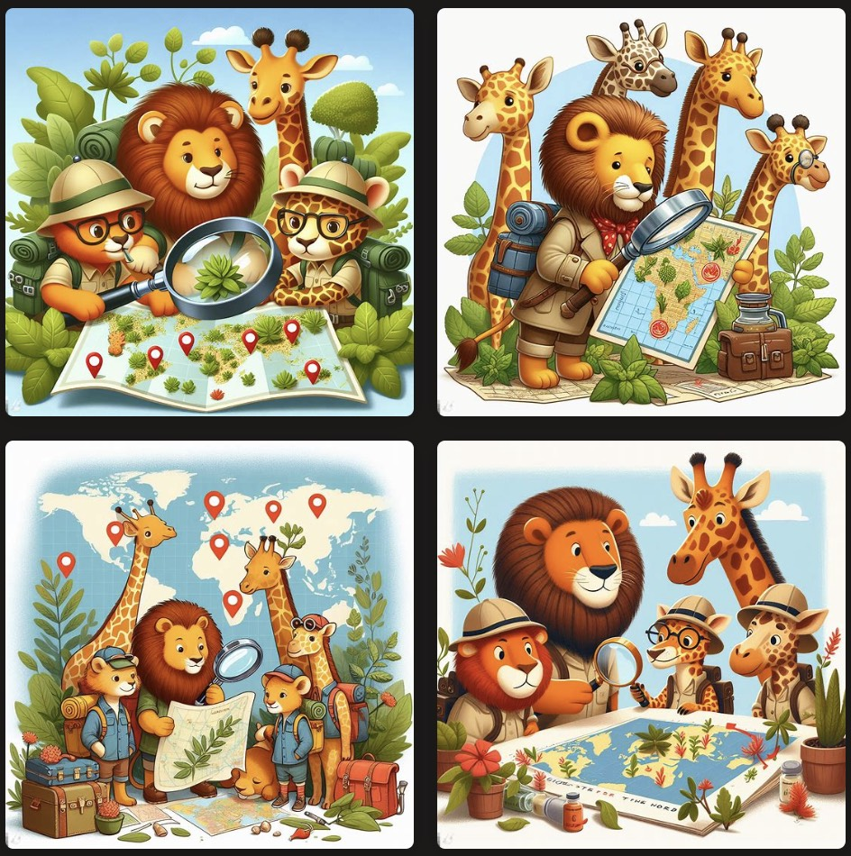
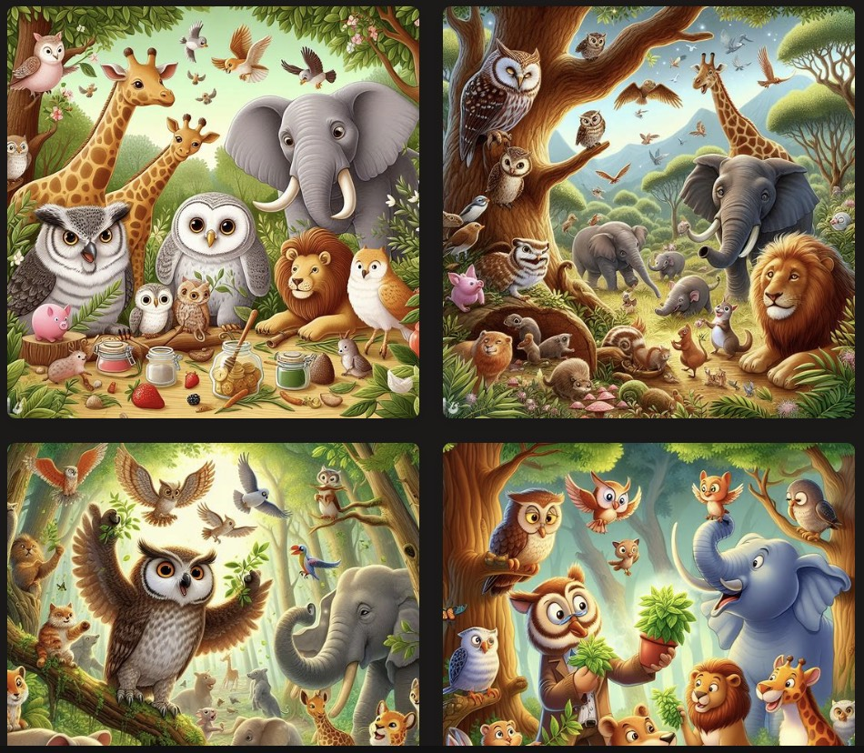
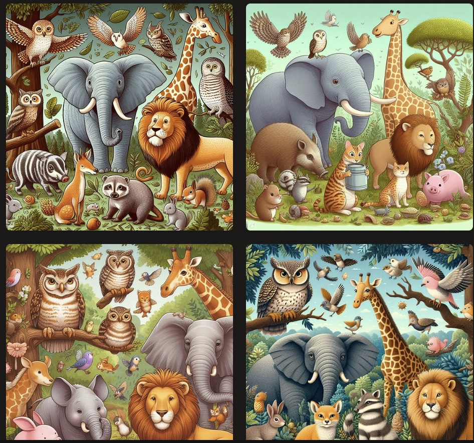
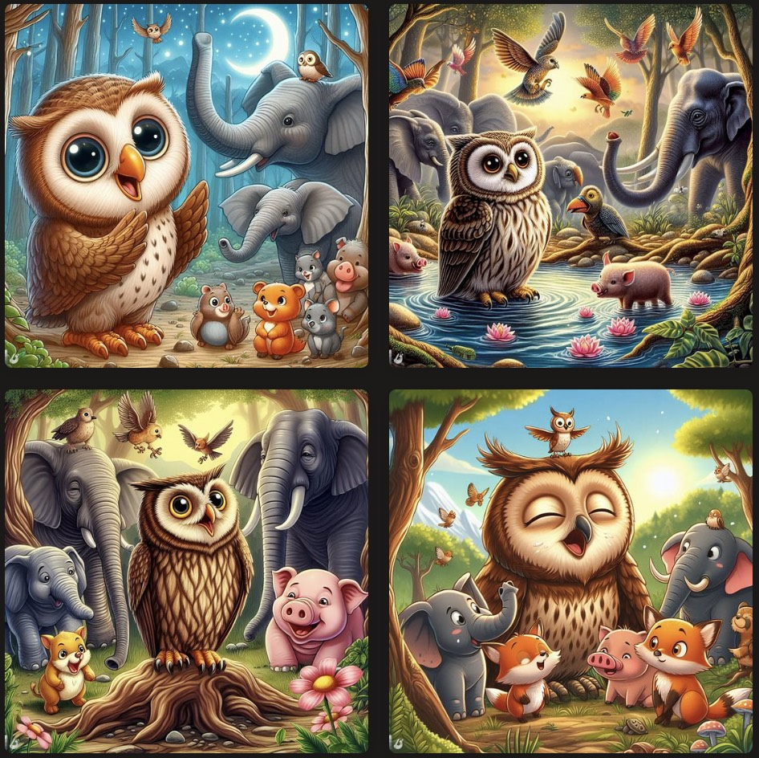
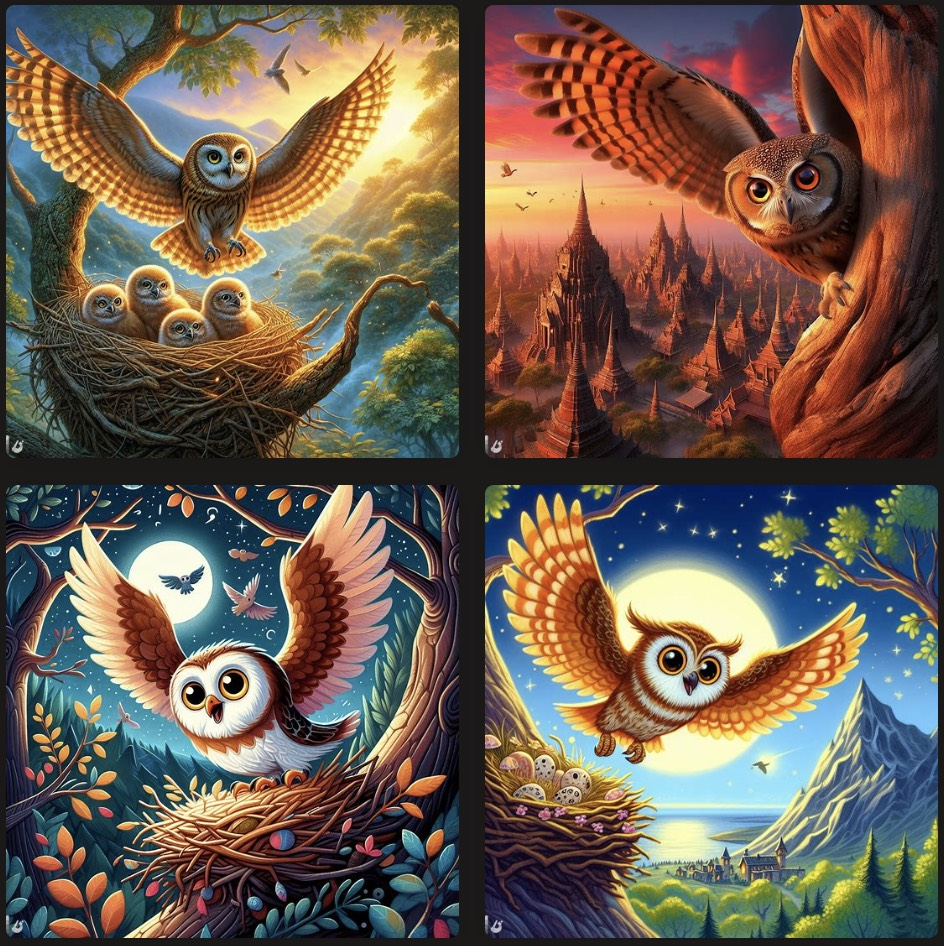

**第一页：**

 

*画面描述：森林的入口，猫头鹰站在一颗大树上，眺望着前方的神秘森林。*

文字内容：在一个神秘的森林深处，有一只勇敢的猫头鹰，它心里藏着一个重要的目标。

**第二页：**

 

*画面描述：猫头鹰踏入森林，遇到了一只聪明的松鼠。*

文字内容：猫头鹰决定踏上探险之旅。在森林深处，它遇到了一位聪明的小松鼠，松鼠告诉它寻找神秘的草药。

**第三页：**

 

*画面描述：猫头鹰在大象的庞大身影下，询问关于草药的线索。*

文字内容：猫头鹰继续探险，遇到了一只友善的大象。大象说：“草药的线索在河边，但要小心野猪！” 

**第四页：**

 

*画面描述：野猪和猫头鹰的一场激动人心的追逐。*

文字内容：猫头鹰在河边找到了草药的线索，但突然出现了顽皮的野猪，它们开始了一场激动人心的追逐。

**第五页：**

 

*画面描述：猫头鹰与野猪的对话，找到了合作的机会。*

文字内容：在一片开阔的地方，猫头鹰和野猪停下来，开始对话。他们发现原来大家都有各自的需求，于是决定合作寻找草药。

---

**第六页：**

 

*画面描述：狮子和长颈鹿加入探险队伍，大家一同探讨如何找到草药。*

文字内容：野猪和猫头鹰的合作引起了其他动物的兴趣，狮子和长颈鹿也加入了他们的队伍，大家一同商讨如何找到神秘的草药。

**第七页：**

 

*画面描述：队伍在森林深处发现了神秘的草药，大家欢呼雀跃。*

文字内容：经过大家共同的努力，队伍终于来到森林深处，发现了神秘的草药。所有动物都欢呼雀跃，他们的合作取得了成功。

---

**第八页：**

 

*画面描述：动物们分享草药的好处，森林变得更加美丽。*

文字内容：动物们发现草药不仅对猫头鹰有好处，对每个动物都有益。森林变得更加美丽，充满了欢笑和友谊。

**第九页：**

 

*画面描述：猫头鹰感慨良多，对伙伴们表示感激。*

文字内容：猫头鹰看着身边的伙伴们，心里充满感激。他们一起经历了冒险，学到了合作和友谊的重要性。

**第十页：**

 

*画面描述：猫头鹰飞回巢穴，回顾整个探险的经历，笑容满面。*

文字内容：猫头鹰带着满心的欢笑，飞回了自己的巢穴。探险虽然结束，但它们之间的友谊将永远长存。

