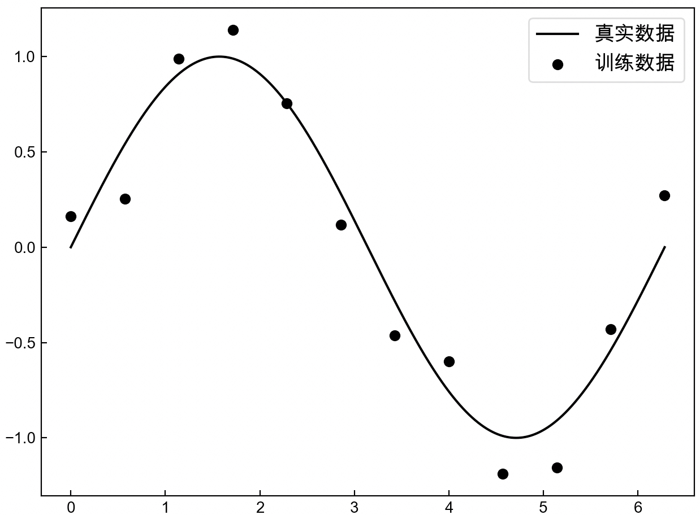
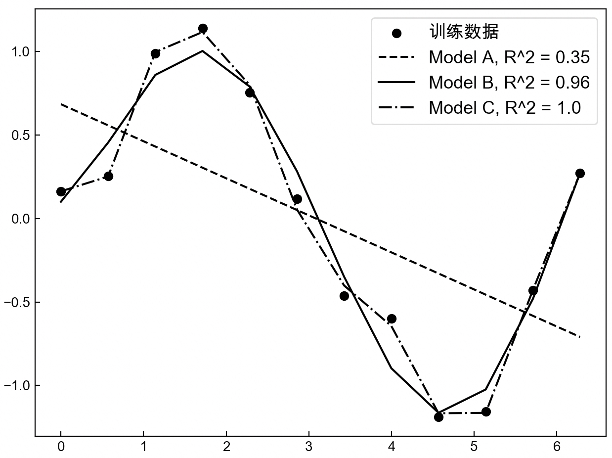
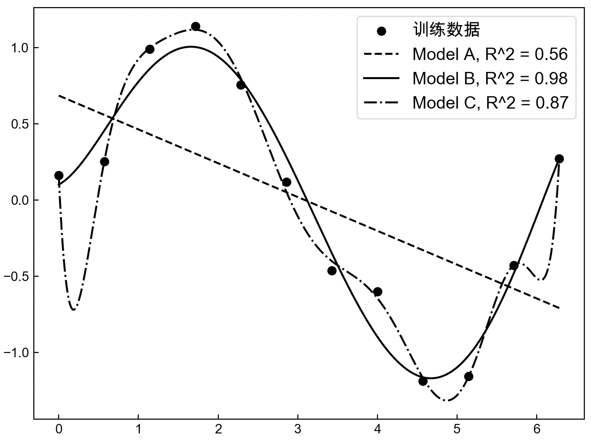
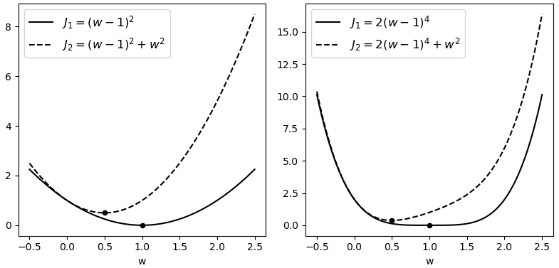
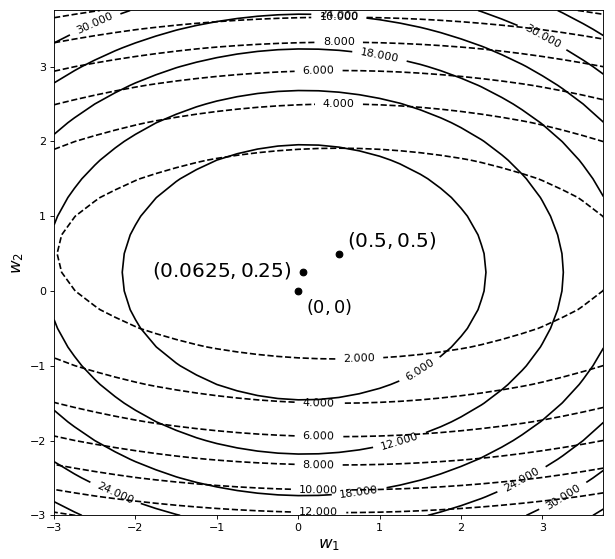
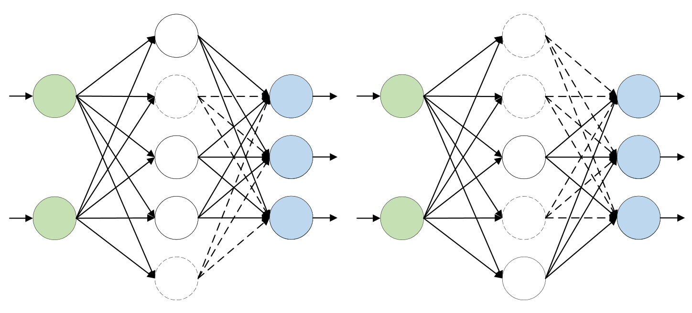

# 3.10 过拟合与正则化

经过前面几节内容的介绍， 我们对于深度学习的理念以及最基本的回归和分类模型已经有了清晰的认识。在接下来的这节内容中，笔者将逐步开始介绍深度学习中关于模型优化的一些基本内容，包括模型的过拟合、正则化和丢弃法等。

## 3.10.1 模型拟合

在第3.3节内容中，笔者首次引入了梯度下降这一优化算法，以此来最小化线性回归中的目标函数，并且在经过多次迭代后便可以得到模型中对应的参数。此时可以发现，模型的参数是一步一步根据梯度下降算法更新而来，直至目标函数收敛，也就是说这是一个循序渐进的过程，因此，这一过程也被称作拟合（Fitting）模型参数的过程，当这个过程执行结束后就会产生多种拟合后的状态，例如过拟合（Overfitting）和欠拟合（Underfitting）等。

在第3.8节内容中，笔者介绍了几种评估回归模型常用的指标，但现在有一个问题： 当MAE或者RMSE越小时就代表模型越好吗？还是说在某种条件下其越小就越好呢？细心的读者可能一眼便明了，肯定是有条件下的越小所对应的模型才越好。那这其中到底是怎么回事呢？

假设现在有一批样本点，它本是由函数$sin(x)$生成（现实中并不知道），但由于其他因素的缘故，使我们得到的样本点并没有准确地落在曲线$sin(x)$上，而是分布在其附近，如图3-38所示。

<div align=center>

</div>
<div style="text-align: center;">
  图 3-38 正弦样本点图形
</div>


如图3-38所示，黑色圆点为训练集，黑色曲线为样本真实的分布曲线。现在需要根据训练集来建立并训练模型，然后得到相应的预测函数。现在我们分别用3个不同的模型A、B和C（复杂度依次增加，例如更多的网络层数和神经元个数等）来分别根据这12个样本点进行建模，那么最终便可以得到如图3-39所示的结果。

<div align=center>

</div>
<div style="text-align: center;">
  图3-39正弦样本点拟合图形
</div>


从图3-39中可以看出，随着模型复杂度的增加，$R^2$指标的值也越来越大（$R^2\in(-\infty,1]$），并且在模型C中$R^2$还达到了1.0，但是最后就应该选择模型C吗？

不知到又过了多久，突然一名客户要买你的这个模型进行商业使用，同时客户为了评估这个模型的效果自己又带来了一批新的含有标签的数据（虽然模型C已经用$R^2$测试过，但客户并不会完全相信，万一你对这个模型作弊呢）。于是你拿着客户的新数据（也是由$sin(x)$所生成），然后分别用上面的3个模型进行预测，并得到了如图3-40所示的可视化结果。

<div align=center>

</div>
<div style="text-align: center;">
  图 3-40 正弦样本点过拟合图形
</div>


如图3-40所示，各个曲线表示根据新样本预测值绘制得到的结果。此时令你感到奇怪的是，为什么模型B的结果居然会好于模型C的结果，问题出在哪里？其原因在于，当第1次通过这12个样本点进行建模时，为了尽可能地使“模型好（表现形式为$R^2$尽可能大）”而使用了非常复杂的模型，尽管最后每个训练样本点都“准确无误”地落在了预测曲线上，但是这却导致最后模型在新数据上的预测结果严重地偏离了其真实值。

## 3.10.2 过拟合与欠拟合概念

在机器学习领域中，通常将建模时所使用的数据叫作训练集（Training Dataset），例如图3-38中的12个样本点。将测试时所使用的数据集叫作测试集（Testing Dataset）。同时把模型在训练集上产生的误差叫作训练误差（Training Error），把模型在测试集上产生的误差叫作泛化误差（Generalization Error），最后也将整个拟合模型的过程称作训练（Training）[1]。

进一步讲，将3.10.1节中模型C所产生的现象叫作过拟合（Overfitting），即模型在训练集上的误差很小，但在测试集上的误差却很大，也就是泛化能力弱； 相反，将其对立面模型A所产生的现象叫作欠拟合（Underfitting），即模型训练集和测试集上的误差都很大； 同时，将模型B对应的现象叫作恰拟合（Goodfitting），即模型在训练集和测试集上都有着不错的效果。

同时，需要说明的是，在3.10.1节中笔者仅仅以回归任务为例来向读者直观地介绍了什么是过拟合与欠拟合，但并不代表这种现象只出现在回归模型中，事实上所有的深度学习模型都会存在着这样的问题，因此一般来讲，所谓过拟合现象指的是模型在训练集上表现很好，而在测试集上表现却糟糕，欠拟合现象是指模型在两者上的表现都十分糟糕，而过拟合现象是指模型在训练集上表现良好（尽管可能不如过拟合时好），但同时在测试集上也有着不错的表现。

## 3.10.3 解决欠拟合与过拟合

**1\. 如何解决欠拟合问题**

经过上面的描述我们已经对欠拟合有了一个直观的认识，所谓欠拟合就是训练出来的模型根本不能较好地拟合现有的训练数据。在深度学习中，要解决欠拟合问题相对来讲较为简单，主要分为以下3种方法： 

(1) 重新设计更为复杂的模型，例如增加网络的深度、神经元的个数或者采用更为复杂的网络架构（如Transformer）；

(2) 减小正则化系数，当模型出现欠拟合现象时，可以通过减小正则化中的惩罚系数来减缓欠拟合现象，这一点将在第3.10.4节中进行介绍。

**2\. 如何解决过拟合问题**

对于如何有效地缓解模型的过拟合现象，常见的做法主要分为以下4种方法： 

(1) 收集更多数据，这是一个最为有效但实际操作起来又是最为困难的一种方法。训练数据越多，在训练过程中也就越能够纠正噪声数据对模型所造成的影响，使模型不易过拟合，但是对于新数据的收集往往有较大的困难。

(2) 降低模型复杂度，当训练数据过少时，使用较为复杂的模型极易产生过拟合现象，例如3.10.1节中的示例，因此可以通过适当减少模型的复杂度来达到缓解模型过拟合的现象。

(3) 正则化方法，在出现过拟合现象的模型中加入正则化约束项，以此来降低模型过拟合的程度，这部分内容将在3.10.4节中进行介绍。

(4) 集成方法，将多个模型集成在一起，以此来达到缓解模型过拟合的目的。

**3\. 如何避免过拟合**

为了避免训练出来的模型产生过拟合现象，在模型训练之前一般会将获得的数据集划分成两部分，即训练集与测试集，且两者一般为7∶3的比例。其中训练集用来训练模型（降低模型在训练集上的误差），然后用测试集来测试模型在未知数据上的泛化误差，观察是否产生了过拟合现象 [2]。

但是由于一个完整的模型训练过程通常会先用训练集训练模型，再用测试集测试模型，而绝大多数情况下不可能第1次就选择了合适的模型，所以又会重新设计模型（如调整网络层数、正则化系数等）进行训练，然后用测试集进行测试，因此在不知不觉中，测试集也被当成了训练集在使用，所以这里还有另外一种数据的划分方式，即训练集、验证集（Validation Data）和测试集，且一般为7∶2∶1的比例，此时的测试集一般通过训练集和验证集选定模型后做最后测试所用。

实际训练中应该选择哪种划分方式呢？这一般取决于训练者对模型的要求程度。如果要求严苛就划分为3份，如果不那么严格，则可以划分为2份，也就是说这两者并没硬性的标准。

## 3.10.4 泛化误差的来源

根据第3.10.3节内容可以知道，模型产生过拟合的现象表现为在训练集上误差较小，而在测试集上误差较大，并且笔者还讲到，之所以会产生过拟合现象是由于训练数据中可能存在一定的噪声，而我们在训练模型时为了尽可能地做到拟合每个样本点（包括噪声），往往就会使用复杂的模型。最终使训练出来的模型在很大程度上受到了噪声数据的影响，例如真实的样本数据可能更符合一条直线，但是由于个别噪声的影响使训练出来的是一条曲线，从而使模型在测试集上表现糟糕，因此，可以将这一过程看作由糟糕的训练集导致了糟糕的泛化误差。但是，如果仅仅从过拟合的表现形式来看，糟糕的测试集（噪声多）也可能导致糟糕的泛化误差。

在接下来的内容中，笔者将分别从这两个角度来介绍正则化（Regularization）方法中最常用的$\mathcal{l} _2$正则化是如何来解决这一问题的。

这里以线性回归为例，我们首先来看一下在线性回归的目标函数后面再加上一个$\mathcal{l}_2$正则化项的形式。
$$
J=\frac{1}{2m}\sum\limits_{i=1}^{m}{{{\left[ {{y}^{(i)}}-(\sum\limits_{j=1}^{n}{{{w}_{j}}x_{j}^{(i)}}+b) \right]}^{2}}}+\frac{\lambda }{2n}\sum\limits_{j=1}^{n}{{{({{w}_{j}})}^{2}}};\;\;(\lambda >0)\tag{3-98}
$$
在式(3-98)中的第2项便是新加入的$\mathcal{l}_2$正则化项（Regularization Term），那它有什么作用呢？根据第3.1.3节中的内容可知，当真实值与预测值之间的误差越小（表现为损失值趋于0）时，也就代表着模型的预测效果越好，并且可以通过最小化目标函数来达到这一目的。由式(3-98)可知，为了最小化目标函数$J$，第2项的结果也必将逐渐地趋于0。这使最终优化求解得到的$w_j$均会趋于0附近，进而得到一个平滑的预测模型。这样做的好处是什么呢？

## 3.10.5 测试集导致的泛化误差

所谓测试集导致糟糕的泛化误差是指训练集本身没有多少噪声，但由于测试集含有大量噪声，使训练出来的模型在测试集上没有足够的泛化能力，而产生了较大的误差。这种情况可以看作模型过于准确而出现了过拟合现象。正则化方法是怎样解决这个问题的呢？
$$
y=\sum\limits_{j=1}^{n}{{{x}_{j}}}{{w}_{j}}+b\tag{3-99}
$$
假如式(3-99)所代表的模型就是根据式(3-98)中的目标函数训练而来的，此时当某个新输入样本（含噪声）的某个特征维度由训练时的$x_j$变成了现在的$(x_j+\Delta x_j)$，那么其预测输出就由训练时的$\hat{y}$变成了现在的$\hat{y}+\Delta x_jw_j$，即产生了$\Delta x_jw_j$的误差，但是，由于$w_j$接近于$0$附近，所以这使模型最终只会产生很小的误差。同时，如果$w_j$越接近于$0$，则产生的误差就会越小，这意味着模型越能够抵抗噪声的干扰，在一定程度上越能提升模型的泛化能力 [1]。

由此便可以知道，通过在原始目标函数中加入正则化项，便能够使训练得到的参数趋于平滑，进而能够使模型对噪声数据不再那么敏感，缓解了模型的过拟合现象。

## 3.10.6 训练集导致的泛化误差

所谓训练集导致糟糕的泛化误差是指，由于训练集中包含了部分噪声，导致我们在训练模型的过程中为了能够尽可能地最小化目标函数而使用了较为复杂的模型，使最终得到的模型并不能在测试集上有较好的泛化能力（如第3.10.1节中的示例），但这种情况完全是因为模型不合适而出现了过拟合的现象，而这也是最常见的过拟合的原因。$\mathcal{l}_2$正则化方法又是怎样解决在训练过程中就能够降低对噪声数据的敏感度的呢？为了便于后面的理解，我们先从图像上来直观地理解一下正则化到底对目标函数做了什么。

如图3-41所示，左右两边黑色实线为原始目标函数，黑色虚线为加了$\mathcal{l}_2$正则化后的目标函数。可以看出黑色实线的极值点均发生了明显改变，并且不约而同地都更靠近原点。

<div align=center>

</div>
<center>
  图 3-41 $\mathcal{l}_2$正则化图形
</center>

再来看一张包含两个参数的目标函数在加入$\mathcal{l}_2$正则化后的结果，如图3-42所示。

<div align=center>

</div>
<div style="text-align: center;">
  图 3-42 $\mathcal{l}_2$正则化投影图形
</div>


如图3-42所示，图中黑色虚线为原始目标函数的等高线，黑色实线为施加正则化后目标函数的等高线。可以看出，目标函数的极值点同样也发生了变化，从原始的$(0.5,0.5)$变成了$(0.0625,0.25)$，而且也更靠近原点（$w_1$和$w_2$变得更小了）。到此我们似乎可以发现，正则化能够使原始目标函数极值点发生改变，并且同时还有使参数趋于0的作用。事实上也正是因为这个原因才使$\mathcal{l}_2$正则化具有缓解过拟合的作用，但原因在哪里呢？

## 3.10.7 $\mathcal{l}_2$正则化原理

以目标函数${{J}_{1}}=1/6{{({{w}_{1}}-0.5)}^{2}}+{{({{w}_{2}}-0.5)}^{2}}$为例，其取得极值的极值点为$(0.5,0.5)$，且$J_1$在极值点处的梯度为$(0,0)$。当对其施加正则化$R=(w_1^2+w_2^2)$后，由于$R$的梯度方向是远离原点的（因为$R$为一个二次曲面），所以给目标函数加入正则化，实际上等价于给目标函数施加了一个远离原点的梯度。通俗点讲，正则化给原始目标函数的极值点施加了一个远离原点的梯度（甚至可以想象成施加了一个力的作用），因此，这也就意味着对于施加正则化后的目标函数$J_2=J_1+R$来讲，$J_2$的极值点$(0.0625,0.25)$相较于$J_1$的极值点$(0.5,0.5)$更加靠近于原点，而这也就是$\mathcal{l}_2$正则化本质之处。

注意：在通过梯度下降算法最小化目标函数的过程中，需要得到的是负梯度方向，因此上述极值点会向着原点的方向移动。

假如有一个模型$A$，它在含有噪声的训练集上表示异常出色，使目标函数$J_1(\hat{w})$的损失值等于$0$（也就是拟合到了每个样本点），即在$w=\hat{w}$处取得了极值。现在，我们在$J_1$的基础上加入$\mathcal{l}_2$正则化项构成新的目标函数$J_2$，然后来分析一下通过最小化$J_2$求得的模型$B$到底产生了什么样的变化。
$$
\begin{aligned}
  & {{J}_{1}}=\frac{1}{2m}\sum\limits_{i=1}^{m}{{{\left[ {{y}^{(i)}}-(\sum\limits_{j=1}^{n}{x_{j}^{(i)}}{{w}_{j}}+b) \right]}^{2}}} \\[1ex] 
 & {{J}_{2}}={{J}_{1}}+\frac{\lambda }{2n}\sum\limits_{j=1}^{n}{{{({{w}_{j}})}^{2}}};\;\;(\lambda >0) \\ 
\end{aligned}\tag{3-100}
$$
从式(3-100)可知，由于$J_2$是由$J_1$加正则化项构成的，同时根据先前的铺垫可知，$J_2$将在离原点更近的极值点$w=\tilde{w}$处取得$J_2$的极值，即通过最小化含正则化项的目标函数$J_2$，将得到$w=\tilde{w}$这个最优解，但是需要注意，此时的$w=\tilde{w}$将不再是$J_1$的最优解，即$J_1(\tilde{w})\neq0$，因此通过最小化$J_2$求得的最优解$w=\tilde{w}$将使$J_1(\tilde{w})>J_1(\hat{w})$，而这就意味着模型$B$比模型$A$更简单了，也就代表着从一定程度上缓解了$A$的过拟合现象。

同时，由式(3-98)可知，通过增大参数$\lambda$的取值可以对应增大正则化项所对应的梯度，而这将使最后求解得到更加简单的模型（参数值更加趋近于0）。也就是$\lambda$越大，一定程度上越能缓解模型的过拟合现象，因此，参数$\lambda$又叫作惩罚项（Penalty Term）或者惩罚系数。

最后，从上面的分析可知，在第1种情况中$\mathcal{l}_2$正则化可以看作使训练好的模型不再对噪声数据那么敏感，而对于第2种情况来讲，$\mathcal{l}_2$正则化则可以看作使模型不再那么复杂，但其实两者的原理归结起来都是一回事，那就是通过较小的参数取值，使模型变得更加简单。

## 3.10.8 $\mathcal{l}_2$正则化中的参数更新

在给目标函数施加正则化后也就意味着其关于参数的梯度发生了变化。不过幸运的是正则化是被加在原有目标函数中，因此其关于参数$w$的梯度也只需加上惩罚项中对应参数的梯度，同时关于偏置$b$的梯度并没有改变。

以线性回归为例，根据式(3-98)可知，目标函数关于$w_j$的梯度为
$$
\frac{\partial J}{\partial {{w}_{j}}}=-\frac{1}{m}\sum\limits_{i=1}^{m}{{{\left[ {{y}^{(i)}}-(\sum\limits_{j=1}^{n}{x_{j}^{(i)}}{{w}_{j}}+b) \right]x^{(i)}_j}}}+\frac{\lambda}{n}w_j\tag{3-101}
$$


因此，对于任意目标函数$J$来说，其在施加$l_2$正则化后的梯度下降迭代公式为
$$
w=w-\alpha\left(\frac{\partial J}{\partial w}+\frac{\lambda}{n}w\right)=\left(1-\alpha\frac{\lambda}{n}\right)w-\alpha\frac{\partial J}{\partial w}\tag{3-102}
$$
从式(3-102)可以看出，相较于之前的梯度下降更新公式，$\mathcal{l}_2$正则化会令权重$w$先自身乘以小于1的系数，再减去不含惩罚项的梯度，这也将使模型参数在迭代训练的过程中以更快的速度趋近于0，因此$\mathcal{l}_2$正则化又叫作权重衰减（Weight Decay）法 [2]。

## 3.10.9 $\mathcal{l}_2$正则化示例代码

在介绍完$\mathcal{l}_2$正则化的原理后，下面以加入正则化的线性回归模型为例进行示例。完整代码见[Code/Chapter03/C16_L2Regularization/main.py](https://github.com/moon-hotel/DeepLearningWithMe/blob/master/Code/Chapter03/C16_L2Regularization/main.py)文件。

**1\. 制作数据集**

由于这里要模拟模型的过拟合现象，所以需要先制作一个容易导致过拟合的数据集，例如特征数量远大于训练样本数量。具体代码如下： 

```python
 1 def make_data():
 2     np.random.seed(1)
 3     n_train, n_test, n_features = 80, 110, 150
 4     w, b = np.random.randn(n_features, 1) * 0.01, 0.01
 5     x = np.random.normal(size=(n_train + n_test, n_features))
 6     y = np.matmul(x, w) + b
 7     y += np.random.normal(scale=0.3, size=y.shape)
 8     x = torch.tensor(x, dtype=torch.float32)
 9     y = torch.tensor(y, dtype=torch.float32)
10     x_train, x_test = x[:n_train, :], x[n_train:, :]
11     y_train, y_test = y[:n_train, :], y[n_train:, :]
12     return x_train, x_test, y_train, y_test
```

在上述代码中，第1行用于设定一个随机种子，保证每次生成的数据一样，使得结果可复现；第3行用来指定训练样本、测试样本和特征的数量；第4~7行用于生成原始样本并在真实值中加入相应的噪音；第8~9行是将numpy中的向量转化为PyTorch中的张量；第10~12行是划分数据集并返回。

**2\. 定义$l_2$惩罚项**

由于整个线性回归的模型定义和训练部分的代码在第3.2.2节房价预测实现中已经做过介绍，所以这里就不再赘述，只是介绍一下如何在原始目标函数中加入$l_2$惩罚项，示例代码如下所示：

```python
 1 def train(x_train, x_test, y_train, y_test, lambda_term=0.):
 2     ......
 3     loss = nn.MSELoss()  # 定义损失函数
 4     optimizer = torch.optim.SGD(net.parameters(), lr=lr, weight_decay=lambda_term)
 5     loss_train,loss_test = [], []
 6     for epoch in range(epochs):
 7         logits = net(x_train)
 8         l = loss(logits, y_train)
 9         loss_train.append(l.item())
10         logits = net(x_test)
11         ll = loss(logits, y_test)
12         loss_test.append(ll.item())
13         optimizer.zero_grad()
14         l.backward()
15         optimizer.step()  # 执行梯度下降
16     return loss_train, loss_test
```

在上述代码中，第3行为定义损失函数；第4行是指定优化器，其中`weight_decay`参数便是$l_2$正则化中的惩罚项系数，默认情况下为0，即不使用正则化；第7~9行是在训练集上进行正向传播并保存对应的损失值；第10~12行则是在测试集上进行正向传播并保存损失值；第13~15行是在训练集上进行反向传播并更新模型参数；第16行是分别返回模型在训练集和测试集上的损失值。

在定义完上述各个函数后，便可以用来分别训练带正则化项和不带正则化项（`lambda_term`参数设为0）的线性回归模型，最终得到的损失变化如图3-43所示。

<div align=center>

</div>
<div style="text-align: center;">
  图 3-43 $\mathcal{l}_2$正则化损失图
</div>


在图3-43中，左边为未添加正则化项时训练误差和测试误差的走势。可以明显看出模型在测试集上的误差远大于在训练集上的误差，这就是典型的过拟合现象。右图为使用正则化后模型的训练误差和测试误差，可以看出虽然训练误差有些许增加，但是测试误差得到了很大程度上的降低[2]。这就说明正则化能够很好地缓解模型的过拟合现象。

## 3.10.10 $\mathcal{l}_1$正则化原理

在介绍完$\mathcal{l}_2$正则化后我们再来简单地看一下$\mathcal{l}_1$正则化背后的思想原理。如式(3-103)所示便是加入$\mathcal{l}_1$正则化后的线性回归目标函数。

$$
J=\frac{1}{2m}\sum\limits_{i=1}^{m}{{{\left( {{y}^{(i)}}-(\sum\limits_{j=1}^{n}{{w}_{j}}{x_{j}^{(i)}}+b) \right)}^{2}}}+\frac{\lambda }{2n}\sum\limits_{j=1}^{n}{{{|{{w}_{j}}|}}};\ \ (\lambda >0)\tag{3-103}
$$
在式(3-103)中的第2项便是新加入的$\mathcal{l}_1$正则化项，可以看出它与$\mathcal{l}_2$正则化的差别在于前者是各个参数的绝对值之和，而后者是各个参数的平方之和。那$\mathcal{l}_1$正则化又是如何解决模型过拟合现象的呢？

以单变量线性回归为例，且假设此时只有一个样本，在对其施加$\mathcal{l}_1$正则化之前和之后的目标函数如式(3-104)所示
$$
\begin{aligned}
J_1&=\frac{1}{2}(wx+b-y)^2\\[2ex]
J_2&=J_1+\lambda|w|
\end{aligned}\tag{3-104}
$$
由式(3-104)可知，目标函数$J_1$和$J_2$关于权重$w$的梯度分别为
$$
\begin{aligned}
\frac{\partial J_1}{\partial w} &= x(wx+b-y)\\[2ex]
\frac{\partial J_2}{\partial w}& = \begin{cases}x(wx+b-y)+\lambda,\;\;w>0\\[2ex]x(wx+b-y)-\lambda,\;\;w<0
\end{cases}
\end{aligned}\tag{3-104}
$$
进一步由梯度下降算法可得两者的参数更新公式为
$$
\begin{aligned}
w&=w-\alpha\frac{\partial J_1}{\partial w} =w-\alpha\cdot x(wx+b-y)\\[2ex]
w&=w-\alpha\frac{\partial J_2}{\partial w} =
\begin{cases}w-\alpha\cdot[x(wx+b-y)+\lambda],\;\;w>0\\[2ex]
w-\alpha\cdot[x(wx+b-y)-\lambda],\;\;w<0
\end{cases}
\end{aligned}\tag{3-105}
$$
为了更好的观察式(3-105)中两者的差异，令$\phi=x(wx+b-y)$，$\alpha=1$，此时有
$$
\begin{aligned}
w&=w-\alpha\frac{\partial J_1}{\partial w} =w-\phi\\[2ex]
w&=w-\alpha\frac{\partial J_2}{\partial w} =
\begin{cases}(w-\lambda)-\phi,\;\;w>0\\[2ex]
(w+\lambda)-\phi,\;\;w<0
\end{cases}
\end{aligned}\tag{3-106}
$$
此时根据式(3-107)中两者对比可知，对于施加$\mathcal{l}_1$正则化后的目标函数来说，当$w>0$时，$w$会先减去$\lambda$；当$w<0$时，$w$会先加上$\lambda$；所以在这两种情况下更新后的$w$都会更加的趋向于0，而这也就是$\mathcal{l}_1$正则化同样能缓解模型过拟合的原因。


## 3.10.11 $\mathcal{l}_1$与$\mathcal{l}_2$正则化差异

根据前面的几节内容的介绍可知，$\mathcal{l}_1$和$\mathcal{l}_2$正则化均能够使得求解得到的参数趋向于0（即接近于0），但是对于$\mathcal{l}_1$正则化来说它却能够使得模型参数更加的稀疏，即直接使得模型对应的参数变为0（不仅仅是接近）。那$\mathcal{l}_1$正则化是如何产生这一结果的呢？

以单变量线性回归为例，对其分别施加$\mathcal{l}_1$和$\mathcal{l}_2$正则化后，目标函数关于参数$w$的梯度分别为
$$
\begin{aligned}
\mathcal{l}_1:\;\;\;\;\;&\begin{cases} x(wx+b-y)+\lambda,\;\;w>0\\[2ex]
 x(wx+b-y)-\lambda,\;\;w<0
\end{cases}\\[2ex]
\mathcal{l}_2:\;\;\;\;\;& x(wx+b-y)+\lambda w
\end{aligned}\tag{3-107}
$$
根据式(3-107)可知，对于$\mathcal{l}_1$正则化来说，只要满足条件$|x(wx+b-y)|<\lambda$，那么带有$\mathcal{l}_1$正则化的目标函数总能保持，当$w<0$时单调递减，当$w>0$时单调递增，即此时一定能在$w=0$产生最小值。对于$\mathcal{l}_2$正则化来说，当$w=0$时，只要$x(wx+b-y)\neq 0$，那么带有$\mathcal{l}_2$正则化的目标函数便不可能在$w=0$出产生最小值。也就是说，对于$\mathcal{l}_1$正则化来说只需要满足条件$-\lambda<x(wx+b-y)<\lambda$，便可以在$w=0$处取得最小值；而对于$\mathcal{l}_2$正则化来说，只有满足条件$x(wx+b-y)=0$时，才可能在$w=0$处取得最小。因此，相较于$\mathcal{l}_2$正则化，$\mathcal{l}_1$正则化更能够使得模型产生稀疏解。

当然，我们还可以从另外一个比较直观的角度来解释为什么$\mathcal{l}_1$正则化更容易产生稀疏解。从本质上看，带正则化的目标函数实际上就等价于带约束条件的原始目标函数，即为了缓解模型的过拟合现象可以对原始目标函数的解空间施加一个约束条件，而这个约束便可以是$\mathcal{l}_1$或者是$\mathcal{l}_2$正则化。例如对于带$\mathcal{l}_1$约束条件的目标函数有
$$
\min \frac{1}{2m}\sum_{i=1}^m \left(y^{(i)} -(\sum_{j=1}^nw_jx_j^{(i)}+b)\right)^2\\[2ex]
s.t.\;\;\sum_{j=1}^n|w_j|\leq t,\;t>0\tag{3-108}
$$

从式(3-108)可以看出，这是一个典型的带有不等式约束条件的极值求解问题，且可以得到对应的如下拉格朗日函数
$$
\mathcal{L}(w,b)=\frac{1}{2m}\sum_{i=1}^m\left(y^{(i)}-(\sum_{j=1}^nw_jx_j^{(i)}+b)\right)^2+\mu(\sum_{j=1}^n|w_j|-t);\;\mu\geq 0\tag{3-109}
$$
其中$\mu$被称为拉格朗日乘子，可以看出本质上它就等同于式(3-103)中的惩罚系数$\lambda$，同时由于$t$为常数，所以式(3-109)与目标函数(3-103)等价。

进一步，根据式(3-109)可以画出在二维特征条件下原始目标函数与$\mathcal{l}_1$约束条件下解的分布情况（同理还可以画出$\mathcal{l}_2$约束条件下的解空间），如图3-44所示。

<div align=center>

</div>
<div style="text-align: center;">
  图 3-44 两种约束条件下目标函数对应的最优解
</div>

在图3-44中，椭圆曲线表示目标函数对应的等高线，菱形和圆形分别表示$\mathcal{l}_1$和$\mathcal{l}_2$约束条件下对应的解空间。从图中可以看出，目标函数在$\mathcal{l}_1$约束条件下于p处取得最小值，在$\mathcal{l}_2$约束条件下于q处取得最小值。此时可以发现，由于$\mathcal{l}_1$约束条件下的解空间为菱形，因此相较于$\mathcal{l}_2$约束，$\mathcal{l}_1$更容易在顶点处产生极值，这就导致$\mathcal{l}_1$约束更能够使得模型产生稀疏解。同时，我们还可以通过一张更明显的图示来进行说明，如图3-45所示。

<div align=center>

</div>
<div style="text-align: center;">
  图 3-45. 不同目标函数在两种约束条件下的最优解
</div>

从图4-45可以看出，对于不同的约束条件来说，相较于$\mathcal{l}_2$约束条件目标函数都更容易在$\mathcal{l}_1$约束条件下产生稀疏解。

最后，在实际运用过程中，还可以将两种正则化方式结合到一起，即弹性网络惩罚（Elastic-Net）[3]，如式(4-24)所示
$$
\lambda\sum_{i=1}^n(\beta |w_i|+(1-\beta) w_i^2),\;\;0\leq\beta\leq1\tag{3-110}
$$
其中$\beta$是用来控制$\mathcal{l}_1$和$\mathcal{l}_2$惩罚项各自所占的比重，可以看出当$\beta=0$时式(3-110)便等价于$\mathcal{l}_2$正则化，当$\beta=1$时则等价于$\mathcal{l}_1$正则化。

最后，由于PyTorch中没有直接提供调用$l_1$正则化的方法，因此我们需要通过如下方式来使用，示例代码如下所示：

```python
 1 def train(x_train, x_test, y_train, y_test, lambda_term=0.):
 2     ......
 3     optimizer = torch.optim.SGD(net.parameters(), lr=lr)  # 定义优化器
 4     loss_train = []
 5     for epoch in range(epochs):
 6         logits = net(x_train)
 7         l = loss(logits, y_train)
 8         for p_name in net.state_dict():
 9             if 'bias' not in p_name:
10                 p_value = net.state_dict()[p_name]
11                 l += lambda_term/len(x_train) * torch.norm(p_value, 1)
12     ......
```

在上述代码中，第3行为指定优化器，且不需要指定`weight_decay`参数；第8~9行则是遍历模型中的所有参数，并将偏置过滤掉；第10~11行则是分别对模型中的参数进行$l_1$正则化处理。

## 3.10.12 丢弃法

在深度学习中，除了通过正则化方法来缓解模型的过拟合现象外，还有一种常用的处理方式，即丢弃法（Dropout）[4]。丢弃法的思想是在模型的训练过程中，根据某一概率分布随机将其中一部分神经元忽略（乘以一个只含0和1的掩码矩阵）的做法，并且对于每一次前向传播来说忽略部分神经元的位置都是不尽相同的，因此从另一个角度来看每次执行梯度下降时优化的都是不同模型对应的参数。

<div align=center>

</div>
<div style="text-align: center;">
  图 3-46. Dropout示例图
</div>

如图3-46所示便是在原始网络结构的基础上对输出层进行Dropout后可能的两种结果，其中虚线表示被丢弃的神经元，其作为输入在下一层线性组合时对应位置的值便为0。可以看出，丢弃法这一思想相当于是引入了类似Bagging集成学习的思想，可以被认为是集成了大量深层神经网络的Bagging方法[5]。

具体地，设某一层中神经元$o_i$被丢弃的概率为$p$，即随机变量$\eta_i$为0和1的概率分别为$p$和$1-p$，则有
$$
o^{\prime}_i=\frac{\eta_i}{1-p}o_i\tag{3-111}
$$
其中$o^{\prime}_i$为使用丢弃法后的结果。

在式(3-111)中之所以还要除以$(1-p)$的目的在于能够使得施加丢弃法后的结果的期望等于作用丢弃法之前的结果。由于$E(o^{\prime}_i)=0\cdot\eta_i+1\cdot(1-p)$，所以有
$$
E(o^{\prime}_i)=E(o^{\prime}_i)\frac{1}{1-p}o_i=\frac{1-p}{1-p}o_i=o_i\tag{3-112}
$$
同时，需要注意的是模型在测试或者称为推理（Inference）过程中，并不需要进行随机丢弃操作，一方面是为了保证模型每次输出结果相同，另一方面是因为如果在测试过程进行了随机丢弃则此时相当于仅使用了整个集成模型中的一个模型。

在介绍完丢弃法的基本原理后，下面开始介绍其具体实现过程。首先需要实现函数来完成整个dropout操作，实现代码如下所示：

```python
 1 def dropout(a, drop_pro=0.5, training=True):
 2     if not training:
 3         return a
 4     assert 0 <= drop_pro <= 1
 5     if drop_pro == 1:
 6         return refs.zeros_like(a)
 7     if drop_pro == 0:
 8         return a
 9     keep_pro = 1 - drop_pro
10     scale = 1 / keep_pro
11     mask = refs.uniform(a.shape, low=0.0, high=1.0, 
12         dtype=torch.float32, device=a.device) < keep_pro
13     return refs.mul(refs.mul(a, mask), scale)
```

在上述代码中，第1行中`a`表示输入的网络层，`drop_pro`表示神经元被丢弃的概率，`training` 表示当前是否处于训练状态；第2~3行表示如果是推理阶段则直接返回原始值；第4行用于判断丢弃比例的合法取值；第5~8行表示返回特殊情况下对应的结果；第9~13行则是式(3-111)计算过程的体现，其中第11~12行为根据均匀分布返回一个只包含0和1的掩码矩阵，第13行则是原始输如先乘以掩码矩阵再进行缩放。

到此对于dropout的计算过程就实现完了，我们可以直接把它当做一个函数进行调用。不过为了能将其作为PyTorch中的网络层添加到`nn.Sequential()`中进行使用，我们还需要将其封装成一个`nn.Module`类对象，实现代码如下所示：

```python
1 class MyDropout(nn.Module):
2     def __init__(self, p=0.5):
3         super(MyDropout, self).__init__()
4         self.p = p
5 
6     def forward(self, x):
7         return dropout(x, drop_pro=self.p, training=self.training)
```

在上述代码中，第1行表示继承PyTorch中的`nn.Module`类，所有想要作为一个网络层来进行使用的类都需要继承该类，在后续内容中笔者也会持续介绍到；第2~4行则是初始化相应的参数，其中`p`表示丢弃率；第6~7行则是定义前向传播过程，其中`self.training`用于获取模型当前的状态（训练或推理）。

最后，可以通过如下方式来使用`MyDropout()`，代码如下所示：

```python
1 if __name__ == '__main__':
2     a = torch.randn([2, 10])
3     op_dropout = MyDropout(p=0.2)
4     print(op_dropout(a))
```

输入结果如下所示：

```python
1 tensor([[-1.4843, -1.0103, -0.0000,  0.7997,  0.9650,  
2           0.4117, -0.6568, -0.4334,  1.5951, -0.9222],
3         [-1.2151,  2.4469, -1.9339, -0.6010, -0.0000,  
4           0.0342, -1.1552,  0.0000,0.1395,  1.7941]])
```

在上述结果中，取值为0的位置便是被丢弃的位置。

上述完整代码见[Code/Chapter03/Code/Chapter03/C17_Dropout/main.py](https://github.com/moon-hotel/DeepLearningWithMe/blob/master/Code/Chapter03/C17_Dropout/main.py)文件。

## 3.10.13 小结

在这节内容中，笔者首先通过示例详细介绍了如何通过$\mathcal{l}_2$正则化方法来缓解模型的过拟合现象，以及介绍了为什么$\mathcal{l}_2$正则能够使模型变得更简单，其次笔者介绍了加入正则化后原有梯度更新公式的变化之处，其仅仅加上了正则化项对应的梯度，然后笔者通过一个示例来展示了$\mathcal{l}_2$正则化的效果，与此同时还介绍了另外一种常见的$\mathcal{l}_1$正则化方法并详细对比了$\mathcal{l}_1$正则化和$\mathcal{l}_2$正则化的差异之处；最后介绍了深度学习中另外一种常见缓解模型过拟合的丢弃法及其实现方式。

# 引用

[1] Hungyi Lee, MachineLearning, National Taiwan University, 2020, Spring.

[2] 阿斯顿·张, 李沐, 扎卡里·C.立顿, 等. 动手学深度学习［M］.北京: 人民邮电出版社, 2019.

[3] Trevor Hastie, Robert Tibshirani, Jerome Friedman, The Elements of Statistical Learning, Second Edition, Springer Series in Statistics, Jan 13, 2017.

[4] G. E. Hinton, N. Srivastava, A. Krizhevsky, etc. Improving neural networks by preventing co-adaptation of feature detectors.

[5] 赵申剑, 黎彧君, 符天凡, 李凯 译，深度学习 [M]. 北京：人民邮电出版社, 2017.