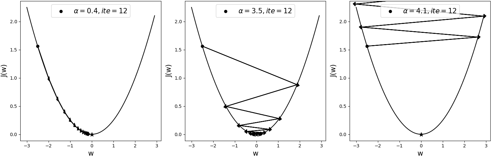
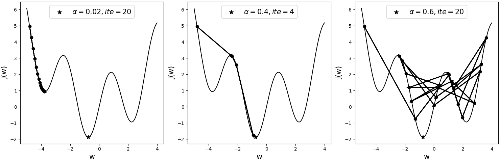
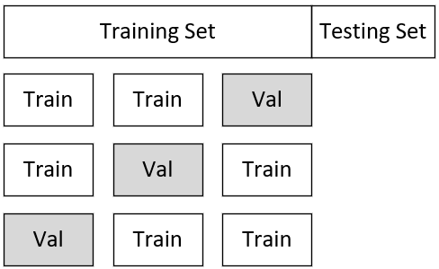
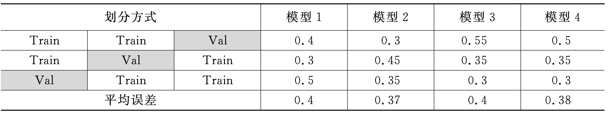

# 3.11 超参数与交叉验证

在深度学习中，除了通过训练集根据梯度下降算法训练得到的权重参数之外，还有另外一类通过手动设置的超参数（Hyper Parameter），而超参数的选择对于模型最终的表现也至关重要。在接下来的这节内容中，笔者将会介绍到目前为止我们已经接触过的几个超参数及其选择方式。


## 3.11.1 超参数介绍

在之前的介绍中，我们知道了模型中的权重参数可以通过训练集利用梯度下降算法求解得到，但超参数又是什么呢？所谓超参数是指那些不能通过数据集训练得到的参数，但它的取值同样会影响最终模型的效果，因此同样重要。到目前为止，我们一共接触过了3个超参数，只是第一次出现的时候笔者并没有提起其名字，在这里再做一个细致的总结。这4个超参数分别是： 学习率$\alpha$ 、惩罚系数$\lambda$、网络层数、丢弃率。

**1\. 学习率$\alpha$** 

在第3.3.3节中介绍梯度下降算法原理时，笔者首次介绍了梯度下降算法的迭代更新公式，见式(3-12)，并且讲过$\alpha$ 的作用是用来控制每次向前跳跃的距离，较大的$\alpha$可以更快地跳到谷底并找到最优解，但是过大的$\alpha$同样能使目标函数在峡谷的两边来回振荡，以至于需要多次迭代才可以得到最优解（甚至可能得不到最优解）。

如图3-47所示为相同模型采用不同学习率后，经梯度下降算法在同一初始位置优化后的结果，其中黑色五角星表示全局最优解（Global Optimum），ite表示迭代次数。

<div align=center>

</div>
<div style="text-align: center;">
  图 3-47. 凸函数优化过程
</div>

从图3-47可以看出，当学习率为0.4时，模型大概在迭代12次后就基本达到了全局最优解。当学习率为3.5时，模型在大约迭代12次后同样能够收敛于全局最优解附近，但是，当学习率为4.1时，此时的模型已经处于了发散状态。可以发现，由于模型的目标函数为凸形函数（例如线性回归），所以尽管使用了较大的学习率3.5，目标函数依旧能够收敛，但在后面的学习过程中，遇到更多的情况便是非凸型的目标函数，此时的模型对于学习率的大小将会更加敏感。

如图3-48所示为一个非凸形的目标函数，三者均从同一初始点开始进行迭代优化，只是各自采用了不同的学习率。其中黑色五角星表示全局最优解，ite表示迭代次数。

<div align=center>

</div>
<div style="text-align: center;">
  图 3-48. 非凸形函数优化过程
</div>

从图3-48可以看出，当采用较小的学习率0.02时，模型在迭代20次后陷入了局部最优解（Local Optimum），并且可以知道此时无论再继续迭代多少次，其依旧会收敛于此处，因为它的梯度已经开始接近于0，而使参数无法得到更新。当采用较大一点的学习率0.4时，模型在迭代4次后便能收敛于全局最优解附近。当采用学习率为0.6时，模型在这20次的迭代过程中总是来回振荡，并且没有一次接近于全局最优解。

从上面两个示例的分析可以得出，学习率的大小对于模型的收敛性及收敛速度有着严重的影响，并且非凸函数在优化过程中对于学习率的敏感性更大。同时值得注意的是，所谓学习率过大或者过小，在不同模型间没有可比性。例如在上面凸函数的图示中学习率为0.4时可能还算小，但是在非凸函数的这个例子中0.4已经算是相对较大了。

**2\. 惩罚系数$\lambda$**

从第3.10.9节内容中正则化的实验结果可知，超参数$\lambda$表示对模型的惩罚力度。$\lambda$越大也就意味着对模型的惩罚力度越大，最终训练得到的模型也就相对越简单，在一定程度上可以环境模型的过拟合现象。但是这并不代表$\lambda$约越好，过大的$\lambda$将会降低模型的拟合能力，是的最终得到结果呈现出欠拟合的转态，因此，在模型的训练过程中，也需要选择一个合适的$\lambda$来使模型的泛化能力尽可能好。

**3\. 网络层数**

在第3.5.8节内容中，笔者介绍到我们可以通过增加网络模型的深度来提高模型的特征表达能力，以此来提高后续任务的精度。但是对于具体的层数也需要人为地进行设定，因此网络层数也是深度学习中的一个重要超参数。

**4\. 丢弃率**

在第3.10.12节内容中，笔者介绍我们可以通过在训练网络时随机丢弃一部分神经元来近似达到集成模型的效果，以此来缓解模型的过拟合现象。但是从丢弃法的原理可知，对于参数神经元的丢弃率来说它同样是一个需要手动设定的超参数，不同的取值对模型也有不同的影响，因此需要我们根据经验或者交叉验证进行选择，不过通常情况下会将0.5作为默认值。

经过上面的介绍，我们明白了超参数对于模型最终的性能有着重要的影响。那到底应该如何选择这些超参数呢？对于超参数的选择，首先可以列出各个参数的备选取值，例如$\alpha=[0.001,0.03,0.1,0.3,1]$，$\lambda=[0.1,0.3,1,3,10]$（通常可以以3的倍数进行扩大），然后根据不同的超参数组合训练得到不同的模型（例如这里就有25个备选模型），然后通过第3.11.2节所要介绍的交叉验证来确立模型。

不过随着介绍的模型越来越复杂，就会出现更多的超参数组合，训练一个模型也会花费一定的时间，因此，对于模型调参的一个基本要求就是要理解各个参数的含义，这样才可能更快地排除不可能的参数取值组合，以便于更快地训练出可用的模型。

## 3.11.2 模型选择

当在对模型进行改善时，自然而然地就会出现很多备选模型，而我们的目的便是尽可能地选择一个较好的模型。但如何选择一个好的模型呢？通常来讲有两种方式： 第1种便是第3.10.3节中介绍过的将整个数据集划分成3部分的方式； 第2种则是使用K折交叉验证（KFold Cross Validation）[1] 的方式。对于第1种方法，其步骤为先在训练集上训练不同的模型，然后在验证集上选择其中表现最好的模型，最后在测试集上测试模型的泛化能力，但是这种做法的缺点在于，对于数据集的划分可能恰好某一次划分出来的测试集含有比较怪异的数据，导致模型表现出来的泛化误差也很糟糕，此时就可以通过K折交叉验证来解决。

如图3-49所示，以3折交叉验证为例，首先需要将整个完整的数据集分为训练集与测试集两部分，并且同时再将训练集划分成3份，每次选择其中两份作为训练数据，另外一份作为验证数据进行模型的训练与验证，最后选择平均误差最小的模型。

<div align=center>

</div>
<div style="text-align: center;">
  图 3-49. 交叉验证划分图
</div>

假设现在有4个不同的备选模型，其各自在不同验证集上的误差如表3-1所示。根据得到的结果，可以选择平均误差最小的模型2作为最终选择的模型，然后将其用于整个大的训练集训练一次，最后用测试集测试其泛化误差。当然，还有一种简单的交叉验证方式，即一开始并不划分出测试集，而是直接将整个数据划分成为K份进行交叉验证，然后选择平均误差最小的模型即可。

<div style="text-align: center;">
  表 3-1. 3折交叉验证划分图
</div>
<div align=center>

</div>

## 3.11.3 基于交叉验证的手写体分类

在详细介绍完模型超参数以及交叉验证的相关原理后，下面笔者将通过一个实际的示例来介绍如何运用交叉验证去选择一个合适的深度学习模型。这里我们依旧以MNIST数据集为例进行介绍，完整示例代码可以参见[Code/Chapter03/C18_HyperParams/main.py](https://github.com/moon-hotel/DeepLearningWithMe/blob/master/Code/Chapter03/C18_HyperParams/main.py)文件。

**1\. 载入数据**

首先，需要载入原始数据，实现代码如下所示：

```python
1 def load_dataset():
2     data_train = MNIST(root='~/Datasets/MNIST', train=True, download=True
3                        , transform=transforms.ToTensor())
4     data_test = MNIST(root='~/Datasets/MNIST', train=False, download=True,
5                       transform=transforms.ToTensor())
6     return data_train, data_test
```

在上述代码中，第2~5行是分别载入训练数据和测试数据，同时这里需要注意的是由于需要通过交叉验证来选择模型所以这里暂时没有直接返回训练集和测试集对应的`DataLoader`迭代器。

**2\. 定义网络结果**

接下来，需要定义网络模型的整体框架，实现代码如下所示：

```python
 1 def get_model(input_node=28 * 28,
 2               hidden_nodes=1024,
 3               hidden_layers=0,
 4               output_node=10,
 5               p=0.5):
 6     net = nn.Sequential(nn.Flatten())
 7     for i in range(hidden_layers):
 8         net.append(nn.Linear(input_node, hidden_nodes))
 9         net.append(nn.Dropout(p=p))
10         input_node = hidden_nodes
11     net.append(nn.Linear(input_node, output_node))
12     return net
```

在上述代码中，第1~5行是相关超参数的默认值；第6行是只定义了一个`Flatten()`层，因为我们不知道需要定义多少隐藏层；第7~10则是根据输入的超参数来确定隐藏层的个数；第11~12行则是加入最后的输出层，并返回最后的模型。

**3\. 模型训练**

进一步，需要定义一个函数来完成单个模型的训练过程，实现代码如下所示：

```python
 1 def train(train_iter, val_iter, net, lr=0.03, weight_decay=0., epochs=1):
 2     net.train()
 3     loss = nn.CrossEntropyLoss()  # 定义损失函数
 4     optimizer = torch.optim.SGD(net.parameters(), lr=lr, weight_decay=weight_decay)  # 定义优化器
 5     for epoch in range(epochs):
 6         for i, (x, y) in enumerate(train_iter):
 7             logits = net(x)
 8             l = loss(logits, y)
 9             optimizer.zero_grad()
10             l.backward()
11             optimizer.step()  # 执行梯度下降
12     return evaluate(train_iter, net), evaluate(val_iter, net)
```

在上述代码中，第1行`train_iter`表示训练集样本迭代器，`val_iter`表示验证集样本迭代器，`net`表示网络模型，`lr`表示学习率，`weight_decay`表示$l_2$惩罚项系数，`epochs`表示迭代轮数；第2行表示设定模型当前为训练状态；第3~12行则为标准的模型训练过程不再赘述；第12行则是分别返回模型在训练集和验证集上的准确率，其中`evaluate()`函数的实现如下所示：

```python
1 def evaluate(data_iter, net):
2     net.eval()
3     with torch.no_grad():
4         acc_sum, n = 0.0, 0
5         for x, y in data_iter:
6             logits = net(x)
7             acc_sum += (logits.argmax(1) == y).float().sum().item()
8             n += len(y)
9         return round(acc_sum / n, 4)
```

在上述代码中，第2行为将模型的状态设定为推理转态，因为在推理阶段不需要进行Dropout操作，同时这一步PyTorch内部已经帮我们实现，不需要自己写逻辑判断是否要进行Dropout；第3行表示在进行前向传播时不再预先计算缓存相关变量用于后续计算梯度，有利于在推理阶段节省计算开销；第4~8行是对迭代器中的所有样本进行预测，然后记录预测正确的数量和总数量，并返回最后的准确率。

**4\. 交叉验证**

在实现完单个模型的训练过程后，下面需要定义个函数来实现整个交叉验证的执行逻辑，实现代码如下所示：

```python
 1 def cross_validation(data_train,k=2,
 2                      batch_size=128,input_node=28 * 28,
 3                      hidden_nodes=1024,hidden_layers=0,
 4                      output_node=10,p=0.5,
 5                      weight_decay=0.,lr=0.03):
 6     model = get_model(input_node, hidden_nodes, hidden_layers, output_node, p)
 7     kf = KFold(n_splits=k)
 8     val_acc_his = []
 9     for i, (train_idx, val_idx) in enumerate(kf.split(np.arange(len(data_train)))):
10         train_sampler = SubsetRandomSampler(train_idx)
11         val_sampler = SubsetRandomSampler(val_idx)
12         train_iter = DataLoader(data_train, batch_size=batch_size, sampler=train_sampler)
13         val_iter = DataLoader(data_train, batch_size=batch_size, sampler=val_sampler)
14         train_acc, val_acc = train(train_iter, val_iter, model, lr, weight_decay)
15         val_acc_his.append(val_acc)
16         print(f"  # Fold {i} train acc: {train_acc}, val acc: {val_acc} finished.")
17     return np.mean(val_acc_his), model
```

在上述代码中，第2~5行是传入模型对应的参数或者超参数；第6行为根据当前这一组参数得到对应的网络模型；第7行为实例化一个用于产生K折交叉验证样本索引的类；第9行是生成每一折验证时所取训练样本和验证样本的索引；第10~13行是根据索引在原始样本中取到对应训练或验证部分的样本，并构造得到相应的迭代器；第14行则是通过当前这一组参数和样本得到模型在训练集和验证集上的准确率；第17行是返回模型在交叉验证上的平均准确率和对应的模型。

**5\. 模型选择** 

在完成上述所有辅助函数的实现之后，接下来便可以列出所有的备选超参数组合，然后通过交叉验证逐一训练和验证每个模型，并输出最优的模型，实现代码如下所示：

```python
 1 if __name__ == '__main__':
 2     data_train, data_test = load_dataset()
 3     k, batch_size = 3, 128
 4     input_node, hidden_nodes = 28 * 28, 1024
 5     output_node = 10
 6     hyp_hidden_layers, hyp_p = [0, 2], [0.5, 0.7]
 7     hyp_weight_decay, hyp_lr = [0., 0.01], [0.01, 0.03]
 8     best_val_acc,no_model = 0, 1
 9     best_model, best_params = None, None
10     total_models = len(hyp_hidden_layers) * len(hyp_p) * len(hyp_weight_decay) * len(hyp_lr)
11     print(f"### Total model {total_models}, fitting times {k * total_models}")
12     for hidden_layer in hyp_hidden_layers:
13         for p in hyp_p:
14             for weight_decay in hyp_weight_decay:
15                 for lr in hyp_lr:
16                     print(f" ## Fitting model [{no_model}/{total_models}]......")
17                     no_model += 1
18                     mean_val_acc, model = cross_validation(data_train=data_train,
19                         k=k, batch_size=batch_size,input_node=input_node,
20                         hidden_nodes=hidden_nodes,hidden_layers=hidden_layer,
21                         output_node=output_node,p=p,weight_decay=weight_decay,lr=lr)
22                     params = {"hidden_layer": hidden_layer, "p": p,
23                               "weight_decay": weight_decay, "lr": lr,
24                               "mean_val_acc": mean_val_acc}
25                     if mean_val_acc > best_val_acc:
26                         best_val_acc = mean_val_acc
27                         best_model = model
28                         best_params = params
29                     print(f"{params}\n")
30     test_iter = DataLoader(data_test, batch_size=128)
31     print(f"The best model params: {best_params},"
32           f"acc on test: {evaluate(test_iter, best_model)}")
```

在上述代码中，第2行是用来载入原始数据样本；第3~7行分别用来定义模型的参数以及备选的超参数；第10~11行用来计算模型的个数以及需要拟合的次数并打印输出；第12~15行则是开始构造各个超参数组合；第18~21行是根据当前的超参数组合进行模型的交叉验证；第25~28行是用来保存在交叉验证中表现最好的模型；第30行则是通过测试集来测试交叉验证中最优模型的泛化能力。

最后，在上述代码运行结束后，便可以得到类似如下所示的输出结果：

```python
 1  ### Total model 16, fitting times 48
 2      ## Fitting model [1/16]......
 3       # Fold 0 train acc: 0.824, val acc: 0.8194 finished.
 4       # Fold 1 train acc: 0.8464, val acc: 0.8415 finished.
 5       # Fold 2 train acc: 0.8565, val acc: 0.8618 finished.
 6     {'hidden_layer': 0, 'p': 0.5, 'weight_decay': 0.0, 'lr': 0.01, 'mean_val_acc': 0.8409}
 7     ......
 8      ## Fitting model [2/16]......
 9     {'hidden_layer': 0, 'p': 0.5, 'weight_decay': 0.0, 'lr': 0.03, 'mean_val_acc': 0.8707}
10      ## Fitting model [3/16]......
11     {'hidden_layer': 0, 'p': 0.5, 'weight_decay': 0.01, 'lr': 0.01, 'mean_val_acc': 0.8415}
12     ......
13     The best model params: {'hidden_layer': 2, 'p': 0.5, 'weight_decay': 0.0, 'lr': 0.03, 'mean_val_acc': 0.8874}, acc on test: 0.9072
```

根据上述输出结果可知，第13行中列出了最优模型的超参数组合，且其在最终测试集上的准确率为0.9072。

## 3.11.4 小结

在本节内容中，笔者首先介绍了什么是超参数，以及几个常见超参数能够给模型带来什么样的影响；然后详细介绍了什么是交叉验证以及如何通过交叉验证来选择模型；最后，笔者一步一步从零介绍了基于手写体分类任务的模型筛选过程。

# 引用

[1] Hungyi Lee,Machine Learning,National Taiwan University,2020,Spring.