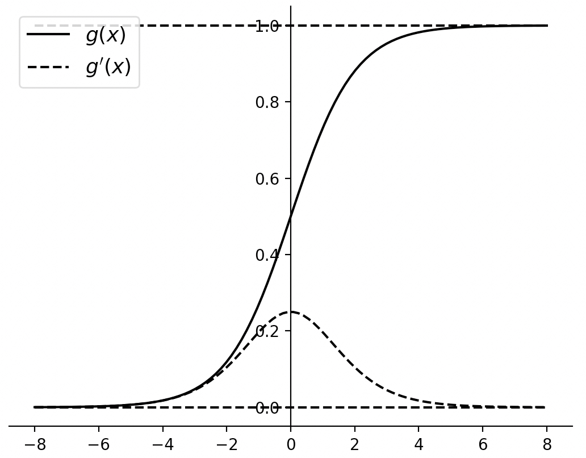
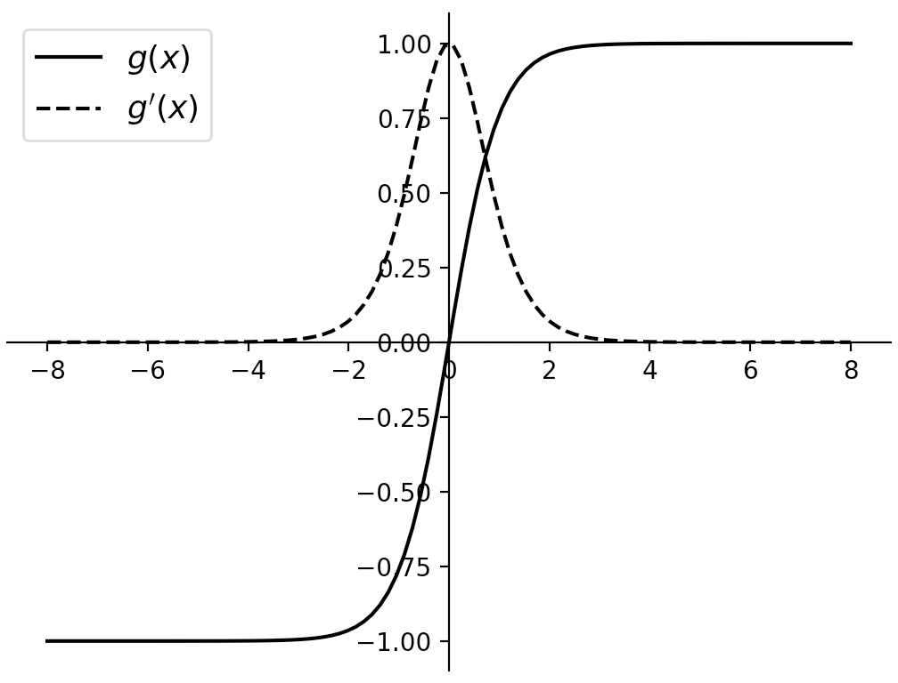
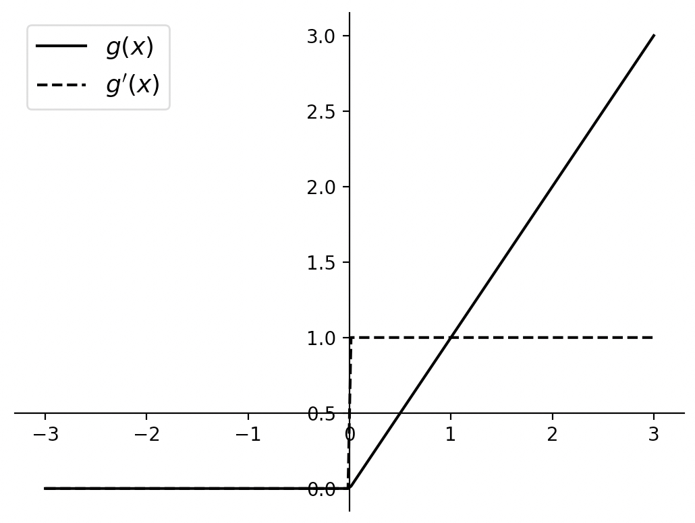
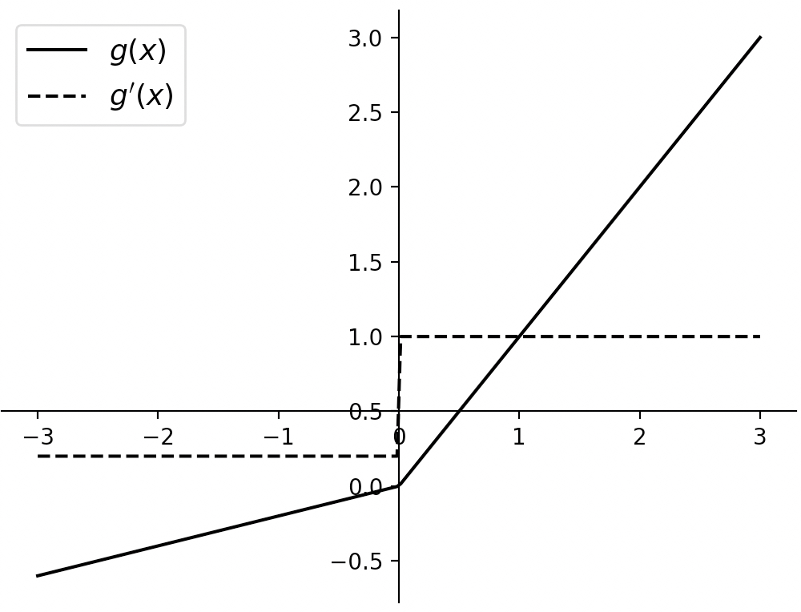

# 3.12 激活函数

在第3.1.6节内容中笔者介绍到，神经网络中多次线性组合后的输出结果仍旧只是原始特征的线性组合它并没有增加模型的复杂度。为了增加模型的表达能力需要对每一层的输出结果通过一个激活函数（Activation Function）来进行一次非线性变换然后再将其作为下一层网络的输入。在深度学习中，常见的激活函数包括Sigmoid、Tanh、ReLU和LeakyReLU等，下面笔者来分别进行介绍。

## 3.12.1 Sigmoid

**1\. 原理**

Sigmoid激活函数的作用是将神经元的输出值映射到区域$(0,1)$中，同时它是最常用的具有指数形式的激活函数，其计算过程如下所示
$$
g(x)=\frac{1}{1+e^{-x}}\tag{3-113}
$$
其导数为
$$
g^{\prime}(x)=\frac{e^{-x}}{(1+e^{-x})^2}=g(x)(1-g(x))\tag{3-114}
$$
进一步，根据式(3-113)和式(3-114)我们可以分别画出两者的函数图像，如图3-50所示。

<div align=center>

</div>
<div style="text-align: center;">
  图 3-50. Sigmoid函数图像
</div>


在图3-50中，由于经过 Sigmoid函数非线性变换后，其值域将被限定在0到1的开区间内，可以发现当输入值在0附近时，Sigmoid激活函数就类似于一个线性函数；当输入值在函数两端时，将对输入形成抑制作用，即梯度趋于0附近。根据图 3-50中 Sigmoid 激活函数的导数$g^{\prime}(x)$的图像可知，$g^{\prime}(x)\in(0,\frac{1}{4})$，即当使用Sigmoid作为激活函数时，会减缓参数的更新速度。因此，Sigmoid 激活函数的最大缺点在于当神经元的输入值过大或者过小时都容易引起神经元的饱和现象，即梯度消失问题，使得网络模型的训练过程变慢甚至停止。通常，此时我们会对输入进行标准化操作，例如将每个特征维度进行归一化操作。

**2\. 实现**

在清楚Sigmoid激活函数的基本原理之后，笔者再来介绍如何实现与使用。根据式(3-113)可知，Sigmoid的实现代码如下所示：

```python
1 def sigmoid(x):
2    return 1 / (1 + torch.exp(-x))
```

进一步，需要将Sigmoid操作当做一个网络层来进行使用，因此需要构造一个继承自`nn.Module`类，实现代码如下所示：

```python
1 class MySigmoid(nn.Module):
2     def forward(self, x):
3         return sigmoid(x)
```

最后，可以通过如下方式来进行使用：

```python
1 def test_Sigmoid():
2     x = torch.randn([2, 5], dtype=torch.float32)
3     net = nn.Sequential(MySigmoid())
4     y = net(x)
5     print(f"Sigmoid前: {x}")
6     print(f"Sigmoid后: {y}")
```

上述代码运行结束后，便可以得到类似如下所示的结果：

```python
1 Sigmoid前: tensor([[-9.01e-02,  1.11e+00, -6.33e-01,  3.26e-01, -7.47e-01],
2                    [-8.38e-01,  1.89e-01, -4.15e-01, -5.49e-01,  1.11e-04]])
3 Sigmoid后: tensor([[0.4775, 0.7525, 0.3467, 0.5810, 0.3214],
4                    [0.3034, 0.5473, 0.3977, 0.3661, 0.5000]])
```

当然，在PyTorch中还可以直接通过`nn.Sigmoid()`来使用Sigmoid激活函数。

## 3.12.2 Tanh激活函数

**1\. 原理**

Tanh激活函数也叫做双曲正切激活函数，其作用效果与Sigmoid激活函数类似且本质上仍旧属于类 Sigmoid激活函数，都是使用指数来进行非线性变换。Tanh 激活函数会将神经元的输入值压缩到 $(−1,1)$中，与Sigmoid 相比Tanh 的激活值具有更大的激活范围。 其数学定义如下
$$
g(x)=\frac{e^{x}-e^{-x}}{e^{x}+e^{-x}}\tag{3-115}
$$
其导数为
$$
g^{\prime}(x)=1-(g(x))^2\tag{3-116}
$$
进一步，根据式(3-115)和式(3-116)我们可以分别画出两者的函数图像，如图3-51所示。

<div align=center>

</div>
<div style="text-align: center;">
  图 3-51. Tanh函数图像
</div>


如图3-51所示，Tanh激活函数可以看作是放大并且平移后的 Sigmoid函数。与 Sigmoid 函数类似，当输入值在0附近时，Tanh类似于一个线性函数；当输入值在两端时，将对输入形成抑制作用。因此，当神经元的输入值过大或者过小时其依旧存在梯度消失的问题，同时其指数计算也会加大网络的计算开销。从Tanh的导数图像来看，其具有更大的梯度范围$(0,1]$，能够在网络训练时加快训练速度。

**2\. 实现**

在有了Sigmoid激活函数的实现示例后，Tanh就相对容易了。根据式(3-115)可知，Tanh的实现代码如下所示：

```python
 1 def tanh(x):
 2     p = torch.exp(x) - torch.exp(-x)
 3     q = torch.exp(x) + torch.exp(-x)
 4     return p / q
 5 
 6 class MyTanh(nn.Module):
 7     def forward(self, x):
 8         return tanh(x)
 9 
10 def test_Tanh():
11     x = torch.randn([2, 5], dtype=torch.float32)
12     net = nn.Sequential(MyTanh())
13     y = net(x)
14     print(f"Tanh前: {x}")
15     print(f"Tanh后: {y}")
```

在上述代码中，第1~4行为实现基础的Tanh计算过程；第6~8行为将其定义为一个网络层；第10~15行为使用示例，最后将会输入类似如下所示的结果：

```python
1 Tanh前: tensor([[-0.2107,  0.3643,  0.3670,  0.3385,  0.7338],
2                 [ 1.0832, -0.3375,  2.1993, -1.1353,  0.9691]])
3 Tanh后: tensor([[-0.2076,  0.3490,  0.3514,  0.3261,  0.6254],
4                 [ 0.7944, -0.3253,  0.9757, -0.8128,  0.7483]])
```

在PyTorch中可以直接通过`nn.Tanh()`来使用Tanh激活函数。

## 3.12.3 ReLU激活函数

**1\. 原理**

ReLu激活函数的全称为线性修正单元（Rectified Linear Unit, ReLU），是目前深度学习中使用最为广泛的非线性激活函数，它能够将神经元的输入值映射到$[0,+\infty)$的范围， 其数学定义如下

$$
g(x)=\begin{cases}
x,\;x\geq0\\[1ex]
0,\; x<0
\end{cases}=\max(0,x)\tag{3-117}
$$
其导数为
$$
g^{\prime}(x)=\begin{cases}
1,\;x>0\\[1ex]
0,\; x\le0
\end{cases}\tag{3-118}
$$
值得注意的是，尽管$g(x)$在$x=0$处不可导，但是在实际处理时可以取其导数为0。

进一步，根据式(3-117)和式(3-118)我们可以分别画出两者的函数图像，如图3-52所示。

<div align=center>

</div>
<div style="text-align: center;">
  图 3-52. ReLU函数图像
</div>


如图 3-52 所示，虽然ReLU激活函数整体上是一个非线性函数，但是其在原点两边均为线性函数。因此，采用 ReLU激活函数的神经元只需要进行加、乘和比较的操作，使得网络在训练过程中能够很大程度上的降低运算复杂度提高计算效率。同时从优化的角度来看，相比于Sigmoid 和Tanh激活函数的两端饱和性，ReLU激活函数为左端饱和函数，因此当$x>0$时其梯度始终为1，这在很大程度上缓解了网络梯度消失的问题， 加速了网络的收敛速度。但同时，由于ReLU激活函数在$x<0$时，其激活值始终保持为0，因此在网络的训练过程中容易造成神经元“死亡”的现象。

**2\. 实现**

根据式(3-117)可知，ReLU激活函数的实现代码如下所示：

```python
 1 def relu(x):
 2     mask = x >= 0.
 3     return x * mask
 4 
 5 class MyReLU(nn.Module):
 6     def forward(self, x):
 7         return relu(x)
 8 
 9 def test_ReLU():
10     x = torch.randn([2, 5], dtype=torch.float32)
11     net = nn.Sequential(MyReLU())
12     y = net(x)
13     print(f"ReLU前: {x}")
14     print(f"ReLU后: {y}")
```

在上述代码中，第2用于判断哪些位置上的元素大于0 ，将会返回得到一个只含True和False的向量；第3行则是计算最后的输出值，True和False将分别被视为1和1参与进行。

最终将会输出类似如下所示的结果：

```python
1 ReLU前: tensor([[ 0.4586, -2.1994,  0.6357, -1.7937,  0.1907],
2                 [ 1.1383,  0.9027,  1.8619, -0.9388, -0.1586]])
3 ReLU后: tensor([[0.4586, -0.0000, 0.6357, -0.0000, 0.1907],
4                 [1.1383, 0.9027, 1.8619, -0.0000, -0.0000]])
```

在PyTorch中也可以直接通过`nn.ReLU()`来使用ReLU激活函数。

## 3.12.4 LeakyReLU激活函数

**1\. 原理**

LeakyReLU激活函数即带泄露的修正线性单元，其总体上与 ReLU激活函数一样， 只是在$x<0$的部分保持了一个很小的梯度。这样使得神经元在非激活状态时也能有一个非零的梯度来更新参数，避免了 ReLU激活函数中神经元永远不能被激活的问题，其数学定义如下
$$
g(x)=\begin{cases}
x,\;\;\;x\geq0\\[1ex]
\gamma x,\; x<0
\end{cases}=\max(0,x)+\gamma \min(0,x)\tag{3-119}\\
$$
其导数为
$$
g^{\prime}(x)=\begin{cases}
1,\;\;\;x>0\\[1ex]
-\gamma,\;\;\; x\leq0
\end{cases}\tag{3-120}
$$
其中$\gamma\geq0$，且尽管$g(x)$在$x=0$处不可导，但是在实际处理时可以取其导数为$-\gamma$。

进一步，根据式(3-119)和式(3-120)我们可以分别画出两者的函数图像，如图3-53所示。

<div align=center>

</div>
<div style="text-align: center;">
  图 3-53. LeakeyReLU函数图像
</div>

从图3-53可知，与ReLU激活函数的主要区别在于当$x\leq0$时，LeakyReLU仍旧存在一个较小激活值$-\gamma$ ，从而不会造成神经元的“死亡”现象。

**2\. 实现**

根据式(3-119)可知，LeakyReLU激活函数的实现代码如下所示：

```python
 1 def leakyrelu(x, gamma=0.2):
 2     y = (x >= 0) * x + gamma * (x < 0) * x
 3     return y
 4 
 5 class MyLeakyReLU(nn.Module):
 6     def __init__(self, gamma=0.2):
 7         super(MyLeakyReLU, self).__init__()
 8         self.gamma = gamma
 9     def forward(self, x):
10         return leakyrelu(x, self.gamma)
11 
12 def test_LeakyReLU():
13     x = torch.randn([2, 5], dtype=torch.float32)
14     net = nn.Sequential(MyLeakyReLU(0.2))
15     y = net(x)
16     print(f"LeakyReLU前: {x}")
17     print(f"LeakyReLU后: {y}")
```

在上述代码中，第2行便是式(3-119)的实现过程；第5~10行则是将其封装为一个网络层。

最终将会输出类似如下所示的结果：

```python
1 LeakyReLU前: tensor([[-0.0888, -0.5845, -0.8447, -0.9255,  1.1864],
2                      [ 0.7030, -0.2215, -0.7323,  1.4960,  0.7068]])
3 LeakyReLU后: tensor([[-0.0178, -0.1169, -0.1689, -0.1851,  1.1864],
4                      [ 0.7030, -0.0443, -0.1465,  1.4960,  0.7068]])
```

在PyTorch中也可以直接通过`nn.LeakyReLU()`来使用LeakyReLU激活函数。

## 3.12.5 小结

在本节内容中，笔者首先回顾了在深度学习中为什么我们需要进行非线性变换；然后介分别介绍了4种常见激活函数Sigmoid、Tanh、ReLU和LeakyReLU的原理和计算过程；最后详细介绍了各个激活函数的实现过程和使用示例。
