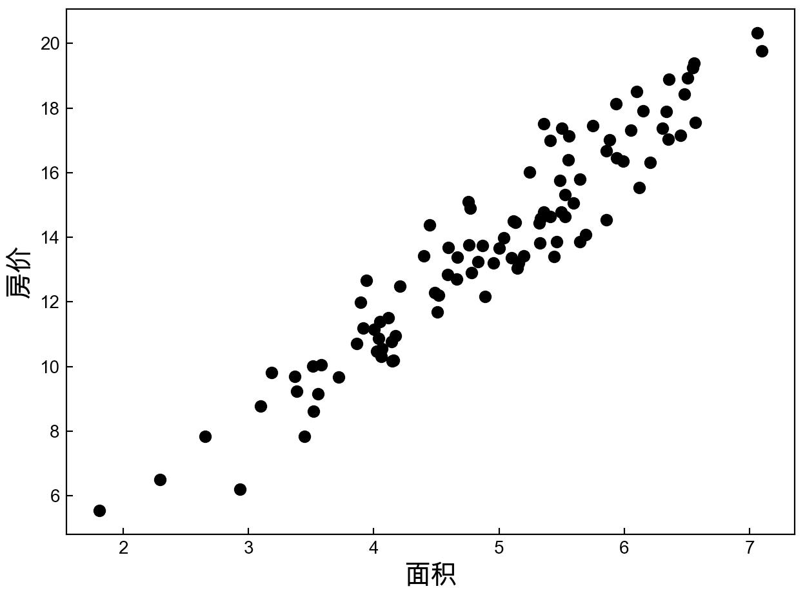
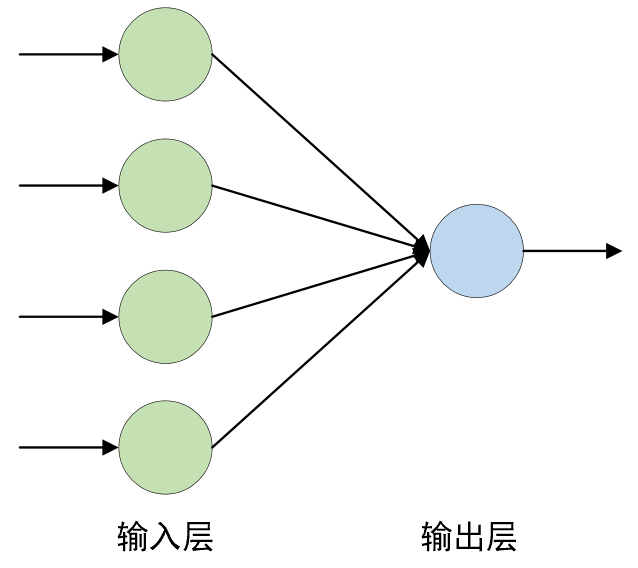
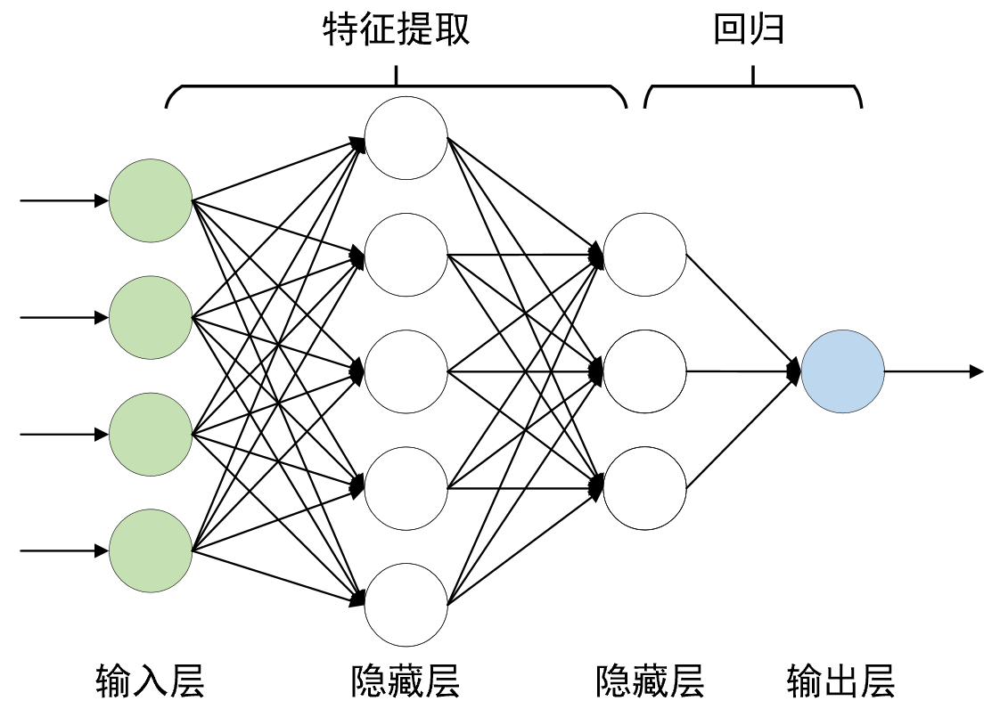

# 3.1 线性回归

经过前面预备知识的介绍，现在终于正式进入到了深度学习的内容介绍中。那什么又是深度学习呢？以及我们为什么需要深度学习呢？要想弄清楚这两个问题，我们还得先从机器学习中的线性回归说起。

## 3.1.1 理解线性回归模型

通常来讲，我们所学的每个算法都是为了解决某一类问题而诞生的。换句话说，也就是在实际情况中的确存在一些问题能够通过线性回归来解决，例如对房价的预测，但是有人可能会问，为什么对于房价的预测就应该用线性回归，而不是其他算法模型呢？其原因就在于常识告诉我们房价是随着面积的增长而增长的，且总体上呈线性增长的趋势。那有没有当面积大到一定程度后价格反而降低，因此不符合线性增长的呢？这当然也可能存在，但在实际处理中肯定会优先选择线性回归模型，当效果不佳时我们会尝试其他算法，因此，当学习过多个算法模型后，在得到某个具体的问题时，可能就需要考虑哪种模型更适合来解决这个问题了。

例如某市的房价走势如图3-1所示，其中横坐标为面积，纵坐标为价格，并且房价整体上呈线性增长的趋势。假如现在随意告诉你一个房屋的面积，要怎样才能预测（或者叫计算）出其对应的价格呢？

  图 3-1 某市的房价走势图

## 3.1.2 建立线性回归模型

一般来讲，当我们得到一个实际问题时，首先会根据问题的背景结合常识选择一个合适的模型。同时，现在常识告诉我们房价的增长更优先符合线性回归这类模型，因此可以考虑建立一个如下所示的线性回归模型（Linear Regression）。

$$
\hat{y}=h(x)=wx+b\tag{3-1}
$$
其中$w$叫权重（Weight）或模型参数（Parameter），$b$叫偏置（Bias）或者截距（Intercept）。当通过某种方法求解得到未知参数$w$和$b$之后，也就意味着我们得到了这个预测模型，即给定一个房屋面积$x$，就能够预测出其对应的房价$\hat{y}$。

注意： 在机器学习中所谓的模型，可以简单理解为一个函数。

当然，尽管影响房价的主要因素是面积，但是其他因素同样也可能影响房屋的价格。例如房屋到学校的距离、到医院的距离和到大型商场的距离等，只是各个维度对应的权重大小不同而已。虽然现实生活中一般不这么量化，但是开发商也总是会拿学区房做卖点，所以这时便有了影响房价的4个因素，而在机器学习中我们将其称为特征（Feature）或者属性（Attribute），因此，包含多个特征的线性回归就叫作多变量线性回归（Multiple Linear Regression）。

此时，便可以得到如下所示的线性回归模型。
$$
\hat{y}=h(x)={{w}_{1}}{{x}_{1}}+\cdots +{{w}_{4}}{{x}_{4}}+b=w^Tx+b\tag{3-2}
$$
其中$x_1,x_2,x_3,x_4$表示输入的4项房屋信息特征，$w_1,w_2,w_3,w_4$表示每个特征对应的权重参数，$b$ 为偏置。

并且我们还可以通过如下示意图来对式(3-2)中的模型进行表示：

    图 3-2. 房价预测线性回归结构图（偏置未画出）

## 3.1.3 求解线性回归模型

当建立好一个模型后，自然而然想到的就是如何通过给定的数据，也叫训练集（Training Data），来对模型 $h(x)$进行求解。在中学时期我们学过如何通过两个坐标点来求解过这两点的直线，可在上述的场景中这种做法显然是行不通的（因为求解线性回归模型所有的点并不在一条直线上），那有没有什么好的解决的办法呢？

此时就需要我们转换一下思路了，既然不能直接进行求解，那就换一种间接的方式。现在来想象一下，当 $h(x)$ 满足一个什么样的条件时，它才能称得上是一个好的$h(x)$？ 回想一下求解$h(x)$的目的是什么，不就是希望输入面积$x$后能够输出“准确”的房价$\hat{y}$吗？既然直接求解$h(x)$不好入手，那么我们就从“准确”来入手。

可又怎样来定义准确呢？在这里，我们可以通过计算每个样本的真实房价与预测房价之间的均方误差来对“准确”进行刻画。
$$
\begin{cases}
 J(w,b)=\frac{1}{2m}\sum\limits_{i=1}^{m}{{{({{y}^{(i)}}-{{{\hat{y}}}^{(i)}})}^{2}}}\\ 
  {{{\hat{y}}}^{(i)}}=h({{x}^{(i)}})=w^T{{x}^{(i)}}+b  
\end{cases}
\tag{3-3}
$$
其中，$m$表示样本数量； $x^{(i)}$表示第$i$个样本为一个列向量；$w$表示模型对应的参数也为一个列向量； $y^{(i)}$表示第$i$个房屋的真实价格； $y^{(i)}$表示第$i$ 个房屋的预测价格。

由式(3-3)可知，当函数$J(w,b)$取最小值时的参数$\hat{w}$和$\hat{b}$，就是要求的目标参数。为什么？因为当$J(w,b)$取最小值时就意味着此时所有样本的预测值与真实值之间的误差（Error）最小。如果极端一点，就是所有预测值都等同于真实值，那么此时的$J(w,b)$就是0了。因此，对于如何求解模型 $h(x)$ 的问题就转换成了如何最小化函数$J(w,b)$的问题，而$J(w,b)$也有一个专门的术语叫作目标函数（Objective Function）或者代价函数（Cost Function）抑或损失函数（Loss Function）。关于目标函数的求解问题将在第3.2节内容中进行介绍。

## 3.1.4 多项式回归建模

在3.1.2小节的内容中，笔者分别介绍了单变量线性回归和多变量线性回归，接下来我们开始介绍多项式回归。那什么是多项式回归呢？现在假定已知矩形的面积公式，而不知道求解梯形的面积公式，并且同时手上有若干个类似图3-3所示的梯形。已知梯形的上底和下底，并且上底均等于高。现在需要建立一个模型，当任意给定一个类似图3-3中的梯形时能近似地算出其面积。面对这样的问题该如何进行建模呢？

    图 3-3. 梯形块儿

首先需要明确的是，即使直接建模成类似于3.1.2节中的多变量线性回归模型$h(x)=w_1x_1+w_2x_2+b$也是可以的，只是效果可能不会太好。现在我们来分析一下，对于这个梯形，左边可以看成正方形，所以可以人为地构造第3个特征$(x_1)^2$，而整体也可以看成长方形的一部分，则又可以人为地构造出$x_1x_2$这个特征，最后，整体还可以看成大正方形的一部分，因此还可以构造出$(x_2)^2$这个特征。

根据上述内容可知，我们建模时除了以$x_1,x_2$作为特征外，还人为构造了$x_1x_2,x^2_1,x^2_2$这三个特征，并且后三个特征也存在着一定意义上的可解释性。因此，对于这么一个模型，我们也可以通过类似图3-4的方式进行表示：

    图 3-4. 梯形面积测线性回归结构图（偏置未画出）

此时，我们便可以建立一个如式(3-4)所示的模型
$$
h(x)=x_1w_1+x_2w_2+(x_1)^2w_3+x_1x_2w_4+(x_2)^2w_5+b\tag{3-4}
$$
此时有读者可能会问，式(3-4)中有的部分重复累加了，计算出来的面积岂不大于实际面积吗？这当然不会，因为每一项前面都有一个权重参数$w_i$做系数，只要这些权重有正有负，就不会出现大于实际面积的情况。同时，可以发现$h(x)$中包含了$x_1x_2$、$(x_1)^2$、$(x_2)^2$这些项，因此将其称为多项式回归（Polynomial Regression）。

但是，只要进行如下替换，便可回到普通的线性回归： 
$$
h(x)={{x}_{1}}{{w}_{1}}+{{x}_{2}}{{w}_{2}}+{{x}_{3}}{{w}_{3}}+{{x}_{4}}{{w}_{4}}+{{x}_{4}}{{w}_{5}}+b\tag{3-5}
$$
其中，$x_3=(x_1)^2$、$x_4=x_1x_2$、$x_5=(x_2)^2$，只是在实际建模时先要将原始两个特征的数据转化为5个特征的数据，同时在正式进行预测时，向模型$h(x)$输入的也将是包含5个特征的数据。

## 3.1.5 从特征输入到特征提取

从图3-4可以看出，尽管我们是用了5个特征作为线性回归的特征输入进行建模，但是其原始特征依旧只有$x_1,x_2$这两个。而其余的三个只是我们人为构造的，其本质就相当于我们首先以人为的方式对原始输入进行了一次特征提取，然后再以提取后的特征来进行建模。那既然如此，我们可不可以通过图3-5所示的结构图来进行建模呢？

    图 3-5. 梯形面积预测结构图（偏置并未画出）

其中左边的圆圈表示原始的输入特征，中间的圆圈表示对原始特征提取后的特征，右边圆圈表示最终的预测输出。

通过图3-5我们可以知道，该结构首先以$x_1,x_2$为基础进行特征提取得到3个不同的特征，然后再以这3个特征来建立了一个线性回归模型进行预测输出。因此，$\hat{y}$可以表示为：
$$
\begin{aligned}
a&=w_1x_1+w_2x_2+b_1\\[1ex]
b&=w_3x_1+w_4x_2+b_2\\[1ex]
c&=w_5x_1+w_6x_2+b_3\\[1ex]
\hat{y}&=w_7a+w_8b+w_9c+b_4
\end{aligned}\tag{3-6}
$$

那以图3-5所示的方式进行建模和图3-4所示的方式差别在哪儿呢？差别倒是有很多，但最大的差别在于构造特征的可解释性。也就是说，人为构造的特征一般都具有一定的可解释性，知道每个特征的含义（例如上面的$x_1x_2,x^2_1,x^2_2$）。而以图3-5中的方式得到的特征在我们直观看来并不具有可解释性（例如上面$a,b,c$这3个特征）。因此，在传统的机器学习中还专门有一个分支叫特征工程，即人为的根据原始特征来构造一系列可解释性的新特征。

那说一千道一万，到底能不能用式(3-6)的描述来进行建模呢？很遗憾，并不能。为什么呢？

根据式(3-6)可得
$$
\begin{aligned}
\hat{y} 
&= w_7(w_1x_1+w_2x_2+b_1)+w_8(w_3x_1+w_4x_2+b_2)+w_9(w_5x_1+w_6x_2+b_3)+b_4\\[1ex]
&=(w_1w_7+w_3w_8+w_5w_9)x_1+(w_2w_7+w_4w_8+w_6w_9)x_2+w_7b_1+w_8b_2+w_9b_3+b_4\\[1ex]
&=\alpha x_1+\beta x_2+\gamma
\end{aligned}\tag{3-7}
$$
由此可知，根据式(3-7)的描述，建模得到的仍旧只是一个以原始特征$x_1,x_2$为输入的线性回归模型。那图3-5这么好的结构设想难道就这么放弃？当然不会，图3-5的结构并没错，错的是式子(3-6)中的描述。

## 3.1.6 从线性输入到非线性变换

在上面我们说到，如果以式(3-6)中的描述进行建模，那么我们最终得到的仍旧只是一个简单的线性回归模型，其原因在于，通过式子(3-6)我们得到的3个特征$a,b,c$仅仅只是$x_1,x_2$之间在不同权重下的线性组合。也就是说$a,b,c$都是3个线性的特征，如果再将其进行线性组合作为输出，那么整个模型仍旧只是原始特征的线性组合，并没有增加模型的复杂度。那该怎么办呢？既然一切都是“线性”的错，那么唯有抛弃“线性”引入非线性才是解决问题的正道，而所谓非线性即是指通过一个非线性函数对原始输出进行一次变换。

如式(3-8)所示，我们只需要对$a,b,c$这3个特征再进行一次非线性变换，那么整个模型也就不可能再被化简为线性了，因此所有问题也将迎刃而解。
$$
\begin{aligned}
a&=g(w_1x_1+w_2x_2+b_1)\\[1ex]
b&=g(w_3x_1+w_4x_2+b_2)\\[1ex]
c&=g(w_5x_1+w_6x_2+b_3)\\[1ex]
\hat{y} &=w_7a+w_8b+w_9c+b_4
\end{aligned}\tag{3-8}
$$
其中$g(\cdot)$为非线性的变换操作，称之为激活函数，例如常见的sigmoid函数，这部分内容将在第xxx节中进行介绍。

## 3.1.7 单层神经网络

经过以上内容的介绍其实已经在不知不觉中将大家代入到了深度学习（Deep Learning）的领域中。所谓深度学习即是值构建一个多层神经网络（Neural Network），然后进行参数学习的过程，而“深度”只是多层神经网络的一个别称而已。因此，你还可以将深度学习称作是多层神经网络学习。

如图3-6所示的线性回归模型就是一个简单的神经网络结构图，其中每个圆圈表示一个神经元（Neural），输入层神经元的个数表示数据集的特征维度，输出层神经元的个数表示输出维度。并且尽管这里有输入层和输出层两层，但是按照惯例我们只将含有权重参数的层称为一个网络层，因此线性回归模型是一个单层的神经网络。

    图 3-6. 单层神经网络结构图（偏置未画出）

同时，需要注意的是在图3-6所示的网络结构中，输出层的所神经元和输入层的所有神经元都是完全连接。在深度学习中，如果某一层每个神经元的输入都完全依赖于上一层所有神经元的输出，那么我们就将该层称作是一个全连接层（Fully-connected Layer）或者是稠密层（Dense Layer）。例如图3-6中的输出层就是一个全连接层。

## 3.1.8 深度神经网络

所谓深度神经网络就是指网络网络层数大于2的神经网络，如图3-7所示便是一个简单的深度神经网络，其包含有3个全连接层。同时，我们将输入层与输出层之间的所有层都称为隐藏层或隐含层（Hidden Layer）。

    图 3-7. 深度神经网络结构图（偏置未画出）

这里值得注意的是，通过上面房价预测和梯形面积预测这两个例子的介绍我们可以知道，对于输出层之前的所有层，我们都可以将其看成是一个特征提取的过程，而且越靠近输出层的隐含层也就意味着提取得到的特征越抽象。当原始输入经过多层网络的特征提取后，我们就可以将提取得到的特征输入到最后一层进行相应的操作（分类或者回归等）。

到此，对于什么是深度学习以及深度学习的理念就介绍完了，这一点在第xxx节中我们还会再次提及。

## 3.1.9 小结

在本节内容中，笔者首先以房价预测为例引入了单变量线性回归以及如何转换模型的求解思路；然后通过梯形面积预测的实例引入了什么是多项式回归，并进一步引出了抽象特征提取的概念；最后顺理成章地引出了深度学习的概念，即所谓深度学习就是指将原始特征通过多层神经网络进行抽象特征提取，然后再将提取得到的特征输入到最后一层进行回归或者分类的处理过程。

