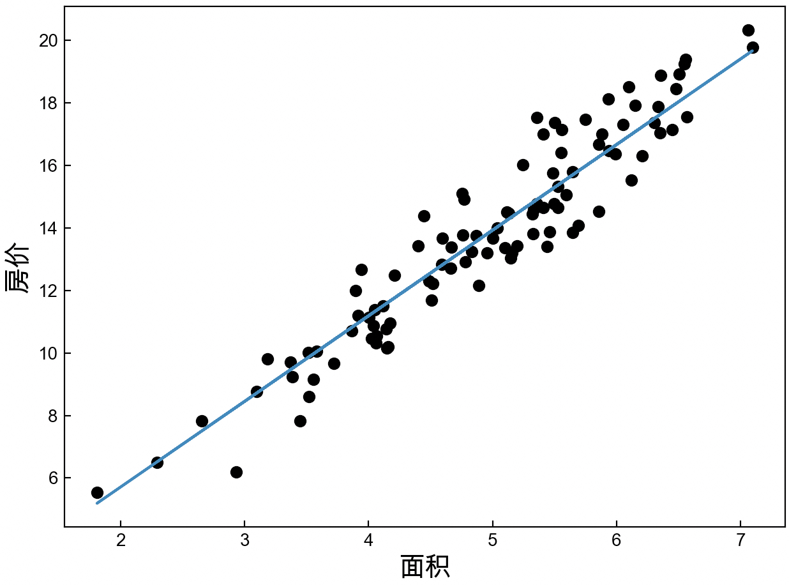
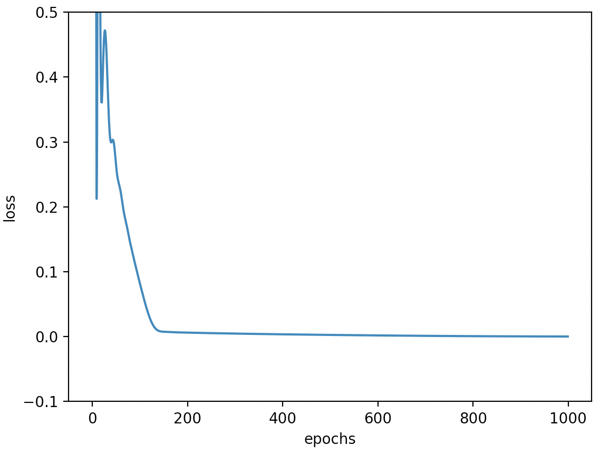

# 3.2 线性回归简洁实现

经过第3.1节内容的介绍我们对于深度学习的基本概念已经有了一定的了解，接下来笔者将开始介绍如何借助PyTorch框架来快速实现上面介绍的房价预测和梯形面积预测这两个实际示例。

## 3.2.1 PyTorch使用介绍

在正式介绍模型实现之前，我们先来看看即将需要使用到的PyTorch中相关模型接口的使用方法。

**1\. `nn.Linear()`使用**

根据图3-7可知，对于每个网络层来说均是一个全连接层，且都可以看成由多个线性组合构成。例如对于第1个全连接层来说，其输入维度为原始样本的特征维度数4，输出维度为5，即由5个线性组合构成了该全连接层。此时，我们可以通过如下方式来定义该全连接层，示例代码如下所示：

```python
1 import torch.nn as nn
2 layer = nn.Linear(4, 5) 
```

在上述代码中，第1行表示导入`torch`中的`nn`模块；第2行表示定义一个全连接层，且该全连接层的输入特征（神经元）数量为4，输出特征数量为5，且`nn.Linear()`内部已经自动随机初始化了网络层对应的权重参数。同理，对于第2个全连接层来说，其定义方式为`nn.Linear(5, 3) `。因此对于式(3-1)中的单变量线性回归来说，其定义方式为`nn.Linear(1, 1) `。

接着，我们便可以通过如下方式来完成一次全连接层的计算，示例代码如下所示：

```python
1 def test_linear():
2     x = torch.tensor([[1., 2, 3, 4], [4, 5, 6, 7]], dtype=torch.float32)  # [2,4]
3     layer = nn.Linear(4, 5)  #
4     y = layer(x)
```

在上述代码中，第2行表示定义输入样本，形状为`[2,4]`列，即样本数量为2，特征数量为4；第4行则是计算该全连接层对应的结果，输出形状为`[2,5]`。

**2\. `nn.Sequential()`使用**

此时我们已经知道了如何定义一个全连接层并完成对应的计算过程，但现在出现的一个问题是图3-7中有多个全连接网络层，该如何定义并完成整个计算过程呢？一种最接的办法就是逐层单独定义并完成相应的计算过程，示例代码如下所示：

```python
1 def multi_layers():
2     x = torch.tensor([[1., 2, 3, 4], [4, 5, 6, 7]], dtype=torch.float32)
3     layer1 = nn.Linear(4, 5)
4     layer2 = nn.Linear(5, 3)
5     layer3 = nn.Linear(3, 1)
6     y1 = layer1(x)
7     y2 = layer2(y1)
8     y3 = layer3(y2)
9     print(y3)
```

但这样的写法会略显冗余，因为对于整个计算过程来说，我们几乎很少会用到中间结果，因此可以采用省略的写法。在PyTorch中，可以通过将所有的网络层放入到一个有序的容器中，然后一次完成整个计算过程，示例代码如下所示：

```python
1 def multi_layers_sequential():
2     x = torch.tensor([[1., 2, 3, 4], [4, 5, 6, 7]], dtype=torch.float32)  # [2,4]
3     net = nn.Sequential(nn.Linear(4, 5), nn.Linear(5, 3), nn.Linear(3, 1))
4     y = net(x)
5     print(y)
```

在上述代码中，第3行中`nn.Sequential()`便是这个有序容器，通过它可以便可以完成整个3层网络的计算过程。

**3\. `nn.MSELoss()`使用**

根据第3.1.3节内容可知，在定义好一个模型之后便需要通过最小化对应的损失函数来求解得到模型对应的权重参数。在此处，我们可以通过计算预测值与真实值之间的均方误差来构造损失函数。在PyTorch中，我们可以借助`nn.MSELoss()`来实现这一目的，示例代码如下所示：

```python
1 def test_loss():
2     y = torch.tensor([1, 2, 3], dtype=torch.float32)
3     y_hat = torch.tensor([2, 2, 1], dtype=torch.float32)
4     l1 = 0.5 * torch.mean((y - y_hat) ** 2) 
5     loss = nn.MSELoss(reduction='mean')
6     l2 = loss(y, y_hat)
7     print(l1,l2)
```

在上述代码中，第2~3行表示定义真实值和预测值这两个张量；第4行表示自行实现式(3-3)中的损失计算；第5~6行表示借助PyTorch中的`nn.MSELoss()`来进行实现，其中`reduction='mean'`表示返回均值，而`reduction='sum'`表示返回和。

在上述代码运行结束后便可以得到如下结果：

```python
1 tensor(0.8333) tensor(1.6667)
```

可以发现两者并不相等，其原因在于`nn.MSELoss()`在计算损失时并没有乘以0.5这个系数，不过两者本质上并没有区别。至于式(3-3)中为什么需要乘以0.5这个系数将在[第3.3.6节](Chapter03/Ch03.3_GDandBP.md)中进行介绍。

上述示例代码可参见[Code/Chapter03/C01_OP/main.py](https://github.com/moon-hotel/DeepLearningWithMe/blob/master/Code/Chapter03/C01_OP/main.py)文件。

## 3.2.2 房价预测实现

在熟悉了`nn.Linear()`和`nn.MSELoss()`这两个模块的基本使用方法后，我们再来看如何借助PyTorch快速实现房价预测这个线性回归模型。完整示例代码可参见[Code/Chapter03/C02_HousePrice/main.py](https://github.com/moon-hotel/DeepLearningWithMe/blob/master/Code/Chapter03/C02_HousePrice/main.py)文件。

**1\. 构建数据集**

首先需要构造后续使用到的数据集，实现代码如下所示：

```python
1 def make_house_data():
2     np.random.seed(20)
3     x = np.random.randn(100, 1) + 5  # 面积
4     noise = np.random.randn(100, 1)
5     y = x * 2.8 - noise  # 价格
6     x = torch.tensor(x, dtype=torch.float32)
7     y = torch.tensor(y, dtype=torch.float32)
8     return x, y
```

在上述代码中，第2行为设置一个固定的随机种子，来使得每次产生样本保持一样；第3~5行表示随机产生100个样本点并加入相应的噪音，其中`x`表示房屋面积，`y`表示房屋价格；第6~7行表示将其转换为PyTorch中的张量，且指定类型为浮点型。第8行表示返回测试数据，两者的形状均为`[100,1]`。

**2\. 构建模型**

在构建完成数据集之后便需要构造整个单变量线性回归模型，实现代码如下所示：

```python
 1 def train(x, y):
 2     input_node = x.shape[1]
 3     output_node = 1
 4     net = nn.Sequential(nn.Linear(input_node, output_node))
 5     loss = nn.MSELoss()  # 定义损失函数
 6     optimizer = torch.optim.SGD(net.parameters(), lr=0.003)  # 定义优化器
 7     for epoch in range(40):
 8         logits = net(x)
 9         l = loss(logits, y)
10         optimizer.zero_grad()
11         l.backward()
12         optimizer.step()  # 执行梯度下降
13         print("Epoch: {}, loss: {}".format(epoch, l))
14     logits = net(x)
15     return logits.detach().numpy()
```

在上述代码中，第2~3行表示分别指定模型的输入输出特征维度，其中`x.shape[1]`表示数据集的列数（特征维度数），这里得到的结果也是1；第4行则是先定义一个全连接层，然后再将其放入到序列容器中；第5行是定义网络的损失函数；第6行是定义随机梯度下降优化器来求解模型的权重参数，其中`net.parameters()`表示得到容器中所有网络层对应的参数，`lr`表示执行梯度下降时的学习率，关于梯度下降算法的具体原理将在第3.3节内容中进行介绍；第7~13行则是迭代求解网络中的权重参数，并且整个迭代过程在深度学习中将其训练（Training），其中第8~12行也是今后所有模型训练的固定写法，各行代码的具体含义将在第3.3节内容中逐一进行介绍；第14~15行则是根据训练完成的模型来对房价进行预测，并同时返回预测后的结果。

**3\. 可视化结果**

在得到模型的预测结果后，便可以借助`matplotlib`中的`plot`模型对其进行可视化，实现代码如下所示：

```python
 1 def visualization(x, y, y_pred=None):
 2     plt.xlabel('面积', fontsize=15)
 3     plt.ylabel('房价', fontsize=15)
 4     plt.scatter(x, y, c='black')
 5     plt.plot(x, y_pred)
 6     plt.show()
 7     
 8 if __name__ == '__main__':
 9     x, y = make_house_data()
10     y_pred = train(x, y)
11     visualization(x, y, y_pred)
```

在上述代码中，第2~3行用于指定横纵坐标的显示标签；第4行是对原始样本点进行可视化；第5行则是对预测结果进行可视化；第6行表示展示所有的绘制结果。最终可视化的结果如图3-8所示。

<div align=center>

</div>
<center>
    图 3-8. 线性回归预测结果图
</center>
在图3-8中，圆点表示原始样本，直线表示模型根据输入面积预测得到的结果。

## 3.2.3 梯形面积预测实现

在介绍完上面线性回归的简洁实现示例后，对于第3.1.4节中梯形面积预测的实现过程就容易多了。完整示例代码可参见[Code/Chapter03/C03_Trapezoid/main.py](https://github.com/moon-hotel/DeepLearningWithMe/blob/master/Code/Chapter03/C03_Trapezoid/main.py)文件。

**1\. 构建数据集**

首先依旧是构建相应的梯形样本数据集，实现代码如下所示：

```python
1 def make_trapezoid_data():
2     x1 = np.random.uniform(0.5, 1.5, [50, 1])
3     x2 = np.random.uniform(0.5, 1.5, [50, 1])
4     x = np.hstack((x1, x2))
5     y = 0.5 * (x1 + x2) * x1
6     x = torch.tensor(x, dtype=torch.float32)
7     y = torch.tensor(y, dtype=torch.float32)
8     return x, y
```

在上述代码中，第2~3行为根据均匀分布在区间0.5到1.5随机生成梯形的上底和下底，且形状为50行1列向量；第4行表示将两列向量拼接在一起得到一个50行2列的矩阵；第5行表示计算梯形真实的面积；第6~8行是分别将`x`和`y`转换为PyTorch中的张量并返回。

**2\. 构建模型**

在构建完数据集之后便需要图3-5中的网络结构来构造整个多层神经网络模型，实现代码如下所示：

```python
 1 def train(x, y):
 2     input_node = x.shape[1]
 3     losses = []
 4     net = nn.Sequential(nn.Linear(input_node, 80),nn.Sigmoid(),nn.Linear(80, 1))
 5     loss = nn.MSELoss()  
 6     optimizer = torch.optim.Adam(net.parameters(), lr=0.003)  # 定义优化器
 7     for epoch in range(1000):
 8         logits = net(x)
 9         l = loss(logits, y)
10         optimizer.zero_grad()
11         l.backward()
12         optimizer.step()
13         losses.append(l.item())
14     logits = net(x)
15     l = loss(logits, y)
16     print("真实值：", y[:5].detach().numpy().reshape(-1))
17     print("预测值：", logits[:5].detach().numpy().reshape(-1))
18     return losses
```

在上述代码中，第4行表示定义整个2层的网络模型，且同时将隐藏层神经元的个数设定为了80并加入了sigmoid非线性变换；第6行是定义一个优化器来求解模型参数，<font color = red>关于Adam优化器将在第5章中进行介绍</font>；第13行则是将每一次迭代后模型的损失值进行保存，其中`item()`方法表示将PyTorch中的一个标量转换为Python中的标量，如果是向量则需要使用`.detach().numpy()`方法进行转换；第16~17行则是分别输出前5个真实值和预测值。

上述代码运行结束后便可以得到如下输出结果：

```python
1 真实值： [1.2635546  1.6118135  1.8578457  1.7236208  0.48818496]
2 预测值： [1.2622473 1.620144  1.855083  1.7280536 0.5039229]
```

从输出结果可以看出，模型的预测结果和真实值已经非常接近了。

最后，还可以对网络训练过程中保存的损失值进行可视化，如图3-9所示。

<div align=center>

</div>
<center>
    图 3-9. 梯形面积预测损失图
</center>
从图3-9可以看出，模型大约在迭代800次之后便进行入了收敛阶段。

## 3.2.4 小结

在本节内容中，笔者首先介绍了PyTorch框架中`nn.Linear()`、`nn.Sequential()`和`nn.MSELoss()`这3个模块的原理与使用示例；然后介绍了如何借助PyTorch来快速实现单变量线性回归模型以及可视化最终的预测结果；最后介绍了多项式回归的简介实现过程，并对训练过程中模型的损失变化进行可展示。