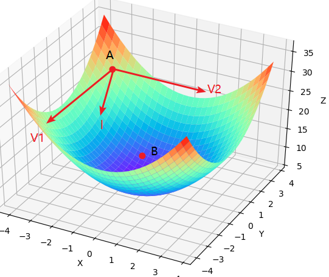
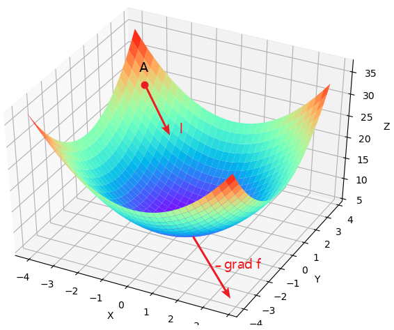
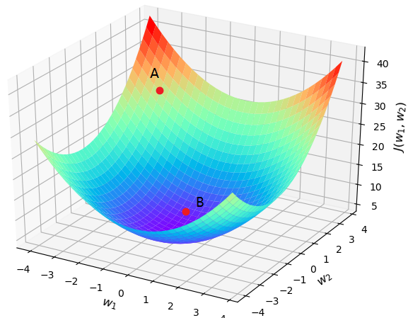
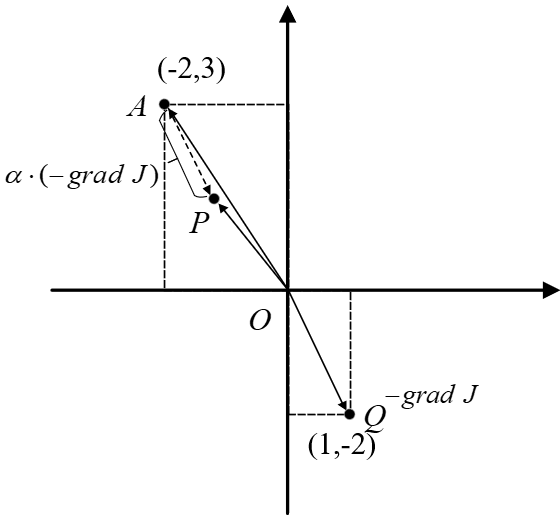
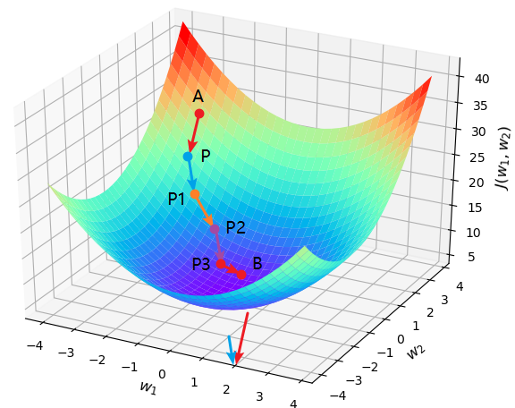
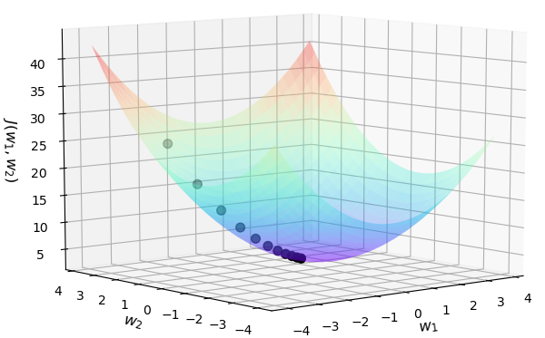

# 3.3 梯度下降与反向传播

根据第3.1.3节内容可知，求解网络模型参数的过程便是等价于最小化目标函数$J(w,b)$的过程。同时，经过第3.2节内容的介绍我们已经知道了如何借助PyTorch中的优化器来求解得到网络模型对应的权重参数，不过对于整个求解过程的具体原理并没有介绍。在第3.2节内容中，当我们定义好损失函数后直接通过两行代码便完成了模型权重参数的优化求解过程，一句是`            l.backward()`，而另一句则是` optimizer.step()`。那这两句代码又是什么意思呢？

在接下来的这节内容中，笔者将会详细介绍如何通过梯度下降算法来最小化目标函数$J(w,b)$，以及深度学习中求解网络参数梯度的利器反向传播（Back Propagation）算法。

## 3.3.1 梯度下降引例

根据上面的介绍可以知道，梯度下降算法的目的是用来最小化目标函数，也就是说梯度下降算法是一个求解的工具。当目标函数取到（或接近）全局最小值时，我们也就求解得到了模型所对应的参数。不过那什么又是梯度下降（Gradient Descent）呢？如图3-10所示，假设有一个山谷，并且你此时处于位置A处，那么请问以什么样的方向（角度）往前跳，你才能最快地到达谷底B处呢?

<div align=center>

</div>
<div style="text-align: center;">
  图 3-10 跳跃方向
</div>


现在大致有3个方向可以选择，沿着$Y$轴的$\boldsymbol{V_1}$方向，沿着$X$轴的$\boldsymbol{V_2}$方向及沿着两者间的$\boldsymbol{l}$方向。其实不用问，各位读者一定都会选择$\boldsymbol{l}$所在的方向往前跳第一步，然后接着选类似的方向往前跳第二步直到谷底。可为什么都应该这样选呢？答： 这还用问一看就知，不信请读者自己试一试。

## 3.3.2 方向导数与梯度

由一元函数导数的相关知识可知，函数$f(x)$在$x_0$处的导数反映的是$f(x)$在$x=x_0$处时的变化率；$|f^{\prime}(x_0)|$越大，也就意味着$f(x)$在该处的变化率越大，即移动$\Delta x$后产生的函数增量$\Delta y$越大。同理，在二元函数$z=f(x,y)$中，为了寻找$z$在A处的最大变化率，就应该计算函数$z$在该点的方向导数
$$
\frac{\partial f}{\partial \boldsymbol{l}}=\{\frac{\partial f}{\partial x},\frac{\partial f}{\partial y}\}\cdot \{cos\alpha ,cos\beta \}=|gradf|\cdot |\boldsymbol{l}|\cdot \cos \theta\tag{3-9}
$$
其中，$\boldsymbol{l}$为单位向量； $\alpha$和$\beta$分别为$\boldsymbol{l}$与$x$轴和$y$轴的夹角； $\theta$为梯度方向与$\boldsymbol{l}$的夹角。

根据式(3-9)可知，要想方向导数取得最大值，那么$\theta$必须为0。由此可知，只有当某点处方向导数的方向与梯度的方向一致时，方向导数在该点才会取得最大的变化率。

在图3-10中，已知$z=x^2+y^2+5$，A的坐标为$(-3,3,23)$，则，则$\partial z/\partial x=2x,\partial z/\partial y=2y$。由此可知，此时在点A处梯度的方向为$(-6,6)$，所以当你站在A点并沿各个方向往前跳跃同样大小的距离时，只有沿着$(\sqrt{2}/2,-\sqrt{2}/2)$这个方向（进行了单位化，并且同时取了相反方向，因为这里需要的是负增量）才会产生最大的函数增量$\Delta z$。

如图3-11所示，要想每次都能以最快的速度下降，则每次都必须向着梯度的反方向向前跳跃。

<div align=center>

</div>
<div style="text-align: center;">
  图 3-11 负梯度方向
</div>

## 3.3.3 梯度下降原理

介绍这么多总算是把梯度的概念讲清楚了，那么如何用具体的数学表达式进行描述呢？总不能一个劲儿地喊它“跳”对吧。为了方便后面的表述及将读者带入一个真实求解的过程中，这里先将图3-10中的字母替换成模型中的参数进行表述。

现在有一个模型的目标函数$J(w_1,w_2)=w_1^2+w_2^2+2w_2+5$（为了方便可视化，此处省略了参数$b$，但是原理都一样），其中$w_1$和$w_2$为待求解的权重参数，并且随机初始化点A为初始权重值。下面就一步步地通过梯度下降算法进行求解。

如图3-12所示，设初始点$A=(w_1,w_2)=(-2,3)$，则此时$J(-2,3)=24$，并且点$A$第一次往前跳的方向为 $-grad\;J=-(2{{w}_{1}},2{{w}_{2}}+2)=(1,-2)$ ，即$(1,-2)$这个方向。

<div align=center>

</div>
<div style="text-align: center;">
  图 3-12 梯度下降
</div>


如图3-13所示，$OQ$为平面上梯度的反方向，$AP$为其平移后的方向，但是长度为之前的$\alpha$倍，因此，根据梯度下降的原则，此时曲面上的$A$点就该沿着其梯度的反方向跳跃，而投影到平面则为$A$应该沿着$AP$的方向移动。假定曲面上从$A$点跳跃到了$P$点，那么对应在投影平面上就是图3-13中的$AP$部分，同时权重参数也从$A$的位置更新到了$P$点的位置。

<div align=center>

</div>
<div style="text-align: center;">
  图 3-13 梯度计算
</div>


从图3-13可以看出，向量$\mathbf{AP}$、$\mathbf{OA}$和$\mathbf{OP}$三者的关系为
$$
\mathbf{OP}=\mathbf{OA}-\mathbf{PA}\tag{3-10}
$$
进一步，可以将式(3-10)改写成
$$
\mathbf{OP}=\mathbf{OA}-\alpha \cdot grad\ J\tag{3-11}
$$


又由于$\mathbf{OP}$和$\mathbf{OA}$本质上就是权重参数$w_1$和$w_2$更新后与更新前的值，所以便可以得出梯度下降的更新公式为

$$
w=w-\alpha \cdot \frac{\partial J}{\partial w}\tag{3-12}
$$

其中，$w=(w_1,w_2)$，$\partial J/\partial w$为权重的梯度方向； $\alpha$为步长，用来放缩每次向前跳跃的距离，即优化器中的学习率（Learning Rate）参数。

根据式(3-12)可以得出，对于待优化求解的目标函数$J(w)$来说，如果需要通过梯度下降算法来进行求解，那么首先需要做的便是得到目标函数关于未知参数的梯度，即$\partial J/\partial w$。各位读者一定要记住这一点，在<font color = red>第XXX节</font>内容中我们也将会再次提及。

进一步，将式(3-12)代入具体数值后可以得出，曲面上的点A在第1次跳跃后的着落点为
$$
\begin{aligned}
  & {{w}_{1}}={{w}_{1}}-0.1\times 2\times {{w}_{1}}=-2-0.1\times 2\times (-2)=-1.6 \\ 
 & {{w}_{2}}={{w}_{2}}-0.1\times (2\times {{w}_{2}}+2)=3-0.1\times (2\times 3+2)=2.2 \\ 
\end{aligned}\tag{3-13}
$$
此时，权重参数便从$(-2,3)$更新为$(-1.6,2.2)$。当然其目标函数$J(w_1,w_2)$也从24更新为16.8。至此，笔者便详细地完成了1轮梯度下降的计算。当$A$跳跃到$P$之后，又可以再次利用梯度下降算法进行跳跃，直到跳到谷底（或附近）为止，如图3-14所示。

<div align=center>

</div>
<div style="text-align: center;">
  图 3-14 梯度下降
</div>

到此可以发现，利用梯度下降算法来最小化目标函数是一个循环迭代的过程。

最后，根据上述原理，还可以通过实际的代码将整个过程展示出来，完整代码见[Code/Chapter03/C04_GradientDescent/main.py](https://github.com/moon-hotel/DeepLearningWithMe/blob/master/Code/Chapter03/C04_GradientDescent/main.py)文件，梯度下降核心代码如下：

```python
 1 def compute_gradient(w1, w2):
 2     return [2 * w1, 2 * w2 + 2]
 3 
 4 def gradient_descent():
 5     w1, w2 = -2, 3
 6     jump_points = [[w1, w2]]
 7     costs,step = [cost_function(w1, w2)],0.1
 8     print("P:({},{})".format(w1, w2), end=' ')
 9     for i in range(20):
10         gradients = compute_gradient(w1, w2)
11         w1 = w1 - step * gradients[0]
12         w2 = w2 - step * gradients[1]
13         jump_points.append([w1, w2])
14         costs.append(cost_function(w1, w2))
15         print("P{}:({},{})".format(i + 1, round(w1, 3), round(w2, 3)), end=' ')
16     return jump_points, costs
```

在上述代码中，第1~2行是返回目标函数关于参数的梯度；第5~6行是初始化起始点；第7行是计算初始损失值和定义学习率为0.1，它决定了每次向前跳跃时的缩放尺度；第9~15行则是迭代整个梯度下降过程，迭代次数为20次，其中第11~12行便是执行式(3-12)中的计算过程；第16行则是返回最后得到的计算结果。

上述代码运行结束后便可以得到如下所示的结果：

```python
1 P:(-2,3) P1:(-1.6,2.2) P2:(-1.28,1.56) P3:(-1.024,1.048) P4:(-0.819,0.638) P5:(-0.655,0.311) 
2 P6:(-0.524,0.049) P7:(-0.419,-0.161) P8:(-0.336,-0.329) P9:(-0.268,-0.463) P10:(-0.215,-0.571)......
```

通过上述代码便可以详细展示跳向谷底时每一次的落脚点，并且可以看到谷底的位置就在$(-0.023,-0.954)$附近，如图3-15所示。

<div align=center>

</div>
<div style="text-align: center;">
  图 3-15 梯度下降可视化
</div>

此致，笔者就介绍完了如何通过编码实现梯度下降算法的求解过程，等后续我们再来自己编码从零完成网络模型的参数求解过程。

## 3.3.4 前向传播过程

在具体介绍网络的训练过程前，笔者先来介绍网络训练结束后的整个预测过程。假定现在有如图3-16所示的一个网络结构图。

<div align=center>

</div>
<div style="text-align: center;">
    图 3-16. 网络结构图
</div>


此时定义：$L$ 表示神经网络总共包含的层数，$S_l$ 表示第$l$层的神经元数目，$K$ 表示输出层的神经元数目，$w_{ij}^l$ 表示第$l$层第$j$个神经元与第$l+1$层第$i$个神经元之间的权重值。

此时对于图3-16所示的网络结构来说，$L=3,S_1=3$，$S_2=4,S_3=K=2$，$a^l_i$表示第$l$层第$i$个神经元的激活值（输入层$a^1_i=x_i$，输出层$a^L_i=\hat{y}_i$），$b^l_i$表示第$l$层的第$i$个偏置（未画出）。

根据图3-16所示的网络结构图，当输入1个样本对其进行预测时，那么网络第1层的计算过程可以表示成如下形式
$$
\begin{aligned}
z^2_1&=a_1^1w^1_{11}+a^1_2w^1_{12}+a^1_3w^1_{13}+b^1_1\\[1ex]
z^2_2&=a_1^1w^1_{21}+a^1_2w^1_{22}+a^1_3w^1_{23}+b^1_2\\[1ex]
z^2_3&=a_1^1w^1_{31}+a^1_2w^1_{32}+a^1_3w^1_{33}+b^1_3\\[1ex]
z^2_4&=a_1^1w^1_{41}+a^1_2w^1_{42}+a^1_3w^1_{43}+b^1_4
\end{aligned}\tag{3-14}
$$
如果是将其以矩阵的形式进行表示，则式(3-14)可以改写为
$$
\begin{bmatrix}z^2_1\\ z^2_2\\z^2_3\\z^2_4\end{bmatrix}^T
=\begin{bmatrix}a^1_1&a^1_2&a^1_3\end{bmatrix}_{1\times3}\times \begin{bmatrix}
w^1_{11}&w^1_{21}&w^1_{31}&w^1_{41}\\
w^1_{12}&w^1_{22}&w^1_{32}&w^1_{42}\\
w^1_{13}&w^1_{23}&w^1_{33}&w^1_{43}\\
\end{bmatrix}_{3\times4}+\begin{bmatrix}b^1_1\\b^1_2\\b^1_3\\b^1_4\end{bmatrix}^T\tag{3-15}
$$
进一步，将式(3-15)中的形式进行简化可以得出
$$
z^2=a^1w^1+b^1\implies a^2=f(z^2)\tag{3-16}
$$
其中，$f(\cdot)$表示激活函数，如sigmoid函数等。

同理对于第2层来说有
$$
z^3=a^2w^2+b^2\implies a^3=f(z^3)\tag{3-17}
$$
现在如果用一个通式对(3-17)进行表示的话则为
$$
\begin{aligned}
z^{l+1}_i&=a^l_1w^l_{i1}+a^l_2w^l_{i2}+\cdots+a^l_{S_l}w^l_{iS_l}+b^l\\[1ex]
z^{l+1}&=a^lw^l+b^l\\[1ex]
a^{l+1}&=f(z^{l+1})
\end{aligned}\tag{3-18}
$$

由此可以发现，上述整个计算过程，从输入到输出是根据从左到右按序计算而得到，因此，整个计算过程又被形象的叫做正向传播（Forward Propagation）或者是前向传播。

现在我们已经知道了什么正向传播过程，即当我们训练得到权重参数$w$之后便可以使用正向传播来进行预测了。进一步，我们再来看如何求解目标函数关于权重参数的梯度，以便通过梯度下降算法进行求解网络参数。

## 3.3.5 传统方式梯度求解

根据第3.3.3节内容可知，使用梯度下降求解模型参数的前提便是需要知道损失函数$J$关于权重的梯度，也就是要求得$J$关于模型中每个参数的偏导数。以图3-16所示的网络结构为例，假设网络的目标函数为均方误差损失，且同时只考虑一个样本即
$$
J(w,b)=\frac{1}{2}({y}-{\hat{y}})^{2}\tag{3-19}
$$
其中，$w$表示整个网络中的所有权重参数，$b$表示所有的偏置，$\hat{y}=a^3$。

由此根据图3-16可以发现，如果$J$对$w^1_{11}$求导，则$J$是关于$a^3$的函数，$a^3$是关于$z^3$的函数，$z^3$是关于$a^2$的函数，$a^2$是关于$z^2$的函数，$z^2$是关于$w^1_{11}$的函数。

所以根据链式求导法则有
$$
\begin{aligned}
\frac{\partial J}{\partial w^1_{11}}&=\frac{\partial J}{\partial a^3_{1}}\frac{\partial a^3_{1}}{\partial z^3_{1}}\frac{\partial z^3_{1}}{\partial a^2_1}\frac{\partial a^2}{\partial z^2_1}\frac{\partial z^2_1}{\partial w^1_{11}}+\frac{\partial J}{\partial a^3_{2}}\frac{\partial a^3_{2}}{\partial z^3_{2}}\frac{\partial z^3_{2}}{\partial a^2_1}\frac{\partial a^2}{\partial z^2_1}\frac{\partial z^2_1}{\partial w^1_{11}}\\[3ex]
\frac{\partial J}{\partial w^1_{12}}&=\frac{\partial J}{\partial a^3_{1}}\frac{\partial a^3_{1}}{\partial z^3_{1}}\frac{\partial z^3_{1}}{\partial a^2_1}\frac{\partial a^2}{\partial z^2_1}\frac{\partial z^2_1}{\partial w^1_{12}}+\frac{\partial J}{\partial a^3_{2}}\frac{\partial a^3_{2}}{\partial z^3_{2}}\frac{\partial z^3_{2}}{\partial a^2_1}\frac{\partial a^2}{\partial z^2_1}\frac{\partial z^2_1}{\partial w^1_{12}}\\
&\vdots\\
\frac{\partial J}{\partial w^2_{22}}&=\frac{\partial J}{\partial a^3_2}\frac{\partial a^3_2}{\partial z^3_2}\frac{\partial z^3_2}{\partial w^2_{22}}
\end{aligned}\tag{3-20}
$$
根据式(3-20)可以发现，当目标函数$J$对第2层的参数如$w^2_{22}$求导还相对不太麻烦，但当$J$对第1层的参数进行求导时，就做了很多重复的计算，并且这还是网络相对简单的时候，对于深度学习中动则几十上百层的网络参数，这个过程便会无从下手。显然这种求解梯度的方式是不可取的，这也是为什么神经网络在一段时间发展缓慢的原因，就是因为没有一种高效的计算梯度的方式。

## 3.3.6 反向传播过程

由式(3-20)中第1行可知，我们可以将其整理成如下形式
$$
\begin{aligned}
\frac{\partial J}{\partial w^1_{11}}&=\left(\frac{\partial J}{\partial a^3_{1}}\frac{\partial a^3_{1}}{\partial z^3_{1}}\frac{\partial z^3_{1}}{\partial a^2_1}\frac{\partial a^2}{\partial z^2_1}\right)\frac{\partial z^2_1}{\partial w^1_{11}}+\left(\frac{\partial J}{\partial a^3_{2}}\frac{\partial a^3_{2}}{\partial z^3_{2}}\frac{\partial z^3_{2}}{\partial a^2_1}\frac{\partial a^2}{\partial z^2_1}\right)\frac{\partial z^2_1}{\partial w^1_{11}}
\end{aligned}\tag{3-21}
$$
从式(3-21)可以看出，不管是从哪一条路径过来，在对$w^1_{11}$求导之前都会先到达$z^2_1$，即先对$z^2_1$求导之后，才会有$\partial z^2_1/\partial w^1_{11}$。由此可以得出，不管之前是经过什么样的路径到达$w^l_{ij}$，在对连接第$l$层第$j$个神经元与第$l+1$第$i$个神经元的参数$w^l_{ij}$求导之前，肯定会先对$z^{l+1}_i$求导。因此，对任意参数的求导过程可以改写为
$$
\frac{\partial J}{\partial w^l_{ij}}=\frac{\partial J}{\partial z^{l+1}_i}\frac{\partial z^{l+1}_i}{\partial w^l_{ij}}=\frac{\partial J}{\partial z^{l+1}_i} a^l_j\tag{3-22}
$$
例如：
$$
\frac{\partial J}{\partial w^1_{11}}=\frac{\partial J}{\partial z^{1+1}_1}\frac{\partial z^{1+1}_1}{\partial w^1_{11}}=\frac{\partial J}{\partial z^2_1}\frac{\partial z^2_1}{\partial w^1_{11}}=\frac{\partial J}{\partial z^2_1} a^1_1\tag{3-23}
$$
所以，现在的问题变成了如何快速求解式(3-22)中的$\partial J/ \partial z^{l+1}_i$部分。

从图3-16所示的网络结构可以看出，目标函数$J$对任意$z^l_i$求导时，求导路径必定会经过第$l+1$层的所有神经元，于是结合式(3-18)有
$$
\begin{aligned}
\frac{\partial J}{\partial z^l_i}&=\frac{\partial J}{\partial z^{l+1}_1}\frac{\partial z^{l+1}_1}{\partial z^l_i}+\frac{\partial J}{\partial z^{l+1}_2}\frac{\partial z^{l+1}_2}{\partial z^l_i}+s+\frac{\partial J}{\partial z^{l+1}_{S_{l+1}}}\frac{\partial z^{l+1}_{S_{l+1}}}{\partial z^l_i}\\[1ex]
&=\sum_{k=1}^{S_{l+1}}\frac{\partial J}{\partial z^{l+1}_k}\frac{\partial z^{l+1}_k}{\partial z^l_i}\\[1ex]
&=\sum_{k=1}^{S_{l+1}}\frac{\partial J}{\partial z^{l+1}_k}\frac{\partial}{\partial z^l_i}\left(a^l_1w^l_{k1}+a^l_2w^l_{k2}+s+a^l_{S_l}w^l_{kS_l}+b^l\right)\\[1ex]
&=\sum_{k=1}^{S_{l+1}}\frac{\partial J}{\partial z^{l+1}_k}\frac{\partial}{\partial z^l_i}\sum_{j=1}^{S_l}a^l_jw^l_{kj}\\[1ex]
&=\sum_{k=1}^{S_{l+1}}\frac{\partial J}{\partial z^{l+1}_k}\frac{\partial}{\partial z^l_i}\sum_{j=1}^{S_l}f(z^l_j)w^l_{kj}\\[1ex]
&=\sum_{k=1}^{S_{l+1}}\frac{\partial J}{\partial z^{l+1}_k} f^{\prime}(z^l_{i})w^l_{ki}
\end{aligned}\tag{3-24}
$$
于是此时有
$$
\frac{\partial J}{\partial z^l_i}=\sum_{k=1}^{S_{l+1}}\frac{\partial J}{\partial z^{l+1}_k}\cdot f^{\prime}(z^l_i)w^l_{ki}\tag{3-25}
$$
进一步，根据式(3-25)可以推导得出
$$
\frac{\partial J}{\partial z^{l+1}_i}=\sum_{k=1}^{S_{l+2}}\frac{\partial J}{\partial z^{l+2}_k}\cdot f'(z^{l+1}_i)w^{l+1}_{ki}\tag{3-26}
$$
为了便于书写和观察规律，我们引入一个中间变量$\delta^l_i=\frac{\partial J}{\partial z^l_i}$，则式(3-24)可以重新写为
$$
\delta^l_i=\frac{\partial J}{\partial z^l_i}=\sum_{k=1}^{S_{l+1}}\delta^{l+1}_k f^{\prime}(z^l_i)w^l_{ki}\;,\;\;(l<=L-1)\tag{3-27}
$$
需要注意的是，之所以要$l<=L-1$，是因为由式(3-24)的推导过程可知，$l$最大只能取到$L-1$，因为第$L$层后面没有网络层了。

所以，当以均方误差为损失函数时有
$$
\begin{aligned}
\delta^{L}_i&=\frac{\partial J}{\partial z^L_{i}}=\frac{\partial }{\partial z^L_{i}}\frac{1}{2}\sum_{k=1}^{S_L}(\hat{y}_k-y_k)^2\\[1ex]
&=\frac{\partial }{\partial z^L_{i}}\frac{1}{2}\sum_{k=1}^{S_L}(f(z_k^L)-y_k)^2\\[ 1ex]
&=\left[f(z^L_i)-y_i\right] f^{\prime}(z^L_i)\\[2ex]
&=\left[a^L_i-y_i\right] f^{\prime}(z^L_i)
\end{aligned}\tag{3-28}
$$
根据式(3-28)可以看出，均方误差损失函数前面乘以0.5这个系数的目的便是在求导时能消除平方项，使整个式子看起来更简洁。

同时将式(3-27)带入式(3-22)可得
$$
\frac{\partial J}{\partial w^l_{ij}}=\delta^{l+1}_i a^l_j\tag{3-29}
$$
通过上面的所有推导，由此我们可以得到如下4个迭代公式
$$
\frac{\partial J}{\partial w^l_{ij}}=\delta^{l+1}_i a^l_j\tag{3-30}
$$

$$
\frac{\partial J}{\partial b^l_{i}}=\delta^{l+1}_i\tag{3-31}
$$

$$
\delta^l_i=\frac{\partial J}{\partial z^l_i}=\sum_{k=1}^{S_{l+1}}\delta^{l+1}_k f^{\prime}\tag{3-32}(z^l_i)w^l_{ki},\;\;(0 < l \leq L-1)
$$

$$
\delta^L_i=[a^L_i-y_i] f^{\prime}(z^L_i)\tag{3-33}
$$

注：这里$\delta^L_i$的结果只是针对于损失函数为均方误差时的情况，如采用其它损失函数需根据类似式(3-28)的形式重新推导。

且式(3-30)~式(3-33)经过矢量化后的形式为
$$
\frac{\partial J}{\partial w^l}=(a^l)^T\otimes\delta^{l+1} \tag {3-34}
$$

$$
\frac{\partial J}{\partial b^l}=\delta^{l+1} \tag {3-35}
$$

$$
\delta^l=\delta^{l+1}\otimes(w^l)^T\odot f^{\prime}(z^l)\tag {3-36}
$$

$$
\delta^{L}=[a^L-y]\odot f^{\prime}(z^L)\tag {3-37}
$$

其中$\otimes$表示矩阵乘法，$\odot$表示按位乘操作。

由式(3-34)~式(3-37)分析可知，欲求$J$对$w^l$的导数，必先知道$\delta^{l+1}$；而欲知$\delta^{l+1}$，必先求$\delta^{l+2}$，以此类推。由此可知对于整个求导过程，一定是先求$\delta^L$，再求$\delta^{L-1}$，一直到$\delta^{2}$。因此，对于图3-16这样一个网络结构，整个梯度求解过程为先根据式(3-37)求解得到$\delta^{3}$；然后根据式(3-34)和式(3-35)分别求得$\partial J/\partial w^2$和$\partial J/\partial b^2$的结果；接着再根据式(3-36)并依赖$\delta^{3}$求解得到$\delta^{2}$的结果；最后再根据式(3-34)和式(3-35)分别求得$\partial J/\partial w^1$和$\partial J/\partial b^1$的结果。

此时，我们终于发现了这么一个不争的事实：①最先求解出偏导数的参数一定位于第$L-1$层上（如此处的$w^2$）；②要想求解第$l$层参数的偏导数，一定会用到第$l+1$层上的中间变量$\delta^{l+1}$（如此处求解$w^1$的导数，用到了$\delta^2$）；③整个过程是从右往左依次进行。所以，整个从右到左的计算过程又被形象地称为反向传播（Back Propagation），且$\delta^l$被称为第$l$层的“残差”（Residual）。

最后，在通过整个反向传播过程计算得到所有权重参数的梯度后，便可以根据式(3-12)中的梯度下降算法进行参数更新，而这两个计算过程对应的便是本节内容一开始所提到的`l.backward()`和`optimizer.step()`这两个操作。

## 3.3.7 小结

在本节中，笔者首先通过一个跳跃的例子详细地向大家介绍了什么是梯度，以及为什么要沿着梯度的反方向进行跳跃才能最快到底谷底；然后通过图示导出了梯度下降的更新迭代公式；最后，笔者详细介绍了网络模型的前向传播过程和反向传播过程，并推导了整个梯度的求解过程。这里，笔者需要再次强调的是，梯度下降算法的作用是用来最小化目标函数求解网络参数，而使用梯度下降算法的前提便是要知道所有参数相应的梯度，而反向传播算法正是一种高效的求解梯度的工具，千万不要把两者混为一谈。