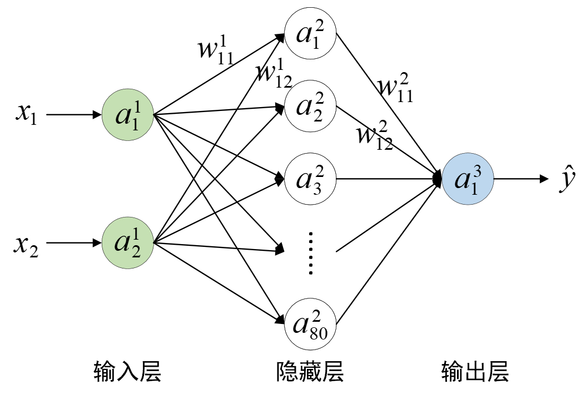
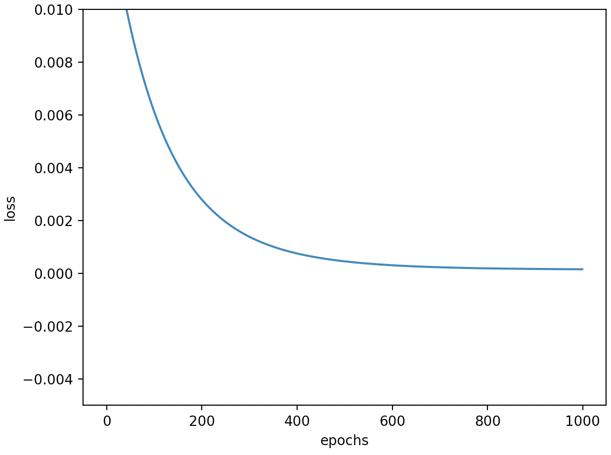

# 3.4 从零实现回归模型

经过第3.3节内容的介绍，我们已经清楚了神经网络训练的基本流程，即先进行正向传播计算预测值，然后进行反向传播计算梯度，接着根据梯度下降算法对网络中的权重参数进行更新，最后循环迭代这3个步骤，直到损失函数收敛为止。在接下来的这节内容中，笔者将会详细介绍如何从零实现第3.2.3节中的梯形面积预测实例，即一个简单的两层神经网络。

## 3.4.1 网络结构

在正式介绍实现部分之前，我们先来看一下整个模型的网络结构以及整理出前向传播和反向传播各自的计算过程。

<div align=center>

</div>
<center>
  图 3-17. 梯形面积预测网络结果图（偏置未画出）
</center>


如图3-17所示，整个网络一共包含2层，其中输入层有2个神经元，即梯形的上底（等同于高）和下底；隐藏层有80个神经元；输出层有1个神经元。由此可以得出，在第1层中$a^1$的形状为`[m,2]`（`m`为样本个数），权重$w^1$的形状为`[2,80]`，$b^1$的形状为`[80]`；在第2层中$a^2$的形状为`[m,80]`，权重$w^2$的形状为`[80,1]`，$b^2$的形状为`[1]`；最终预测输出$a^3$的形状为`[m,1]`。

进一步，可以得到模型的前向传播计算过程为
$$
z^2=a^1w^1+b^1\implies a^2=f(z^2)\tag{3-38}
$$

$$
z^3=a^2w^2+b^2\implies a^3=z^3\tag{3-39}
$$

这里需要注意的是，式(3-39中)最后一层的输出并没有经过非线性变换处理。

同时，模型的损失函数为
$$
J(w,b)=\frac{1}{2m}\sum_{i=1}^m(y_i-\hat{y}_i)^2\tag{3-40}
$$
最后，根据式(3-28)可得
$$
\delta^{3}=[a^3-y]\odot 1\tag{3-41}
$$
进一步根据式(3-34)、式(3-35)和式(3-41)可得
$$
\begin{aligned}
&\frac{\partial J}{\partial w^2}=(a^2)^T\otimes\delta^3\\[1ex]
&\frac{\partial J}{\partial b^2}=\delta^3
\end{aligned}
\tag{3-42}
$$
根据式(3-36)可得
$$
\delta^2=\delta^3\otimes(w^2)^T\odot f^{\prime}(z^2)\tag{3-43}
$$

进一步根据式(3-34)、式(3-35)和式(3-43)可得
$$
\begin{aligned}
&\frac{\partial J}{\partial w^1}=(a^1)^T\otimes\delta^2\\[1ex]
&\frac{\partial J}{\partial b^1}=\delta^2
\end{aligned}
\tag{3-44}
$$

## 3.4.2 模型实现

在完成相关迭代公式的梳理后，下面开始介绍如何从零实现这个2层神经网络模型。首先我们需要完成相关辅助函数的实现，以下完整示例代码可参见[Code/Chapter03/C05_MultiLayerReg/main.py](https://github.com/moon-hotel/DeepLearningWithMe/blob/master/Code/Chapter03/C05_MultiLayerReg/main.py)文件。

**1\. Sigmoid实现**

对于Sigmoid函数的具体介绍可参见<font color = red>第XXX节内容</font>，这里我们先直接进行使用，实现代码如下所示：

```python
1 def sigmoid(z):
2     return 1 / (1 + np.exp(-z))
```

同时，后续需要用到其对应的导数，因此也要进行实现，代码如下所示：

```python
1 def sigmoid_grad(z):
2     return sigmoid(z) * (1 - sigmoid(z))
```

**2\. 损失函数实现**

这里我们采用均方误差作为损失函数，根据式(3-40)可知，实现代码如下所示：

```python
1 def loss(y, y_hat):
2     y_hat = y_hat.reshape(y.shape)  
3     return 0.5 * np.mean((y - y_hat) ** 2)
```

在上述代码中，第2行用于将`y`和`y_hat`转换为同一个形状，否则容易出错且不易排查；第3行则是计算损失并返回结果。

**3\. 前向传播实现**

进一步，需要实现整个网络模型的前向传播过程，实现代码如下所示：

```python
1 def forward(x, w1, b1, w2, b2):  # 预测
2     a1 = x
3     z2 = np.matmul(a1, w1) + b1
4     a2 = sigmoid(z2)
5     z3 = np.matmul(a2, w2) + b2
6     a3 = z3
7     return a3, a2
```

在上述代码中，第1行中各个变量的信息在第3.4.1节内容已经介绍过这里就不再赘述；第3~4行是进行第1个全连接层的计算，对应式(3-38)中的计算过程；第5行则是进行输出层的计算，对应式(3-39)中的计算过程；第7行是返回最后的预测结果，但由于`a2`在反向传播的计算过程中需要用到，所以也进行了返回。

**4\. 反向传播实现**

接着实现反向传播用于计算参数梯度，实现代码如下所示：

```python
1 def backward(a3, w2, a2, a1, y):
2     m = a3.shape[0]
3     delta3 = (a3 - y) * 1.  # [m,output_node]
4     grad_w2 = (1 / m) * np.matmul(a2.T, delta3)
5     grad_b2 = (1 / m) * np.sum(delta3, axis=0)
6     delta2 = np.matmul(delta3, w2.T) * sigmoid_grad(a2)
7     grad_w1 = (1 / m) * np.matmul(a1.T, delta2)
8     grad_b1 = (1 / m) * np.sum(delta2, axis=0)
9     return [grad_w2, grad_b2, grad_w1, grad_b1]
```

在上述代码中，第2行表示获取样本个数；第3行则是根据式(3-41)来计算`delta3`，形状为`[m,1]`；第4~5行是根据式(3-42)来分别计算输出层参数的梯度`grad_w2`和`grad_b2`，形状分别为`[80,1]`和`[1]`，同时因为有`m`个样本所以需要取均值；第6行是根据式(3-43)来计算`delta2`，形状为`[m,80]`；第7~8行是根据式(3-44)来分别计算隐藏层参数的梯度`grad_w1`和`grad_b1`，形状分别为`[2,80]`和`[80]`；第9行则是返回最后所有权重参数对应的梯度。

**5\. 梯度下降实现**

接着实现梯度下降算法用于根据梯度更新网络中的权重参数，实现代码如下所示：

```python
1 def gradient_descent(grads, params, lr):
2     for i in range(len(grads)):
3         params[i] -= lr * grads[i]
4     return params
```

在上述代码中，第1行中的`grads`和` params`均为一个列表，分别表示所有权重参数对应的梯度以及权重参数本身，`lr`则表示学习率；第2~3行是取列表中对应的参数和梯度根据梯度下降来更新参数，这里需要注意的是传入各个参数的梯度`grads`要和`params`中参数的顺序一一对应。

**6\. 模型训练实现**

在实现完上述所有过程后便可以实现整个模型的训练过程，实现代码如下所示：

```python
 1 def train(x, y):
 2     epochs,lr = 1000, 0.05
 3     input_node,hidden_node = 2, 80
 4     output_node = 1
 5     losses = []
 6     w1 = np.random.normal(size=[input_node, hidden_node])
 7     b1 = np.random.normal(size=hidden_node)
 8     w2 = np.random.normal(size=[hidden_node, output_node])
 9     b2 = np.random.normal(size=output_node)
10     for i in range(epochs):
11         logits, a2 = forward(x, w1, b1, w2, b2)
12         l = loss(y, logits)
13         grads = backward(logits, w2, a2, x, y)
14         w2, b2, w1, b1 = gradient_descent(grads, [w2, b2, w1, b1], lr=lr)
15         if i % 10 == 0:
16             print("Epoch: {}, loss: {}".format(i, l))
17         losses.append(l)
18     logits, _ = forward(x, w1, b1, w2, b2)
19     print("真实值：", y[:5].reshape(-1))
20     print("预测值：", logits[:5].reshape(-1))
21     return losses, w1, b1, w2, b2
```

在上述代码中，第2行表示定义梯度下降迭代的轮数和学习率；第3~4行是定义网络模型的结构；第5行是定义一个列表来保存每次迭代后模型当前的损失值；第6~9行是根据正态分布来生成权重参数的初始化结果；第10~17行则是完成整个梯度下降的迭代过程，其中第11行为前向传播过程，其12行计算模型当前的损失值，第13行表示通过反向传播来计算梯度，第14行是执行梯度下降过程来更新权重参数；第15~16行表示每迭代10次输出一下损失值；第18行表示用训练好的模型对`x`进行预测；第19~20行是输出前5个样本的预测值和真实值；第21行是返回训练好的模型参数和整个训练过程中保存的损失值。

上述代码运行结束后便可得到如下输出结果：

```python
1 真实值： [1.26355453 1.61181353 1.85784564 1.7236208  0.48818497]
2 预测值： [1.25302678 1.60291594 1.85990525 1.72523891 0.50386205]
```

同时，还可以对网络模型训练过程中保存的损失值进行可视化，如图3-18所示。

<div align=center>

</div>
<center>
  图 3-18. 梯形面积预测损失图
</center>


从图3-17可以看出，模型大约在迭代1400次之后便进行入了收敛阶段。

**7\. 模型预测实现**

在完成模型训练之后，便可以将其运用在新样本上来预测其对应的结果，实现代码如下所示：

```python
1 def prediction(x, w1, b1, w2, b2):
2     x = np.reshape(x, [-1, 2])
3     logits, _ = forward(x, w1, b1, w2, b2)
4     print(f"预测结果为：\n{logits}")
5     return logits
```

在上述代码中，第1行用于传入带预测的样本点以及网络模型前向传播时所依赖的4个权重参数；第2行是确保带预测样本为`m`行两列的形式；第3行则是模型进行前向传播并返回预测得到的结果。

最后，可以通过如下代码来完成模型的训练与预测过程：

```python
1 if __name__ == '__main__':
2     x, y = make_trapezoid_data()
3     losses, w1, b1, w2, b2 = train(x, y)
4     x = np.array([[0.6, 0.8],
5                   [0.7, 1.5]])
6     prediction(x, w1, b1, w2, b2)
```

在上述代码中，第2~3行是生成模拟数据并完成模型的训练过程；第3~5行则是制作带预测的新样本的；第6行根据已训练好的网络模型来对新样本进行预测。

上述代码运行结果后便可以得到如下所示的结果：

```python
1 预测结果为：[[0.40299857] [0.82788597]]
```

到此，对于如何从零一个简单的多层神经网络就介绍完了。

## 3.4.3 小结

在本节内容中，笔者首先通过一个两层的神经网络来回顾和梳理了前向传播的详细计算过程；然后根据上节中介绍的内容导出了模型在反向传播过程中权重参数的梯度计算公式；最后，一步一步详细地介绍了如何从零开始实现这个两层神经网络，包括模型的正向传播和反向传播过程，以及如何对新样本进行预测等。