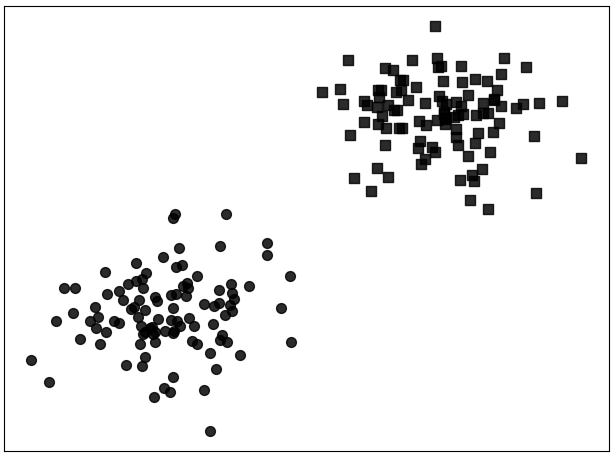
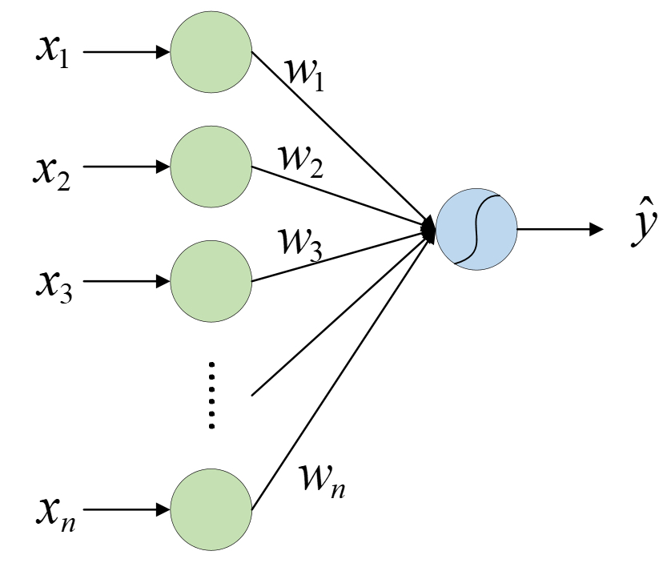
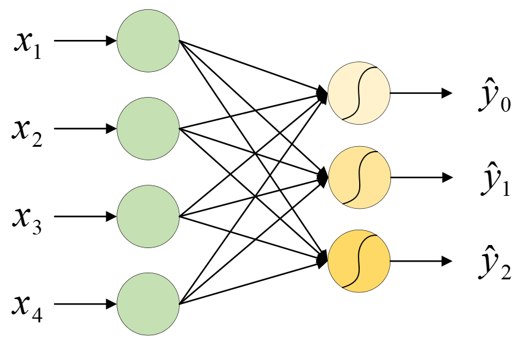
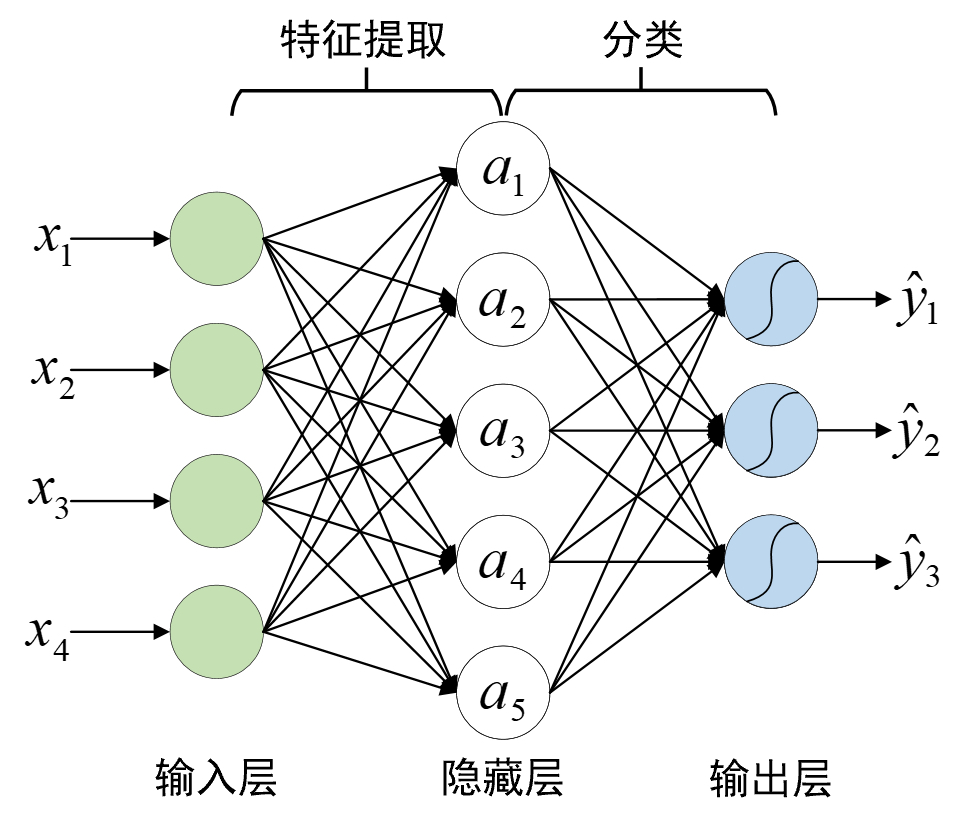
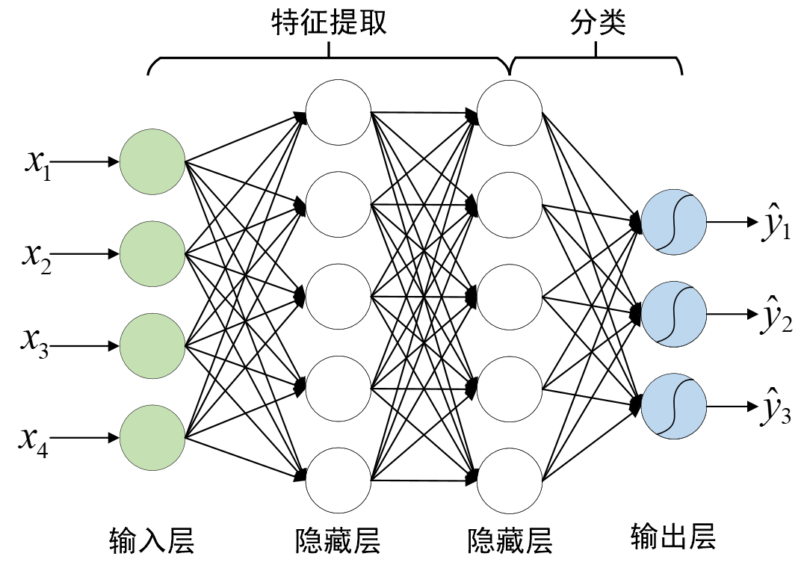

# 3.5 逻辑回归

在前面几节内容中笔者详细地介绍了线性回归模型的原理及其实现，在本节内容中将继续介绍下一个经典的机器学习算法——逻辑回归（Logistic Regression）。

## 3.5.1 理解逻辑回归模型

通常来讲，一个新算法的诞生要么用来改善已有的算法模型，要么就是首次提出用来解决一个新的问题，而逻辑回归模型恰恰属于后者，它是用来解决一类新的问题——分类（Classification）。什么是分类问题呢？

现在有两堆样本点，需要建立一个模型来对新输入的样本进行预测，判断其应该属于哪个类别，即二分类问题（Binary Classification），如图3-19所示。对于这个问题的描述用线性回归来解决肯定是不行的，因为两者本就属于不同类型的问题。退一步讲，即使用线性回归来建模得到的估计也就是一条向右倾斜的直线，而我们这里需要的却是一条向左倾斜的且位于两堆样本点之间的直线。同时，回归模型的预测值都位于预测曲线附近，而无法做到区分直线两边的东西。既然用已有的线性回归解决不了，那么我们可不可以在此基础上做一点改进以实现分类的目的呢？答案是当然可以。

<div align=center>

</div>
<center>
  图 3-19 分类任务
</center>


## 3.5.2 建立逻辑回归模型

既然是解决分类问题，那么完全可以通过建立一个模型用来预测每个样本点$(x_1,x_2)$属于其中一个类别的概率$p$，如果$p＞0.5$，我们就可以认为该样本点属于这个类别，这样就能解决上述的二分类问题了。该怎样建立这个模型呢？

在前面的线性回归中，通过建模$h(x)=wx+b$来对新样本进行预测，其输出值为可能的任意实数，但此处既然要得到一个样本所属类别的概率，那最直接的办法就是通过一个函数$g(z$)，将$x_1$和$x_2$这两个特征的线性组合映射至［0,1］的范围即可。由此，便得到了逻辑回归中的预测模型
$$
\hat{y}=h(x)=g(w_1x_1+w_2x_2+b)\tag{3-45}
$$
其中，$g(x)$同样为Sigmoid函数；$w_1$、$w_2$和$b$为未知参数； $h(x)$称为假设函数（Hypothesis），当$h(x)$大于某个值（通常设为0.5）时，便可以认为样本$x$属于正类，反之则认为属于负类。同时，也将$w_1x_1+w_2x_2+b=0$称为两个类别间的决策边界（Decision Boundary）。当求解得到$w_1$、$w_2$和$b$后，也就意味着得到了这个分类模型。

当然，如果该数据集有$n$个特征维度，那么同样只需要将所有特征的线性组合映射至区间 [0,1] 即可
$$
\hat{y}=h(x)=g({{w}_{1}}{{x}_{1}}+{{w}_{2}}{{x}_{2}}+\cdots +{{w}_{n}}{{x}_{n}}+b)\tag{3-46}
$$

同时，有了前面几节关于神经网络内容的介绍，我们还可以通过如下示意图来对式(3-46)中的模型进行表示

<div align=center>

</div>

<center>
  图 3-20 逻辑回归模型结构图（偏置未画出）
</center>


其中，输出层的曲线就表示这个映射函数$g(x)$。

## 3.5.3 求解逻辑回归模型

当建立好模型之后就需要找到一种方法来求解模型中的未知参数。同线性回归一样，此时也需要通过一种间接的方式，即通过目标函数来刻画预测标签（Label）与真实标签之间的差距。当最小化目标函数后，便可以得到需要求解的参数$w$和b。

对于逻辑回归来说，我们可以通过最小化式(3-47)中的目标函数来求解模型参数
$$
\begin{aligned}
  & J(w,b)=-\frac{1}{m}\left[ \sum\limits_{i=1}^{m}{{{y}^{(i)}}}\log h({{x}^{(i)}})+(1-{{y}^{(i)}})\log (1-h({{x}^{(i)}})) \right] \\[1ex] 
 & h({{x}^{(i)}})=g(w{{x}^{(i)}}+b)  
\end{aligned}\tag{3-47}
$$
其中，$m$表示样本总数，$x^{(i)}$表示第$i$个样本，$y^{(i)}$表示第$i$个样本的真实标签，取值为0或1，$h(x^{(i)})$表示第$i$个样本为正类的预测概率。

由式(3-47)可知，当函数$J(w,b)$取得最小值的参数$\hat{w}$和$\hat{b}$，也就是我们要求的目标参数。原因在于，当$J(w,b)$取得最小值时就意味着此时所有样本的预测标签与真实标签之间的差距最小，这同时也是最小化目标函数的意义，因此，对于如何求解模型$h(x)$的问题就转化为如何最小化目标函数$J(w,b)$的问题。

## 3.5.4 从二分类到多分类

在说完逻辑回归这个二分类模型后自然而然我们就会想到如何进行多分类的任务，因为在实际情况中，绝大多数任务场景都不会是一个简单的二分类任务。通常情况下在用逻辑回归处理多分类任务时，都会采样一种称为One-vs-all（也叫作 One-vs-rest）的方法。这种策略的核心思想是每次将其中一个类别的样本和剩余的其他类的样本两者看作一个二分类任务进行模型训练，最后在预测过程中选择输出概率值最大那个模型对应的类别作为该样本点的所属类别。

例如，对于某个包含有4个特征维度及3个类别的数据集来说，便可以建立3个二分类模型$h_0(x)$、$h_1(x)$和$h_2(x)$来完成整个3分类任务。

<div align=center>

</div>

<center>
    图 3-21. 三分类模型结构示意图（偏置未画出）
</center>


如图3-21所示便是3个逻辑回归的结构图，并且在训练模型时需要对每个样本的类标重新进行编码。例如有5个样本的原始标签为`[0,0,1,2,1]`， 那么在训练$h_0(x)$这个模型时这5个标签将会变为`[1,1,0,0,0]` 。同理，在训练$h_1(x)$和$h_2(x)$时，样本标签将会重新编码为`[0,0,1,0,1]` 和`[0,0,0,1,0]` 。最后，对于每个新样本来说，其预测结果为$h_0(x)$、$h_1(x)$和$h_2(x)$这3个模型中概率值最大的模型对应的类标。

当然，对于图3-21所示的这种表示方法来说，当分类类别较多时表示起来就不那么简洁。由于图3-21中每个模型的输入均相同，因此可以简化为如图3-22所示的形式。

<div align=center>

</div>


<center>
    图 3-22. 三分类模型结构示意图（偏置未画出）
</center>


从图3-22可以看出，此时图3-21里所示的3个模型已经被简化到了一个结构中，并且除了简化整个模型结构之外，图3-22所示的3个模型还能一次同时进行训练并输出3个结果。因此，在这样的条件下，模型训练时的样本标签将会被重新编码为另外一种形式。仍旧以上面5个样本的标签为例，第1个样本的标签将被编码为`[1,0,0]`、第2个样本的标签将被编码为`[1,0,0]`，后续3个依次为`[0,1,0]`、`[0,0,1]`和`[0,1,0]`，以此来分别与图3-22中模型的3个输出进行损失计算。同时，这种形式的编码在深度学习中被称为独热（One-hot）编码。

## 3.5.5 特征的意义

在第3.1节内容中，笔者从线性回归里的房价预测到梯形块面积介绍了输入特征对于模型预测结果的重要性，接着又从特征提取以及非线性变换的角度介绍了特征提取对于模型的重要性，最后从单层神经网络（线性回归模型）顺利的过渡到了多层神经网络，也就是深度学习的概念中，当然这样的理念也同样体现在分类模型中。

与传统的机器学习相比，深度学习最大的不同点便在于特征的可解释性。在机器学习中，我们会尽可能的要求每个特征（包括不同特征之间组合得到的新特征）都具有一定的含义。例如在第3.1.4节中介绍的梯形面积预测示例中，每个特征$x_1$和$x_2$以及手工构造出来的新特征$x_1x_2$、$x_1^2$和$x^2_2$都具有极强的可解释性。因此，在机器学习中基本上不存在所谓“抽象特征”的概念。但是，当我们用机器学习算法来做某一些分类任务时却又不得不用这些不知道什么意思的特征。

例如通过图3-22所示的模型对图3-23中的手写体数字进行分类时，通常做法就是将整个图片展开成一列64维的向量（像素值）输入到模型中进行分类。

<div align=center>

</div>

<center>
  图 3-23. 深层特征提取示意图
</center>


例如对于图3-22所示的数字8来说，其展开后的向量表示为：

```python
1 [ 0.  0. 10. 14.  8.  1.  0.  0.  0.  2. 16. 14.  6.  1.  0.  0.  0.  0.  15. 15.  8. 15.  0.  0.  0.  0.  5. 16. 16. 10.  0.  0.  0.  0. 12. 15.  15. 12.  0.  0.  0.  4. 16.  6.  4. 16.  6.  0.  0.  8. 16. 10.  8. 16.  8.  0.  0.  1.  8. 12. 14. 12.  1.  0.]
```

其含义为，图3-22中第1行第1~2个格子为0即为白色，接着第3个格子为10即灰色，且越接近16的各自颜色月偏向于黑色，其它以此类推。

如果现在让你说出上述64个特征每个特征维度的含义你能说清楚吗？显然是不能的，不过这依然不影响模型最后的分类结果，但这又是为什么呢？想一想，狗主要是靠什么来辨识事物的？对，就是味道。但我们人能通过“味道”这个特征来辨识事物吗？类似的还有蝙蝠能够通过声波这个特征来辨识事物等，而这些都是我们人所不能的。那既然是这样，为什么不可以认为是模型具备了这种我们人所不能的特征识别能力呢？

## 3.5.6 从具体到抽象

在第3.1.4节梯形块面积预测部分的内容我们说到，为了使得模型能有一个更好的预测效果，我们在原始特征$x_1,x_2$的基础上还人为构造了3个依旧可解释的特征$x_1x_2,x_1^2,x^2_2$。由此得到的是，如果仅仅只依靠原始特征来进行建模那么最后的效果往往会不尽人意。因此，在机器学习中我们通常都会在原始特征的基础上再人为构造一部分特征进行建模。但问题在于，当通过以手工的方式来构造特征是，我们的大脑会潜意识地去寻求一个具备解释性的结果，也就是新特征要具有明确的含义，而在实际中这几乎难以进行。

<div align=center>

</div>

<center>
  图 3-24. 深层特征提取示意图
</center>

如图3-24所示是利用深度卷积神经网络对图片进行特征提取后的可视化结果，其中左边是靠近输入层的特征图，右边的靠近输出层的特征图，而以人类的视角我们根本无法说出上述特征图的实际意义。

因此，人工构造特征的方法通常就会带来两个问题：①即使是在知道原始特征含义的情况下也只会构造出极少的特征，而这对深度学习来说可谓是杯水车薪；②若是在不知道原始特征含义的情况下（例如像素点），几乎不可能再构造出新的特征。那怎么办呢？既然如此，何不把这个过程交给模型自己去完成呢？

因此，对于图3-22所示的模型来说，我们可以将现有的输出（并多加几个神经元）作为原始特征组合得到的新特征，然后再将这部分特征作为输入进行分类，如图3-25所示。

<div align=center>

</div>


<center>
    图 3-25. 特征提取示意图
</center>

如图3-25所示，$a_1$到$a_5$便是原始特征输入$x_1$到$x_4$经过多次线性组合和非线性变换后所构成的新特征，而$\hat{y}_0$、$\hat{y}_1$和$\hat{y}_2$则是通过新特征进行三分类后的结果，当然这里我们并不会知道特征$a_1$到$a_5$具有什么样的实际意义。

到此，对于如何在原始特征上进行抽象特征提取的工作似乎就做完了，但此时突然从远处传来了两个声音：①图3-25在进行特征提取时能否组合得到更多的特征，例如10个或者20个？②图3-25中的示例仅仅只是进行了一次特征提取，那能不能在$a_1,a_2,\cdots,a_5$的基础上，再进行几次非线性特征提取，然后再进行最后的分类任务呢？

## 3.5.7 从浅层到深层

虽然看起来这是两个问题，但其实背后都有着同样的初衷，那就是为了得到更为丰富的特征表示，然后提高下游任务的精度。那到底那种做法会更好呢？大量的研究实验表明，第2种方式所取得的效果要远远好于第1种方法，这也是深度学习中网络层数动则几十上百层的缘故。由此我们可以知道，通过深层次的特征提取能够有效提高模型的特征表达能力。

<div align=center>

</div>


<center>
    图 3-26. 深层特征提取网络结构图
</center>

如图3-26所示，我们在图3-25的结构上又加入了一个新的非线性特征提取层，然后再将提取得到的特征进行最后的分类任务。此时可以发现，对于输出层之前的所有层，我们都可以将其看成是一个特征提取的过程，并且越靠后的隐藏层也就意味着提取得到的特征越抽象。当原始输入经过多层网络的特征提取后便可以将其输入到最后一层进行相应的操作（分类或者回归等）。因此，总结起来一句话，深度学习的核心目的就是四个字——特征提取。

## 3.5.8 小结

在本节内容中，笔者首先通过一个例子引入了什么是分类任务，介绍了为什么不能用线性回归模型进行建模的原因；然后通过对线性回归的改进得到了逻辑回归模型，并直接地给出了逻辑回归模型的目标函数；接着介绍了如何通过多个逻辑回归模型来构建多分类任务的模型；最后介绍了深度学习中特征的意义以及可以通过深层特征提取地方式来获得更为抽像和丰富特征，以此来提高模型在下游任务中的精度。

因此我们可以再次得出，所谓深度学习其实就是将原始特征通过多层神经网络进行抽象特征提取，然后再将提取得到的特征输入到最后一层进行回归或者分类处理的过程。
