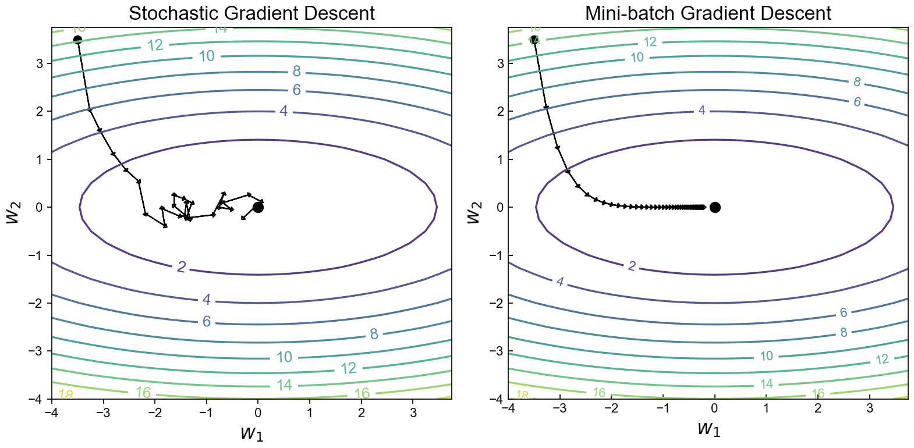
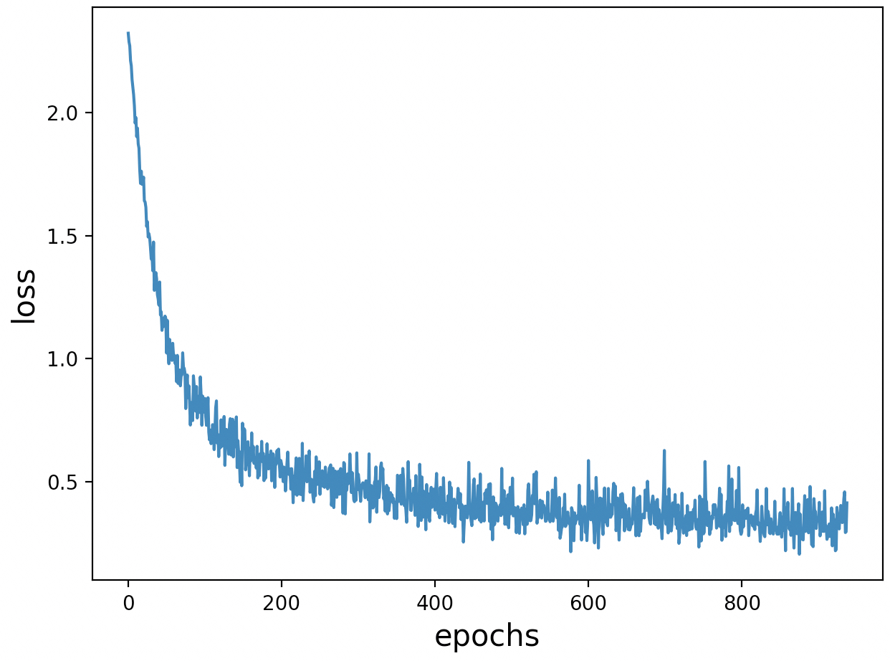

# 3.6 Softmax回归简洁实现

经过第3.5节内容的介绍对于分类模型我们已经有了一定的了解，接下来笔者将开始介绍如何借助PyTorch框架来快速实现基于Softmax回归的手写体分类任务。

## 3.6.1 PyTorch使用介绍

在第3.2.1节内容中，我们已经介绍过了PyTorch中 `nn.Linear()`和`nn.Sequential()`的用法，接下来笔者再介绍数据集迭代器`DataLoader`和分类任务中需要用到的`nn.CrossEntropyLoss()`模块的使用方式。

**1\. `DataLoader`使用**

根据第3.3节介绍的内容可知，在构造完成模型的目标函数之后便可以通过梯度下降算法来求解得到模型对应的权重参数。同时，由于在深度学习中训练集的数量巨大，很难一次同时计算所有权重参数在所有样本上的梯度，因此可以采用随机梯度下降（Stochastic Gradient Descent）或者是小批量梯度下降（Mini-batch Gradient Descent）来解决这个问题[1]。

相比于梯度下降算法在所有样本上计算得到目标函数关于参数的梯度然后再进行平均，随机梯度下降算法的做法是每次迭代时只取一个样本来计算权重参数对应的梯度[2]。由于随机梯度下降是基于每个样本进行梯度计算，所以在迭代过程中每次计算得到的梯度值抖动很大，因此在实际情况中我们会每次选择一小批量的样本来计算权重参数的梯度，而这个批量的大小在深度学习中就被称为批大小（Batch Size）。

<div align=center>

</div>
<center>
    图 3-29. 随机梯度下降与梯度下降模拟结果图
</center>

如图3-29所示，左右两边分别为随机梯度下降算法和梯度下降算法求解参数$w_1$和$w_2$的模拟过程，其中箭头方向表示负梯度方向，中间的原点表示目标函数对应的最优解。从左侧的优化过程可以看出，尽管随机梯度下降算法最终也能近似求解得到最优解，但是在整个迭代优化过程中梯度却不稳定，极有可能导致陷入局部最优解当中。但是对于梯度下降算法来说，由于其梯度是取在多个样本上的均值，因此在每次迭代过程中计算得到的梯度会相对更稳定，从而有更大的几率求解得到全局最优解。上述可视化代码可参见[Code/Chapter03/C07_DigitClassification/main.py](https://github.com/moon-hotel/DeepLearningWithMe/blob/master/Code/Chapter03/C07_DigitClassification/main.py)文件。

在PyTorch中，我们可以借助`DataLoader`模块来快速完成小批量数据样本的迭代生成，示例代码如下所示：

```python
 1 import torchvision.transforms as transforms
 2 from torch.utils.data import DataLoader
 3 from torchvision.datasets import FashionMNIST
 4 def DataLoader1():
 5     data_loader = FashionMNIST(root='~/Datasets/FashionMNIST', download=True,
 6                                transform=transforms.ToTensor())
 7     data_iter = DataLoader(data_loader, batch_size=32)
 8     for (x, y) in data_iter:
 9         print(x.shape,y.shape)
10 # 输出结果
11 torch.Size([32, 1, 28, 28]) torch.Size([32])
12 torch.Size([32, 1, 28, 28]) torch.Size([32])
13 ......
```

在上述代码中，第5~6行表示载入PyTorch中内置的FashionMNIST手写体图片（见图3-25）数据集，`root`参数为指定数据集所在的目录，`download`为`True`表示指定目录不存在时通过网络下载，`transform`用于指定对原始数据进行的变化（这里仅仅是将原始的浮点数转换成PyTorch中的张量）；第7行便是通过`DataLoader`来根据上面载入的原始数据构造一个批大小为32的迭代器；第8~9行则是用于遍历这个迭代器；第11~12行便是遍历迭代器所输出的结果，其中`[32,1,28,28]`的含义便是该张量中有32个样本（即32张图片），每张图片的通道数为1（黑白），长和宽均为28个像素点。

当然，此时可能有读者会问，如果我们载入本地的数据样本又该怎么来构造这个迭代器呢？

对于这种非PyTorch内置数据集的情况，我们同样可以通过`DataLoader`来完成迭代器的构建，只是前面多了一个步骤，示例代码如下所示：

```python
 1 from torch.utils.data import TensorDataset
 2 import torch
 3 import numpy as np
 4 def DataLoader2():
 5     x = torch.tensor(np.random.random([100, 3, 16, 16]))
 6     y = torch.tensor(np.random.randint(0, 10, 100))
 7     dataset = TensorDataset(x, y)
 8     data_iter = DataLoader(dataset, batch_size=32)
 9     for (x, y) in data_iter:
10         print(x.shape, y.shape)
11 #
12 torch.Size([32, 3, 16, 16]) torch.Size([32])
13 torch.Size([32, 3, 16, 16]) torch.Size([32])
14 ......
```

在上述代码中，第5~6行用于生成原始的样本数据，并转换成张量；第7行则是根据原始数据得到实例化的`TensorDataset`（继承自`Dataset`），因为`FashionMNIST`本质上也是继承自类`Dataset`；第8行则同样是生成对应的迭代器，并指定批大小为32；第12~13行便是最终遍历迭代器所输出的结果，含义同上不再赘述。上述示例代码可参见[Code/Chapter03/Code/Chapter03/C09_DataLoader/main.py](https://github.com/moon-hotel/DeepLearningWithMe/blob/master/Code/Chapter03/Code/Chapter03/C09_DataLoader/main.py)文件。

**2\. `nn.CrossEntropyLoss()`使用**

根据第3.5.5节内容可知，在分类任务中我们通常会使用交叉熵来作为目标函数，并且在计算交叉熵损失之前需要对预测概率进行Softmax归一化操作。在PyTorch中，我们可以借助`nn.CrossEntropyLoss()`模块来一次完成这两步计算过程，示例代码如下所示：

```python
1 if __name__ == '__main__':
2     logits = torch.tensor([[0.5, 0.3, 0.6], [0.5, 0.4, 0.3]])
3     y = torch.LongTensor([2, 0])
4     loss = nn.CrossEntropyLoss(reduction='mean')
5     l = loss(logits, y)
6     print(l)
7 # tensor(0.9874)
```

在上述代码中，第2行是模拟的模型输出结果，包含2个样本3个类别；第3行表示两个样本的正确类标，需要注意的是`nn.CrossEntropyLoss()`在计算交叉熵损失时接受的正确标签是非One-hot的编码形式；第4行则是实例化`CrossEntropyLoss`类对象，其中`reduction='mean'`表示返回所有样本损失的均值，如果`reduction='sum'`则表示返回所有样本的损失和；第5~6表示计算交叉熵并输出计算后的结果。

上述示例代码可参见[Code/Chapter03/C10_CrossEntropy/main.py](https://github.com/moon-hotel/DeepLearningWithMe/blob/master/Code/Chapter03/C10_CrossEntropy/main.py)文件。

## 3.6.2 手写是分类实现

在熟悉了`DataLoader`和`nn.CrossEntropyLoss()`这两个模块的基本使用方法后，我们再来看如何借助PyTorch快速实现基于Softmax回归的手写体分类任务。完整示例代码可参见[Code/Chapter03/C11_DigitClassification/main.py](https://github.com/moon-hotel/DeepLearningWithMe/blob/master/Code/Chapter03/C11_DigitClassification/main.py)文件。

**1\. 构建数据集**

首先需要构造后续使用到的数据集，实现代码如下所示：

```python
1 def load_dataset():
2     data = MNIST(root='~/Datasets/MNIST', download=True,
3                  transform=transforms.ToTensor())
4     return data
```

**2\. 构建模型**

在完成数据集构建后，便需要构造整个Softmax回归模型，实现代码如下所示：

```python
 1 def train(data):
 2     epochs,lr = 2,0.001
 3     batch_size = 128
 4     input_node,output_node = 28 * 28, 10
 5     losses = []
 6     data_iter = DataLoader(data, batch_size=batch_size, shuffle=True)
 7     net = nn.Sequential(nn.Flatten(),nn.Linear(input_node, output_node))
 8     loss = nn.CrossEntropyLoss()  # 定义损失函数
 9     optimizer = torch.optim.SGD(net.parameters(), lr=lr)  # 定义优化器
10     for epoch in range(epochs):
11         for i, (x, y) in enumerate(data_iter):
12             logits = net(x)
13             l = loss(logits, y)
14             optimizer.zero_grad()
15             l.backward()
16             optimizer.step()  # 执行梯度下降
17             acc = (logits.argmax(1) == y).float().mean().item()
18             print(f"Epochs[{epoch + 1}/{epochs}]--batch[{i}/{len(data_iter)}]"
19                   f"--Acc: {round(acc, 4)}--loss: {round(l.item(), 4)}")
20             losses.append(l.item())
21     return losses
```

在上述代码中，第2行中`epochs`表示在整个数据集上迭代训练多少轮；第3行中`batch_size`便是第3.6.1节介绍的样本批大小；第4行中`input_node`和`output_node`分别用于指定网络输入层神经元（特征）个数，和输出层神经元（分类）个数；第6行是用来构造返回小批量样本的迭代器；第7行是定义整个网络模型；第8行为定义损失函数，默认情况下返回的是每个小批量样本损失的均值；第9行是实例化优化器；第11~20行则是每次通过小批量样本来迭代更新网络中的权重参数，其中第12~13行分别是前向传播及损失计算，第14行是将前一次迭代中每个参数计算得到的梯度置零，第15~16行则是进行反向传播和梯度下降；第17行是计算在每个小批量样本上预测结果应对的准确率，关于准确率的介绍将在<font color = red>第XXX节中进行介绍</font>，简单来将就是预测正确的样本数除以总的样本数；第20~21行则是保存每次前向传播时网络的损失值并返回。

在完成上述代码后，便可以通过如下方式来完成整个模型的训练过程：

```python
1 if __name__ == '__main__':
2     data = load_dataset()
3     losses = train(data)
4     visualization_loss(losses)
```

在上述代码运行结束后，便可以得到类似如下所示的输出结果：

```python
1 Epochs[1/2]--batch[0/469]--Acc: 0.1172--loss: 2.3273
2 Epochs[1/2]--batch[1/469]--Acc: 0.1328--loss: 2.2881
3 ...
4 Epochs[2/2]--batch[466/469]--Acc: 0.9141--loss: 0.4141
5 Epochs[2/2]--batch[467/469]--Acc: 0.8438--loss: 0.5982
6 Epochs[2/2]--batch[468/469]--Acc: 0.8958--loss: 0.3955
```

最后，还可以对网络训练过程中保存的损失值进行可视化，如图3-30所示。

<div align=center>

</div>
<center>
    图 3-30. 手写体分类模型训练损失图
</center>

从图3-30可以看出，模型大约在迭代800次后便逐步进行入了收敛阶段。

## 3.6.3 小结

在本节内容中，笔者首先介绍了什么是随机梯度下降和小批量梯度下降，并顺利的引出了PyTorch框架中`DataLoader`模块；然后介绍了PyTorch中用于计算分类任务模型损失的`nn.CrossEntropyLoss()`模块及其使用示例；最后详细介绍了如何借助PyTorch来快速实现基于Softmax回归的手写体分类模型。

# 引用

[1] 动手学深度学习，阿斯顿·张、李沐、扎卡里 C. 立顿、亚历山大 J. 斯莫拉，人民邮电出版社. 

[2] Deep Learning, Yann LeCun, Alfredo Canziani,  NYU,  Spring 2020.


