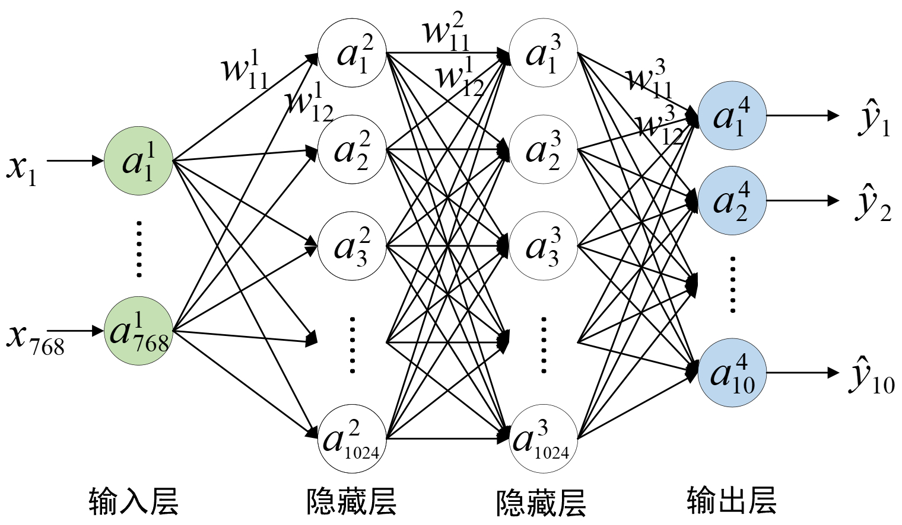

# 3.7 从零实现分类模型

经过第3.5节内容的介绍，我们已经清楚了深度学习中分类模型的基本原理，同时也掌握了如何快速通过PyTorch来实现Softmax回归模型。在接下来的这节内容中，笔者将会详细介绍如何从零实现基于多层神经网络的手写体分类模型。

## 3.7.1 网络结构

在正式介绍实现部分之前，我们先来看一下整个模型的网络结构以及整理出前向传播和反向传播各自的计算过程。

<div align=center>

</div>
<center>
  图 3-31. 手写体识别网络结构图（偏置未画出）
</center>
如图3-31所示，整个网络一共包含3层（含有权重参数的层），其中输入层有784个神经元，即长宽均为28的图片展开后的向量维度；两个隐藏层均有1024个神经元；输出层有10个神经元，即分类类别数量。由此可以得出，在第1层中$a^1$的形状为`[m,784]`（`m`为样本个数），权重$w^1$的形状为`[784,1024]`，$b^1$的形状为`[1024]`；在第2层中$a^2$的形状为`[m,1024]`，权重$w^2$的形状为`[1024,1024]`，$b^2$的形状为`[1024]`；在第3层中$a^3$的形状为`[m,1024]`，权重$w^3$的形状为`[1024,10]`，$b^3$的形状为`[10]`；最终预测输出$a^4$的形状为`[m,10]`。

进一步，可以得到模型的前向传播计算过程为
$$
z^2=a^1w^1+b^1\implies a^2=f(z^2)\tag{3-54}
$$

$$
z^3=a^2w^2+b^2\implies a^3=f(z^3)\tag{3-55}
$$

$$
z^4=a^3w^3+b^3\implies a^4=\text{Softmax}(z^4)\tag{3-56}
$$

其中，$f(\cdot)$表示非线性变换，$\text{Softmax}$的计算公式为
$$
a^L_k=\frac{e^{z^L_k}}{\sum_{i=1}^{S_L}e^{z^L_i}}\tag{3-57}
$$
同时，模型的损失函数为式(3-53)中所示的交叉熵损失函数。并且如果假设此时我们仅考虑一个样本，那么对应的目标函数则为
$$
J(w,b)=-\sum_{k=1}^{S_L}y_k\cdot\log{a^L_k\tag{3-58}}
$$

其中$S_L=10$表示输出层对应神经元的个数，$L=4$表示输出层。

进一步，根据式(3-58)可得目标函数$J$关于$z^L_i$的梯度，即
$$
\begin{aligned}
\delta^{L}_i&=\frac{\partial J}{\partial z^L_i}=\frac{\partial J}{\partial a^L_1}\frac{\partial a^L_1}{\partial z^L_i}+\frac{\partial J}{\partial a^L_2}\frac{\partial a^L_2}{\partial z^L_i}+\cdots+\frac{\partial J}{\partial a^L_{S_L}}\frac{\partial a^L_{S_L}}{\partial z^L_i}\\[2ex]
&=\sum_{k=1}^{S_L}\frac{\partial J}{\partial a^L_k}\frac{\partial a^L_k}{\partial z^L_i}
\end{aligned}
\tag{3-59}
$$
由图3-31可知，$J$关于任何一个输出值$a^L_i$的梯度均只有一条路径上的依赖关系，其计算过程也就相对简单，即
$$
\begin{aligned}
\frac{\partial J}{\partial a^L_i}&=\frac{\partial }{\partial a^L_i}\left[-\sum_{k=1}^{S_L}y_k\cdot\log{a^L_k}\right]\\[2ex]
&=-y_i\frac{1}{a^L_i}
\end{aligned}\tag{3-60}
$$
接下来，需要求解的便是$a^L_i$关于$z^L_j$的梯度（此处不要被各种下标所迷惑，一定要结合式(3-57)进行理解）。例如在求解$a^4_1$关于$z^4_2$的梯度时，根据式(3-57)可知，此时的分子与$e^{z^4_1}$是没关系的（即分子$e^{z^4_1}$看作是常数）；但是在求解$a^4_1$关于$z^4_1$的梯度时，此时的分子就不能看作是常数了。具体有

当$i\neq j$时：
$$
\frac{\partial a^L_i}{\partial z^L_j}=\frac{\partial}{\partial z^L_j}\frac{e^{z^L_i}}{\sum_{k=1}^{S_L}e^{z^L_k}}=\frac{0-e^{z^L_i}e^{z^L_j}}{\left(\sum_{k=1}^{S_L}e^{z^L_k}\right)^2}=-a^L_ia^L_j\tag{3-61}
$$
当$i=j$时：
$$
\begin{aligned}
\frac{\partial a^L_i}{\partial z^L_j}&=\frac{\partial}{\partial z^L_j}\frac{e^{z^L_i}}{\sum_{k=1}^{S_L}e^{z^L_k}}=\frac{e^{z^L_i}\sum_{k=1}^{S_l}e^{z^L_k}-(e^{z^L_i})^2}{\left(\sum_{k=1}^{S_L}e^{z^L_k}\right)^2}\\[2ex]
&=\frac{e^{z^L_i}}{\sum_{k=1}^{S_L}e^{z^L_k}}\left(1-\frac{e^{z^L_i}}{\sum_{k=1}^{S_L}e^{z^L_k}}\right)=a^L_i(1-a^L_i)
\end{aligned}\tag{3-62}
$$
进一步，由式(3-59)~式(3-62)便可以得到
$$
\begin{aligned}
\delta^{L}_i&=\frac{\partial J}{\partial z^L_j}=\sum_{i=1}^{S_L}\frac{\partial J}{\partial a^L_i}\frac{\partial a^L_i}{\partial z^L_j}=\sum_{i\neq j}\frac{\partial J}{\partial a^L_i}\frac{\partial a^L_i}{\partial z^L_j}+\frac{\partial J}{\partial a^L_i}\frac{\partial a^L_i}{\partial z^L_j}\\[2ex]
&=\sum_{i\neq j}y_i\frac{1}{a^L_i}a^L_ia^L_{j}+\left[-y_{j}\frac{1}{a^L_{j}}a^L_{j}(1-a^L_{j})\right]\\[2ex]
&=\sum_{i\neq j}y_ia^L_{j}+y_{j}a^L_{j}-y_{j}\\[1ex]
&=a^L_j\sum_{i=1}^{S_L}y_i-y_j\\[2ex]
&=a^L_j-y_j
\end{aligned}\tag{3-63}
$$

在对式(3-63)进行矢量化表示有
$$
\delta^{L}=a^L-y\tag{3-64}
$$
由此，我们便得到了在Softmax作用下，利用反向传播算法对交叉熵损失函数关于所有参数进行梯度求解的计算公式。

对于第3层中的参数来说有
$$
\begin{aligned}
\delta^{4}&=a^4-y\\[2ex]
\frac{\partial J}{\partial w^3}&=(a^3)^T\otimes\delta^4\\[2ex]
\frac{\partial J}{\partial b^3}&=\delta^4
\end{aligned}
\tag{3-65}
$$
对于第2层中的参数来说有
$$
\begin{aligned}
\delta^3&=\delta^4\otimes(w^3)^T\odot f^{\prime}(z^3)\\[2ex]
\frac{\partial J}{\partial w^2}&=(a^2)^T\otimes\delta^3\\[2ex]
\frac{\partial J}{\partial b^2}&=\delta^3
\end{aligned}
\tag{3-66}
$$
对于第1层中的参数来说有
$$
\begin{aligned}
\delta^2&=\delta^3\otimes(w^2)^T\odot f^{\prime}(z^2)\\[2ex]
\frac{\partial J}{\partial w^1}&=(a^1)^T\otimes\delta^2\\[2ex]
\frac{\partial J}{\partial b^1}&=\delta^2
\end{aligned}
\tag{3-67}
$$
下面，笔者就来介绍如何编码实现整个网络模型。

## 3.7.2 模型实现

在完成相关迭代公式的梳理后，下面开始介绍如何从零实现这个3层网络的分类模型。首先我们需要完成相关辅助函数的实现，以下完整示例代码可参见[Code/Chapter03/C12_MultiLayerCla/main.py](https://github.com/moon-hotel/DeepLearningWithMe/blob/master/Code/Chapter03/C12_MultiLayerCla/main.py)文件。

**1\. 数据集构建实现**

这里，我们依旧使用之前的MNIST数据集来进行建模，同时由于不再借助PyTorch框架所以需要将原始数据转换为`numpy`中的`arry`类型，实现代码如下所示：

```python
 1 def load_dataset():
 2     data = MNIST(root='~/Datasets/MNIST', download=True,
 3                  transform=transforms.ToTensor())
 4     x, y = [], []
 5     for img in data:
 6         x.append(np.array(img[0]).reshape(1, -1))
 7         y.append(img[1])
 8     x = np.vstack(x)
 9     y = np.array(y)
10     return x, y
```

在上述代码中，第5~7行表示遍历原始数据中的每个样本得到输入和标签，并直接将图片拉伸成一个784维的向量；第8~9行则是分别将输入和标签转换成`np.array`类型。最终，`x`和`y`的形状分别为`(60000, 784)`和`(60000,)`。

**2\. 迭代器实现**

由于不再借助PyTorch中的`DataLoader`模块，所以我们需要自己来实现一个迭代器，实现代码如下所示：

```python
 1 def gen_batch(x, y, batch_size=64):
 2     s_index, e_index = 0, 0 + batch_size
 3     batches =  len(y) // batch_size
 4     if batches * batch_size < len(y):
 5         batches += 1
 6     for i in range(batches):
 7         if e_index > len(y):
 8             e_index = len(y)
 9         batch_x = x[s_index:e_index]
10         batch_y = y[s_index: e_index]
11         s_index, e_index = e_index, e_index + batch_size
12         yield batch_x, batch_y
```

在上述代码中，第1行`x`和`y`分别表示上面构建得到的数据和标签；第2行用来标识取每个batch样本时的开始和结束索引；第3~5行用来判断，当样本数不能被`batch_size`整除时的特殊情况；第6~11行是按索引依次取每个batch对应的样本；第12行则是返回对应一个batch的样本。这里需要注意的是，Python中`yield`在函数中的功能类似于`return`，不同的是`yield`每次返回结果之后函数并没有退出，而是每次遇到`yield`关键字后返回相应结果，并保留函数当前的运行状态，等待下一次的调用。

**3\. 交叉熵与Softmax实现**

根据式(3-58)可得，对于预测结果和真实结果的交叉熵实现代码如下所示：

```python
1 def crossEntropy(y_true, logits):
2     loss = y_true * np.log(logits) # [m,n]
3     return -np.sum(loss) / len(y_true)
```

在上述代码中，第1行`y_true`和` logits`分别表示每个样本的真实标签和预测概率，其形状均为`[m,c]`，即`y_true`为One-hot的编码形式；第2行表示同时计算所有样本的损失值；第3行则是计算所有样本的损失的均值。

同时，根据式(3-57)可得，对于预测结果的Softmax运算实现代码如下所示：

```python
1 def softmax(x):
2     s = np.exp(x)
3     return s / np.sum(s, axis=1, keepdims=True)
```

在上述代码中，第1行`x`表示模型最后一层的线性组合结果，形状为`[m,c]`；第2行表示取所有值对应的指数；第3行则是计算Softmax输出结果。这里值得注意的是，因为`np.sum(s, axis=1)`操作后变量的维度会减1，为了保证广播机制正常，所以设置 `keepdims=True`保持维度不变。

**4\. 前向传播实现**

进一步，需要实现整个网络模型的前向传播过程，实现代码如下所示：

```python
1 def forward(x, w1, b1, w2, b2, w3, b3):
2     z2 = np.matmul(x, w1) + b1  
3     a2 = sigmoid(z2) 
4     z3 = np.matmul(a2, w2) + b2
5     a3 = sigmoid(z3)
6     z4 = np.matmul(a3, w3) + b3 
7     a4 = softmax(z4)
8     return a4, a3, a2
```

在上述代码中，第1行中各个变量的信息在第3.7.1节内容已经介绍过这里就不再赘述；第2~3行是进行第1个全连接层的计算，对应式(3-54)中的计算过程；第4~5行是进行第2个全连接层的计算，对应式(3-55)中的计算过程；第6~7行则是进行输出层的计算，对应式(3-56)中的计算过程；第8行是返回最后的预测结果，但由于`a3`和`a2`在反向传播的计算过程中需要用到，所以也进行了返回。

**5\. 反向传播实现**

接着实现反向传播用于计算参数梯度，实现代码如下所示：

```python
 1 def backward(a4, a3, a2, a1, w3, w2, y):
 2     m = a4.shape[0]
 3     delta4 = a4 - y
 4     grad_w3 = 1 / m * np.matmul(a3.T, delta4)
 5     grad_b3 = 1 / m * np.sum(delta4, axis=0)
 6     delta3 = np.matmul(delta4, w3.T) * (a3 * (1 - a3))
 7     grad_w2 = 1 / m * np.matmul(a2.T, delta3)  
 8     grad_b2 = 1 / m * (np.sum(delta3, axis=0)) 
 9     delta2 = np.matmul(delta3, w2.T) * (a2 * (1 - a2))
10     grad_w1 = 1 / m * np.matmul(a1.T, delta2) 
11     grad_b1 = 1 / m * (np.sum(delta2, axis=0))
12     return [grad_w1, grad_b1, grad_w2, grad_b2, grad_w3, grad_b3]
```

在上述代码中，第2行表示获取样本个数；第3~5行则是根据式(3-65)来计算`delta4`、`grad_w3`和`grad_b3`，其形状分别为`[m,10]`、`[1024,10]`和`[10]`；第6~8行则是根据式(3-66)来计算`delta3`、`grad_w2`和`grad_b2`，其形状分别为`[m,1024]`、`[1024,1024]`和`[1024]`；第9~11行则是根据式(3-67)来计算`delta2`、`grad_w1`和`grad_b1`，其形状分别为`[m,1024]`、`[784,1024]`和`[1024]`；第12行则是返回最后所有权重参数对应的梯度。

**6\. 模型训练实现**

在实现完上述所有过程后便可以实现整个模型的训练过程，实现代码如下所示：

```python
 1 def train(x_data, y_data):
 2     input_nodes, hidden_nodes = 28 * 28, 1024
 3     output_nodes,epochs = 10, 2
 4     lr,batch_size,losses = 0.03,64,[]
 5     w1 = np.random.uniform(-0.3, 0.3, [input_nodes, hidden_nodes])
 6     b1 = np.zeros(hidden_nodes)
 7     w2 = np.random.uniform(-0.3, 0.3, [hidden_nodes, hidden_nodes])
 8     b2 = np.zeros(hidden_nodes)
 9     w3 = np.random.uniform(-0.3, 0.3, [hidden_nodes, output_nodes])
10     b3 = np.zeros(output_nodes)
11     for epoch in range(epochs):
12         for i, (x, y) in enumerate(gen_batch(x_data, y_data, batch_size)):
13             logits, a3, a2 = forward(x, w1, b1, w2, b2, w3, b3)
14             y_one_hot = np.eye(output_nodes)[y]
15             loss = crossEntropy(y_one_hot, logits)
16             grads = backward(logits, a3, a2, x, w3, w2, y_one_hot)
17             w1, b1, w2, b2, w3, b3 = gradient_descent(grads,
18                                      [w1, b1, w2, b2, w3, b3], lr)
19             losses.append(loss)
20             if i % 5 == 0:
21                 acc = accuracy(y, logits)
22                 print(f"Epochs[{epoch + 1}/{epochs}]--batch[{i}/{len(x_data) // batch_size}]"
23                       f"--Acc: {round(acc, 4)}--loss: {round(loss, 4)}")
24     acc = evaluate(x_data, y_data, forward, w1, b1, w2, b2, w3, b3)
25     print(f"Acc: {acc}")
```

在上述代码中，第2~4行表示定义相关的变量参数，包括输入特征数、隐藏层节点数、分类数和学习率等；第5~10行表示定义不同层的参数值，并进行相应的初始化；第11~23行是开始迭代训练整个模型，其中第12行是遍历数据集中每个小批量的样本，第13行是进行前向传播计算，第14行是将原始真是标签转换为One-hot编码，第15行是计算损失值，第16行是反向传播计算所有参数的梯度值，第17~18行是通过梯度下降算法来更新参数，第20~23行是每隔5个小批量计算一次准确率；第24行是计算模型在整个数据集上的准确率。关于准确率的介绍将在<font color = red>第XXX节中进行介绍。</font>

上述代码运行结束后便可得到类似如下输出结果：

```python
1 Epochs[1/2]--batch[0/937]--Acc: 0.0625--loss: 7.1358
2 Epochs[1/2]--batch[5/937]--Acc: 0.1406--loss: 2.3524
3 Epochs[1/2]--batch[10/937]--Acc: 0.2188--loss: 2.2945
4 ......
5 Epochs[2/2]--batch[925/937]--Acc: 0.9844--loss: 0.1114
6 Epochs[2/2]--batch[930/937]--Acc: 0.9844--loss: 0.0674
7 Epochs[2/2]--batch[935/937]--Acc: 1.0--loss: 0.0276
8 Acc: 0.9115333333333333
```

同时，还可以对网络模型训练过程中保存的损失值进行可视化，如图3-32所示。

<div align=center>

</div>
<center>
  图 3-32. 梯形面积预测损失图
</center>

**7\. 模型预测实现**

在完成模型训练之后，便可以将其运用在新样本上来预测其对应的结果，实现代码如下所示：

```python
1 def prediction(x, w1, b1, w2, b2, w3, b3):
2     x = x.reshape(-1, 784)
3     logits, _, _ = forward(x, w1, b1, w2, b2, w3, b3)
4     return np.argmax(logits, axis=1)
```

在上述代码中，第1行用于传入带预测的样本点以及网络模型前向传播时所依赖的6个权重参数；第2行是确保带预测样本为`m`行784列的形式；第3~4行则是模型进行前向传播并返回预测得到的结果。

最后，可以通过如下代码来完成模型的训练与预测过程：

```python
1 if __name__ == '__main__':
2     x, y = load_dataset()
3     losses, w1, b1, w2, b2, w3, b3 = train(x, y)
4     visualization_loss(losses)
5     y_pred = prediction(x[0], w1, b1, w2, b2, w3, b3)
6     print(f"预测标签为: {y_pred}, 真实标签为: {y[0]}")
#     预测标签为: [5], 真实标签为: 5
```

到此，对于如何从零多层神经网络分类模型就介绍完了。

## 3.7.3 小结

在本节内容中，笔者首先通过一个3层的神经网络来回顾和梳理了分类模型前向传播的详细计算过程；然后根据第3.3节中介绍的内容导出了模型在反向传播过程中权重参数的梯度计算公式；最后，一步一步详细地介绍了如何从零开始实现这个3层网络的分类模型，包括分类数据集的构建、损失函数的计算、模型的正向传播和反向传播过程，以及如何对新样本进行预测等。