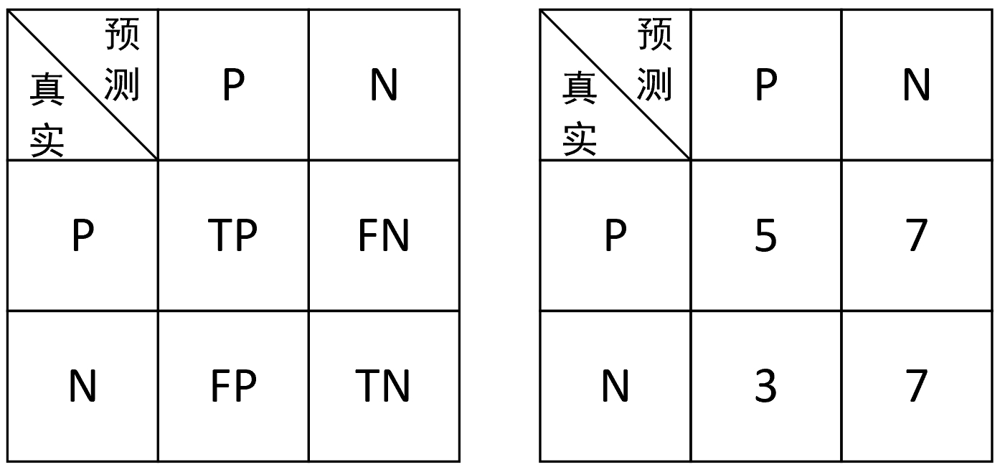
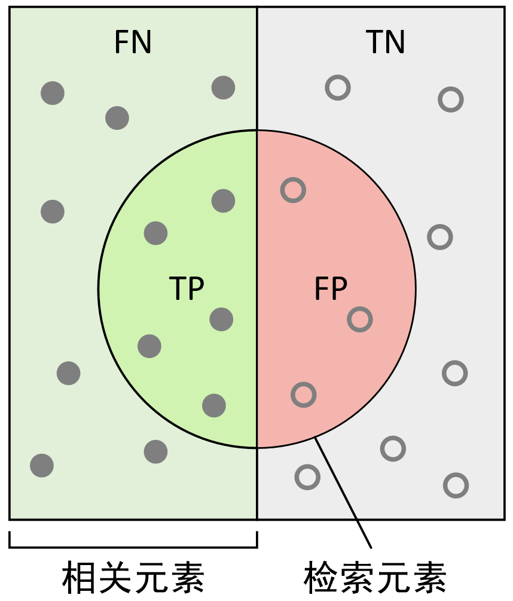
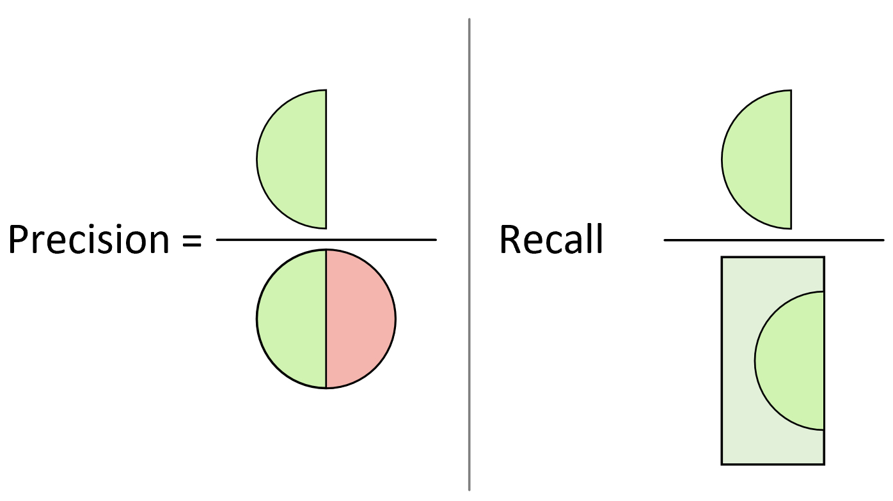
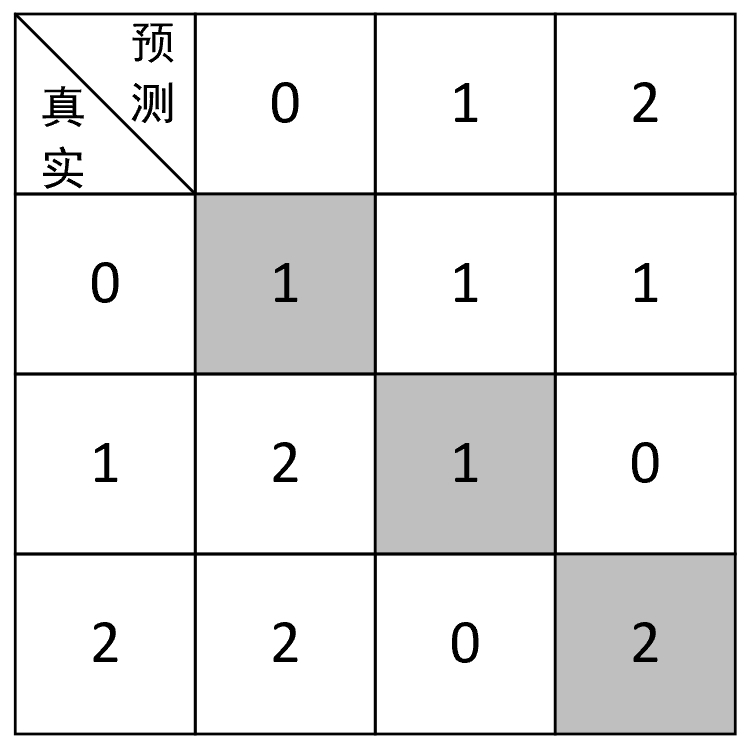

# 3.9 分类模型评估指标

如同回归模型一样，分类模型在训练结束之后同样需要一种测度来对模型的结果进行评判，以便于我们进行下一步流程。相较于回归模型的评估指标，分类模型的评估指标则相对更多且考虑情况也更为繁杂。在接下来的这节内容中，笔者将从零开始一步一步地详细介绍分类任务中几种常见的评估指标及其实现方法。

## 3.9.1 准确率

首先介绍分类任务中最常用也是最简单评估指标准确率（Accuracy）。假定现在有一个猫狗识别程序，并且假定狗为正类别（Positives）猫为负类别（Negatives）。程序在对12张狗和10张猫的混合图片进行识别后，判定其中8张图片为狗，14张图片为猫。待程序识别完毕后，经人工核对在这8张程序判定为狗的图片中仅仅只有5张图片的确为狗，14张被判定为猫的图片中仅有7张为真实的猫。

因此，准确率的定义为预测正确的样本数在总样本数中的占比，即上述例子中程序的准确率为
$$
\text{Accuracy}=\frac{\text{预测正确的样本数}}{\text{总样本数}}=\frac{5+7}{12+10}\approx0.545\tag{3-74}
$$
以上就是准确率的定义及计算过程。

虽然准确率计算过程简单也十分容易理解，但是准确率却存在着一个不容忽视的弊端。例如，现在需要训练一个癌细胞诊断模型来识别癌细胞，且在训练数据中其中负样本（非癌细胞）有10万个，而正样本（癌细胞）只有200个。假如某个模型将其中的105个预测为正样本，100095个预测为负样本。最终经过核对后发现，正样本中有5个预测正确，负样本中有99900个样本预测正确。那么此时该模型在训练集上的准确率为
$$
\text{Accuracy}=\frac{99900+5}{100000+200}\approx0.997\tag{3-75}
$$
但显然，这样的一个模型对于辅助医生决策来说并没有任何作用。如果模型极端一点将所有的样本都预测为负样本，那模型的准确率更是高达$0.998$。因此，在面对类似这种样本不均衡的任务中，并不能够将准确率作为评估模型的唯一指标。此时就需要引入精确率和召回率来作为新的评价指标。

## 3.9.2 精确率与召回率计算

我们仍旧以上面的猫狗识别任务为例。在这8张程序判定为狗的图片中仅仅只有5张图片的确为狗，因此这5张图片就被称为预测正确的正样本（True Positives, TP）；而余下的3张被称为预测错误的正样本（False Positives, FP）。同时，在这14张程序排定为猫的图片中，仅有7张为真实的猫，即预测正确的负样本（True Negatives, TN)；而余下的7张被称为预测错误的负样本（False Negatives, FN）。

此时，根据这一识别结果，我们便可以得到如图3-34所示的混淆矩阵（Confuse Matrix）。

<div align=center>

</div>
<center>
  图 3-34. 混淆矩阵图
</center>

如何来读这个混淆矩阵呢？读的时候首先横向看，然后纵向看。例如读TP的时候，首先横向表示真实的正样本，其次是纵向表示预测的正样本，因此TP表示的就是将正样本预测为正样本的个数，即预测正确，因此，同理共有以下4种情况。

(1) TP： 表示将正样本预测为正样本，即预测正确。 

(2) FN： 表示将正样本预测为负样本，即预测错误。 

(3) FP： 表示将负样本预测为正样本，即预测错误。 

(4) TN： 表示将负样本预测为负样本，即预测正确。

如果此时突然问FP表示什么含义，又该怎样迅速地反映出来呢？我们知道FP从字面意思来看表示的是错误的正类，也就是说实际上它并不是正类，而是错误的正类，即实际上为负类，因此，FP表示的就是将负样本预测为正样本的含义。再看一个FN，其字面意思为错误的负类，也就是说实际上它表示的是正类，因此FN的含义就是将正样本预测为负样本。

在定义完上述4种分类情况后就能得出各种场景下的计算指标公式，如式(3-76)~式(3-78)所示。
$$
\text{Accuracy}=\frac{\text{TP}+\text{TN}}{\text{TP}+\text{FP}+\text{FN}+\text{TN}}\tag{3-76}
$$

$$
\text{Precision}=\frac{\text{TP}}{\text{TP}+\text{FP}}\tag{3-77}
$$

$$
\text{Recall}=\frac{\text{TP}}{\text{TP}+\text{FN}}\tag{3-78}
$$

$$
{\text{F}_{\text{score}}}=(1+{{\beta }^{2}})\frac{\text{Precision}\cdot \text{Recall}}{{{\beta }^{2}}\cdot \text{Precision}+\text{Recall}}\tag{3-79}
$$

注意： 当$\text{{F}}_{\text{score}}$中$\beta=1$时称为$\text{F}_1$值，同时$\text{F}_1$也是用得最多的$\text{{F}}_{\text{score}}$评价指标。

在这里，我们又一次根据不同的定义形式得到了准确率的计算方式，但其本质依旧等同于式(3-74)。同时还可以看到，精确率计算的是预测对的正样本在整个预测为正样本中的比重，而召回率计算的是预测对的正样本在整个真实正样本中的比重，因此一般来讲，召回率越高也就意味着这个模型寻找正样本的能力越强（例如在判断是否为癌细胞的时候，寻找正样本癌细胞的能力就十分重要），而$\text{{F}}_{\text{score}}$则是精确率与召回率的调和平均。

因此，根据精确率和召回率的定义，我们还可以通过更直观的图示来进行说明，如图3-35所示。

<div align=center>

</div>
<center>
  图 3-35. 分类情况分布图
</center>


如图3-35所示，左侧的所有实心样本点为正样本（相关元素），右侧的所有空心点为负样本，中间的圆形区域为模型预测的正样本（检索元素），即圆形左侧为模型将正样本预测为正样本的情况，右侧为模型将负样本预测为正样本的情况。例如现在可以想象这么一个场景，某一次笔者在使用搜索引擎搜索相关内容（正样本）时，搜索引擎一共检索返回了30个搜索页面（搜索引擎认为的正样本），而搜索引擎返回的结果就相当于是图3-35中对应的圆形区域，所以精确率和召回率还可以通过图3-36来形象地进行表示。

<div align=center>

</div>
<center>
  图 3-36. 精确率召回率图示
</center>

从图3-36中更能直观地看出，精确率计算的是预测正确的正样本在整个被预测为正样本中的占比；而召回率计算的是预测正确的正样本在所有真实正样本中的占比。

在有了上述各项指标的定义之后，下面我们就来计算示例中各项指标的实际值。

**1\. 准确率**

根据式(3-76)可得，上述示例中模型的准确率为
$$
\text{Accuracy}=\frac{5+7}{5+3+7+7}\approx0.545\tag{3-80}
$$
**2\. 精确率与召回率**
$$
\text{Precision}=\frac{5}{5+3}=0.625\tag{3-81}
$$

$$
\text{Recall}=\frac{5}{5+7}\approx0.417\tag{3-82}
$$

$$
{\text{F}_{1}}=(1+{{1 }^{2}})\frac{5/8\times 5/12}{{{1 }^{2}}\cdot 5/8+ 5/12}=0.5\tag{3-83}
$$

因此，对于第3.9.1节中癌细胞识别模型中的结果来说，其精确率和召回率分别为
$$
\text{Precision}=\frac{5}{105}\approx0.048\tag{3-84}
$$

$$
\text{Recall}=\frac{5}{200}=0.025\tag{3-85}
$$

根据式(3-84)和式(3-85)中的结果可以看出，尽管该模型的准确率达到了0.997，但是从精确率和召回率来看，这个模型显然非常糟糕。

## 3.9.3 准确率与召回率区别

介绍到这里可能有读者会问，在上述问题中既然精确率和召回率都能够解决准确率所带来的弊端，那可不可以只用其中一个呢？答案是不可以。下面笔者再次以上面的癌细胞判别模型为例，并以3种情况来进行示例说明。

**1\. 情况一**

将所有样本均预测为正样本，此时有$\text{TP}=200$，$\text{FP}=100000$，$\text{TN}=0$，$\text{FN}=0$，则
$$
\begin{aligned}
\text{Accuracy}&=\frac{200}{100200}\approx 0.002\\[2ex]
\text{Precision}&=\frac{200}{100000+200}\approx 0.002\\[2ex]
\text{Recall}&=\frac{200}{200+0}=1.
\end{aligned}\tag{3-86}
$$
**2\. 情况二**

将训其中50个样本预测为正样本，100150个预测为负样本。最终经过核对后发现，正样本中有50个预测正确，负样本中有100000个样本预测正确。此时有$\text{TP}=50$，$\text{FP}=0$，$\text{TN}=100000$，$\text{FN}=150$，则
$$
\begin{aligned}
\text{Accuracy}&=\frac{50+100000}{100200}\approx 0.999\\[2ex]
\text{Precision}&=\frac{50}{50+0}=1.0\\[2ex]
\text{Recall}&=\frac{50}{50+150}=0.25
\end{aligned}\tag{3-87}
$$
**3\. 情况三**

将其中的210个样本预测为正样本，99990个预测为负样本。最终经过核对后发现，正样本中有190个预测正确，负样本中有99980个样本预测正确。此时有$\text{TP}=190$，$\text{FP}=20$，$\text{TN}=99980$，$\text{FN}=10$，则
$$
\begin{aligned}
\text{Accuracy}&=\frac{190+99980}{100200}\approx 0.999\\[2ex]
\text{Precision}&=\frac{190}{190+20}\approx0.905\\[2ex]
\text{Recall}&=\frac{190}{190+10}=0.95
\end{aligned}\tag{3-88}
$$
根据这3种情况下模型的表现结果可以知道，如果仅从单一指标来看无论是准确率、精确率还是召回率都不能全面地来评估一个模型。并且，至少应该选择精确率和召回率同时作为评价指标。同时可以发现，精确率和召回率之间一定程度上存在着某种相互制约的关系，即如果一味的只追求提高精确率那么召回率可能就很低，反之亦然。

所以，在实际情况中我们会根据需要来选择不同的侧重点，当然最理想的情况就是在取得高召回率的同时还能保持较高的精确率。最后，我们也可以直接计算$\text{F}_{\text{score}}$来进行综合评估，例如上述3种情况对应的$\text{F}_{\text{1}}$值分别为$0.039$，$0.4$和$0.927$。因此，对于一个分类模型来说，如果想要在精确率和召回率之间取得一个较好的平衡，最大化$\text{F}_{\text{1}}$值是一个有效的方法。

## 3.9.4 多分类下的指标计算

经过以上内容的介绍，我们对于分类任务下的准确率、精确率、召回率和$\text{F}$值已经有了一定的了解。但这里需要注意的一个问题便是，通常在绝大多数任务中并不会明确哪一类别是正样本，哪一类别又是负样本，例如之前介绍的手写体识别任务，所以对于每个类别来讲都可以计算其各项指标，但是准确率依旧只有一个。

假设有以下3分类任务的预测值与真实值，结果：

```python
1 y_true = [1, 1, 1, 0, 0, 0, 2, 2, 2, 2]
2 y_pred = [1, 0, 0, 0, 2, 1, 0, 0, 2, 2]
```

根据这一结果，便可以得到一个混淆矩阵，如图3-37所示。

<div align=center>

</div>


<center>
  图 3-37 多分类混淆矩阵
</center>

如图3-37所示，由于是多分类，所以也就不止正样本和负样本两个类别，此时这个表该怎么读呢？方法还是同图3-34中的一样，先横向看，再纵向看。例如第2行灰色单元格中的1表示的就是将真实值0预测为0的样本个数（预测正确），接着右边的1表示的就是将真实值0预测为1的个数，第3行灰色单元格中的1表示的就是将真实值1预测为1的个数，第4行灰色单元格中的2表示的就是将真实值2预测为2的个数，也就是说只有对角线上的值才表示模型预测正确的样本数量。接下来开始对每个类别的各项指标进行计算。

**1\. 对于类别0**

在上面笔者介绍过，精确率计算的是预测对的正样本在整个预测为正样本中的比重。根据图3-37可知，对于类别0来讲，预测对的正样本（类别0）的数量为1，而整个预测为正样本的数量为5，因此，类别0对应的精确率为
$$
\text{Precision}=\frac{1}{1+2+2}=0.2\tag{3-89}
$$
同时，召回率计算的是预测对的正样本在整个真实正样本中的比重。根据图3-37可知，对于类别0来讲，预测对的正样本（类别0）的数量为1，而整个真实正样本0的个数为3（图3-37中第2行的3个1），因此，对于类别0来讲其召回率为

$$
\text{Recall}=\frac{1}{1+1+1}=0.33\tag{3-90}
$$
因此，其$\text{F}_1$值为
$$
\text{F}_1=\frac{2\times 0.2\times 0.33}{0.2+0.33}=0.25\tag{3-91}
$$
**2\. 对于类别1**

对于类别1来讲，预测对的正样本（类别1）的数量为1，而整个预测为类别1的样本数量为2，因此，其精确率为
$$
\text{Precision}=\frac{1}{1+1+0}=0.5\tag{3-92}
$$
同理，其召回率和$\text{F}_1$值分别为
$$
\begin{aligned}
  & \text{Recall}=\frac{1}{1+2}=0.33 \\[2ex] 
 & \text{F}_1=\frac{2\times 0.5\times 0.33}{0.5+0.33}=0.40  
\end{aligned}\tag{3-93}
$$
**3\. 对于类别2**
$$
\begin{aligned}
  & \text{Precision}=\frac{2}{1+0+2}=0.67 \\[2ex] 
 & \text{Recall}=\frac{2}{2+0+2}=0.50 \\[2ex] 
 & {\text{F}}_{1}=\frac{2\times 0.67\times 0.50}{0.67+0.50}=0.57  
\end{aligned}\tag{3-94}
$$
**4\. 整体准确率**
$$
\text{Accuracy}=\frac{1+1+2}{1+1+1+2+1+0+2+0+2}=0.4\tag{3-95}
$$
此时，对于多分类场景下各个类别评价指标的计算就介绍完了，不过有读者可能会发现这里每个类别下都有3个评估值，如果是有5个或10个类别，那观察起来简直难以想象。但如果想要衡量模型整体的精确率、召回率或者$\text{F}$值又该怎么处理呢？对于分类结果整体的评估结果常见的做法有两种： 第1种是取算术平均， 第2种是加权平均[1]。

**1\. 算是平均**

所谓算术平均也叫作宏平均（Macro Average），也就是等权重地对各类别的评估值进行累加求和。例如对于上述3分类任务来讲，其精确率、召回率和$\text{F}_1$值分别为
$$
\begin{aligned}
\text{Precision}&=\frac{1}{3}\times \left( 0.20+0.50+0.67 \right)=0.46 \\[1ex] 
\text{Recall}&=\frac{1}{3}\times \left( 0.33+0.33+0.50 \right)=0.39 \\[1ex] 
\text{F}_{1}&=\frac{1}{3}\times \left( 0.25+0.40+0.57 \right)=0.41  
\end{aligned}\tag{3-96}
$$
**2\. 加权平均**

所谓加权平均也就是以不同的加权方式来对各类别的评估值进行累加求和。这里只介绍一种用得最多的加权方式，即按照各类别的样本数在总样本中的占比进行加权。对于图3-37中的分类结果来讲，加权后的精确率、召回率和$\text{F}_1$值分别为
$$
\begin{aligned}
\text{Precision}&=\frac{3}{10}\times 0.2+\frac{3}{10}\times 0.50+\frac{4}{10}\times 0.67=0.48 \\[1ex]
\text{Recall}&=\frac{3}{10}\times 0.33+\frac{3}{10}\times 0.33+\frac{4}{10}\times 0.50=0.40 \\[1ex] 
\text{F}_{1}&=\frac{3}{10}\times 0.25+\frac{3}{10}\times 0.40+\frac{4}{10}\times 0.57=0.42  
\end{aligned}\tag{3-97}
$$
最后，笔者再来介绍如何编码实现上述各项指标的计算。根据图3-34和图3-37可知，计算各项评估值的关键便是如何计算得到这个混淆矩阵。在这里，我们可以借助sklearn框架中的`sklearn.metrics.confusion_matrix`来完成混淆矩阵的计算。不过，更方便地，我们还可以直接使用`sklearn.metrics`中的`classification_report`模块来完成所有指标的计算过程。

各项指标计算过程的示例代码如下所示：

```python
1 from sklearn.metrics import classification_report
2 if __name__ == '__main__':
3     y_true = [1, 1, 1, 0, 0, 0, 2, 2, 2, 2]
4     y_pred = [1, 0, 0, 0, 2, 1, 0, 0, 2, 2]
5     result = classification_report(y_true, y_pred,
6                                    target_names=['class 0', 'class 1', 'class 2'])
7     print(result)
```

上述代码运行结束后便可以得到如下所示的结果：

```python
1               precision    recall  f1-score   support
2      class 0       0.20      0.33      0.25         3
3      class 1       0.50      0.33      0.40         3
4      class 2       0.67      0.50      0.57         4
5     accuracy                           0.40        10
6    macro avg       0.46      0.39      0.41        10
7 weighted avg       0.48      0.40      0.42        10
```

在上述结果中，第2~3行表示各个类别下的不同评估结果；第5行是准确率；第6~7行便是宏平均和加权平均，可以同式(3-96)和式(3-97)进行对比。

## 3.9.5 Top-K准确率

在上面的内容中，笔者详细介绍了分类任务中常见的4种评估指标，看上去似乎已经够用了，但事实上在某些场景下这类指标还是过于严格，尤其是在图片分类的任务中。例如有一个5分类模型，某个样本的真实标签为第0个类别，而模型预测结果的概率分布为$[0.32,0.1,0.2,0.05,0.33]$。如果是取概率值最大的索引为类别，那么该样本的预测结果将为第4个类别，但是我们就一定能说模型表现的结果很差吗？

因此，一种这种的做法就是采用Tok-K准确率来进行评估。不过那什么又是Top-K准确率呢？一句话概括，Top-K准确率就是用来计算预测结果中概率值最大的前K个结果包含正确标签的占比。换句话说，平常我们所说的准确率其实就是Top-1准确率。例如对于上面的例子来说，如果是采用Top-2的计算方式，该预测结果就算是正确的，因为概率值排序第2位的$0.32$对应的类别0就是样本真实的结果。

因此我们可以看出，Top-K准确率考虑的是预测结果中最有可能的K个结果是否包含有真实标签，如果包含则算预测正确，如果不包含则算预测错误。所以这里也能得出，K值越大计算得到的Top-K准确率就会越高，极端情况下如果取K值为分类数，那么得到的准确率就一定是1。但通常情况下我们只会看模型的Top-1、Top-3或Top-5准确率。

介绍完了什么是Top-K准确率，下面我们就来看看如何通过代码来进行实现。从上面是介绍可以知道，想要计算Top-K准确率，首先需要得到的就是预测概率中最大的前K个所对应的预测标签。在PyTorch中可以通过`torch.topk()`函数来返回得到前K个值及其对应的索引，实现代码如下所示：

```python
1 def calculate_top_k_accuracy(logits, targets, k=2):
2     values, indices = torch.topk(logits, k=k, sorted=True)
3     y = torch.reshape(targets, [-1, 1])
4     correct = (y == indices) * 1. 
5     top_k_accuracy = torch.mean(correct) * k 
6     return top_k_accuracy
```

在上述代码中，第1行`logits`表示每个样本预测的概率分布形状为`[m,n]`，`targets`表示每个样本的真实标签形状为`[m,]`；第2行用于返回降序后前K个指及其对应的索引（类标）；第4行是对比预测结果的K个值中是否包含有正确标签中的结果；第5行是计算最后的准确率。

最后，可以通过一下方式来使用上述方法：

```python
1 if __name__ == '__main__':
2     logits = torch.tensor([[0.1, 0.3, 0.2, 0.4],
3                            [0.5, 0.01, 0.9, 0.4]])
4     y = torch.tensor([3, 0])
5     print(calculate_top_k_accuracy(logits, y, k=1).item())  # 0.5
6     print(calculate_top_k_accuracy(logits, y, k=2).item())  # 1.0
```

在上述代码中，从第2~3的预测结果和第4行的真实标签可以看出，如果`k=1`则只有第1个样本预测正确此时的准确率为0.5，如果`k=2`则两个样本都预测正确此时准确率为1。

## 3.9.6 小结

在本节内容中，笔者首先介绍了分类任务中最常见也是最容易理解的评估指标准确率；然后由准确率的弊端引出了为什么需要召回率和精确率，并介绍了两者的调和形式$\text{F}$值；最后详细介绍了多分类场景下各项指标的计算方式及其编码实现，同时也介绍了某些特定场景下模型Top-K准确率的计算原理和实现方式。

# 引用

[1] PEDREGOSA.scikitlearn: Machine Learning in Python［J］.JMLR 12,2011: 28252830.