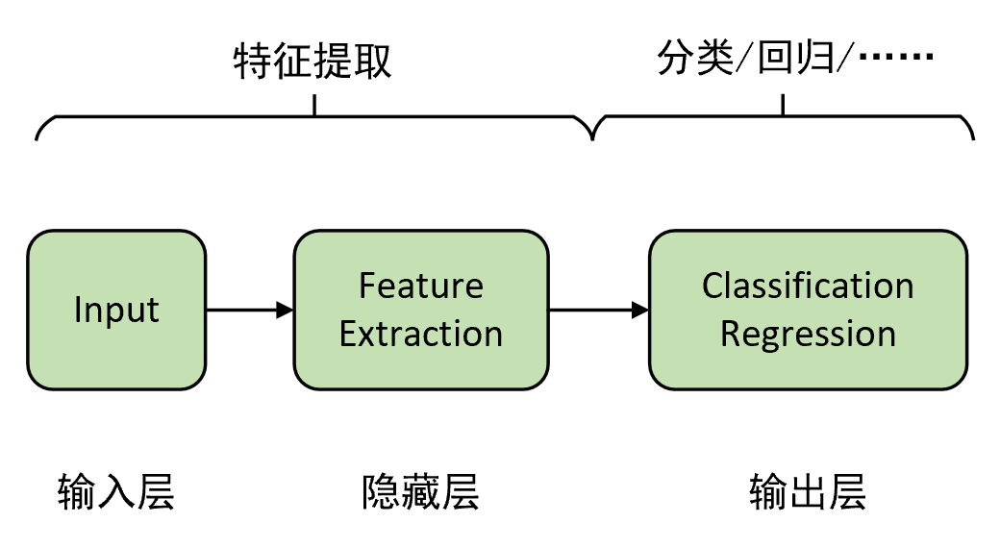
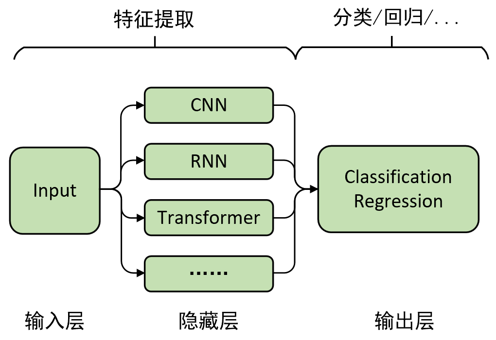
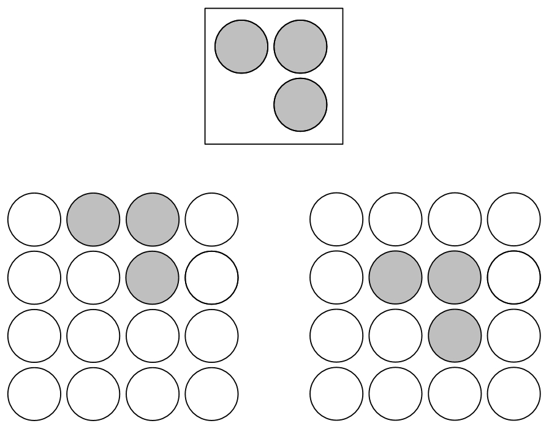
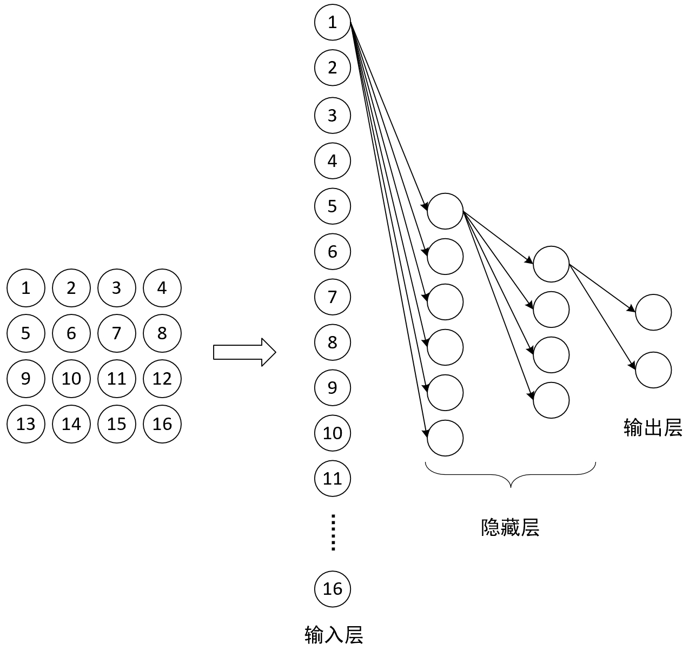
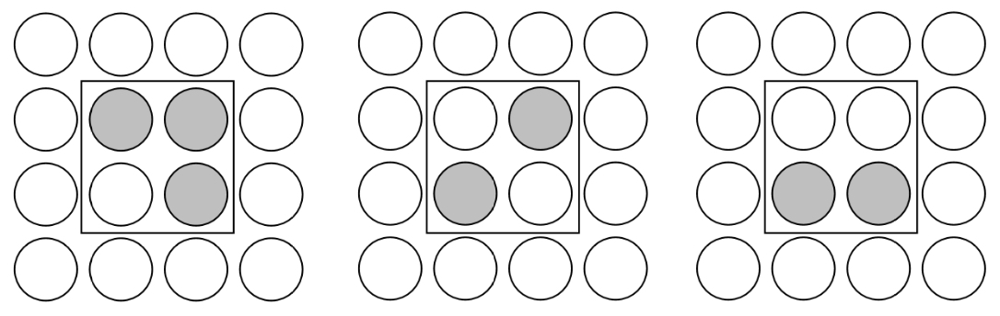
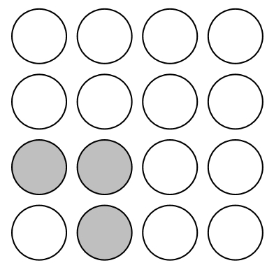
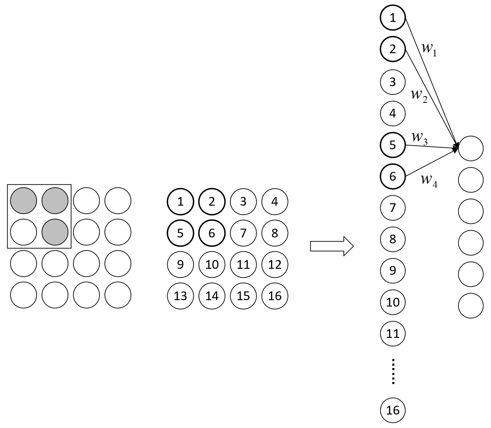

# 4.1 卷积的概念

经过整个第3章内容的介绍，相信各位读者对深度学习已经有了一个基本的概念，对于深层特征提取的重要性以及为什么要“深度”也应该有了一些清晰的认识。在接下来的这章内容中，笔者将会开始介绍深度学习中的第一个网络结构——卷积神经网络（Convolutional Neural Network, CNN）。在正式介绍卷积神经网络之前，笔者先就卷积的相关概念和计算原理进行介绍。

## 4.1.1 深度学习思想

在第3章内容中，笔者由线性回归和逻辑回归为基础延伸到了深度学习中的回归和分类模型，并且得出一个结论就是，对于输出层之前的所有层都可以将其看成是一个特征提取的过程，而且越靠后的隐藏层也就意味着提取得到的特征越抽象。在得到这些抽象特征后，我们再通过最后一层来完成特定场景下的任务，这也就是深度学习的核心思想，由此便可以将深度学习抽象成如图4-1所示的形式。

  图 4-1. 深度学习抽象图

根据图4-1可知，对于深度学习来说最重要最核心的部分当然就是隐藏层的特征提取过程。经过第3章内容的介绍我们已经熟悉了通过深层前馈网络来对输入进行特征提取。那还有没有其它进行特征提取的方式呢？有，当然有，而且在深度学习中还属于是百花齐放式的有，例如我们接下来就介绍到的卷积操作就是其中之一。所以，进一步，我们还可以用下面这个图来表示深度学习的过程。

  图 4-2. 深度学习抽象图

从图4-2中可以看出，我们可以通过不同的方式（技术）来对输入进行特征提取，然后再将提取得到的特征进行下一步的处理。因此，对于如何构造或者组合得到新的特征提取方式，也是深度学习中的一个重要研究方向。接下来，笔者就开始对卷积操作进行介绍。

## 4.1.2 卷积操作的作用

卷积（Convolution）操作它算得上是深度学习中最重要的技术之一，其最早可以追溯到上世纪八十年代。直到今天，近四十年过去了，而这项技术依然是经久不衰地被用于各类网络模型中。说了这么多，那什么又是卷积呢？很多初学者看到在第一次知晓“卷积”这两个字后，总会陷入到数学概念中的那个卷积里来理解卷积，也就是通常会看到这么一句话来解释什么是卷积：卷积是通过两个函数$f$和$g$ 来导出第3个函数的一种数学运算，即表征函数$f$与$g$经过翻转和平移的重叠部分函数值乘积对重叠长度的积分[1]。

看完上面这句定义什么感受呢？如果笔者没有猜错那应该是有种看了不如不看，看了反而更加畏惧的感觉。既然概念如此晦涩，那我们就从“卷积能够干什么”的角度来看看卷积到底做了什么。

从作用上来讲，卷积操作是用于对图像进行特征提取，并且还是主要用于图像处理领域中的一种技术。不过记性好的读者可能还记得笔者在第3.6节内容中曾介绍过如何通过深层全连接网络来对图像进行分类。那既然全连接网络也能对图片进行特征提取那我们为什么还需要卷积操作呢？两者又有什么样的差异呢？

通常，从我们人类的思维角度来看，对于任何一个用于图像分类的模型来说其都应该满足如下几点特性：①平移不变性；②旋转不变性；③缩放不变性；④明暗不变性。同时，在生物体中满足这样类似特性的细胞被称之为“祖母细胞”（Grandmother Cell）。当神经元看到他祖母的照片时该神经元被激活，无论此时他的祖母是出现在照片的左边或右边，也无论是处于明处还是暗处[2]。

**1\. 平移不变性**

所谓平移不变性（Translation Invariance），指的是不管图片中的物体如何移动模型都应该能够将其识别出来，如图4-3所示。

  图 4-3. 平移不变性

如图4-3所示，对于图中的3种情况来说，在我们人类眼中不管它移动到哪个位置，我们都会认为它是同一个事物，因此希望网络模型也能够具备这样的能力。

**2\. 旋转不变性**

所谓旋转不变性（Rotation Invariance），指的是不管图片中物体的角度如何变化，网络模型都应该具有将其视为同一个事物的能力，如图4.4所示。

  图 4-4. 旋转不变性

**3\.  缩放不变性**

  所谓缩放不变性（Size Invariance），指的是不管图片中的物体被放大还是缩小，网络模型也能够具有将其识别出来的能力，如图4.5所示。

  图 4-5. 缩放不变性

**4\. 明暗不变性**

  所谓明暗不变性（Illumination Invariance），指的是不管图片中物体的明暗程度如何变化，网络模型都能够将其识别出来，如图4.6所示。

  图 4-6. 明暗不变性

 以上图片来自[3]。

可以看出，对于上述这4点特性也非常符合人类观察事物的直觉。因此，对于图像识别模型来说不能因为物体的位置或者角度发生了改变就需要重写训练模型。那什么样的特征提取方式能够同时满足这4项特性呢？

## 4.1.3 卷积操作的原理

为了回答上面这个问题，下面笔者就来对全连接操作和卷积操作进行一个比较，看看两者在工作原理上有何不同。下面我们以在大小为4x4的图片中识别是否有下图4-7所示的“横折”为例进行介绍。

   图 4-7. "横着"图例识别

**1\. 全连接网络识别“横折”**

如图4-8所示为我们所采用的全连接网络结构图，其中输入层输入的是由图片拉伸后的向量。

   图 4-8. 全连接网络结构图

在有了网络结构后，我们仅用如图4-9所示的训练集对网络进行进行训练即可。

   图 4-9. 网络训练集

现在问题来了，如果我们用通过图4-9中的训练集训练好的网络（模型A）来识别图4-10中的测试样本是否含有“横折”，那模型A能否成功识别呢？

   图 4-10. 测试样本

遗憾的是，对于模型A来说它并不能够识别出图4-10左下角的“横折”，但这是为什么呢？

从图4-8和图4-9中可以看到，由于在训练样本中，“横折”相关的信息仅仅只是分布在6、7、10、11这4个位置上，因此这也就意味着最终只有这4个位置上对应的权重参数才具备了识别”横折“的能力，换句话模型只能判断这4个位置上是否存在有”横折“。那怎么来解决这一问题，使得其它位置的权重参数同样有效，也能够识别“横折”呢？

对于解决这个问题一个可行的办法就是用大量位于不同位置的“横折”数据样本来对网络进行训练，但这样做的后果就是训练耗时且需要事先准备大量的训练集。不过此时可能就有读者会不禁问道，同样都是“横折”为什么换个位置模型就不认识了？有没有什么方法可以将中间所学到的规律也运用在其他的位置？答案是当然有，那就是让不同位置共享同样的权重参数，而这也就是卷积操作的核心思想。

**2\.  卷积识别“横折”**

上面说完了全连接网络是如何识别“横折”，接下来再来看卷积操作是如果实现这一过程的。如图4-11所示，假定一开始“横折”位于最左上角，也就是1、2、5、6的位置上，并且此时通过$w_1,w_2,w_3,w_4$能够准确的识别出“1、2、5、6所在区域是否包含有“横折这么一个元素。那现在问题来了，如果上面的“横折”向右移动了一个格子，那么如何才能快速有效的识别到“横折”这个元素呢？

   图 4-11. 卷积横折识别图

一个有效的快速的识别方法就是直接同样用$w_1,w_2,w_3,w_4$来对2、3、6、7这个区域中的元素进行识别，判断其是否含有“横折”。此时有读者可能会问，为什么可以这么做呢？原因也很简单，从图4-11可以看出，$w_1,w_2,w_3,w_4$具有识别“横折”的能力并不是因为权重所在的位置，而是由训练集中“横折”的位置使得模型中对应位置上的权重有了这种能力。既然如此，那我们当然可以将这些具备识别能力的权重重复运用于其它位置。换句话说，若是一开始训练数据中的“横折”就有位于2、3、6、7这个区域里的样本，那么对应网络中2、3、6、7这些位置上的权重就具备了识别“横折”的能力。

因此，将具有识别某种特征能力的权重共享到其它位置上的做法就是卷积操作的核心思想，它就像一个“扫描器”一样，能够逐个扫描所有位置上是否包含有“扫描器”能够识别的对应元素。由此我们便可以得出，卷积操作的核心就是在空间上共享权重。同时可以发现，相较于全连接操作，卷积操作在参数量少有了极剧地减少。

## 4.1.4 小结

在本节内容中，笔者首先再次抛出了深度学习的理念，即对输入进行深度特征提取然后再进行后续相关任务；接着笔者引出了对于图像处理相关模型来说其应该具备的4种基本特性；最后，通过比较全连接操作与卷积操作在对图片进行特征提取时的不同之处，来介绍了卷积操作的的核心思想。在下一节内容中笔者将会进一步对卷积操作的运算过程、深层卷积以及其中的常见术语进行介绍。

### 引用

[1] 卷积定义：https://baike.baidu.com/item/%E5%8D%B7%E7%A7%AF

[2] 赵申剑, 黎彧君, 符天凡, 李凯 译，深度学习 [M]. 北京：人民邮电出版社, 2017.

[3] 图片来源：https://stats.stackexchange.com/questions/208936/what-is-translation-invariance-in-computer-vision-and-convolutional-neural-netwo/208949

[4] YJango的卷积神经网络：https://zhuanlan.zhihu.com/p/27642620

[5] Hungyi Lee, MachineLearning, National Taiwan University, 2020, Spring.

