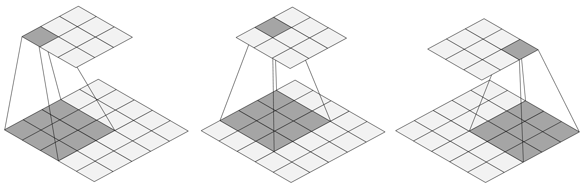
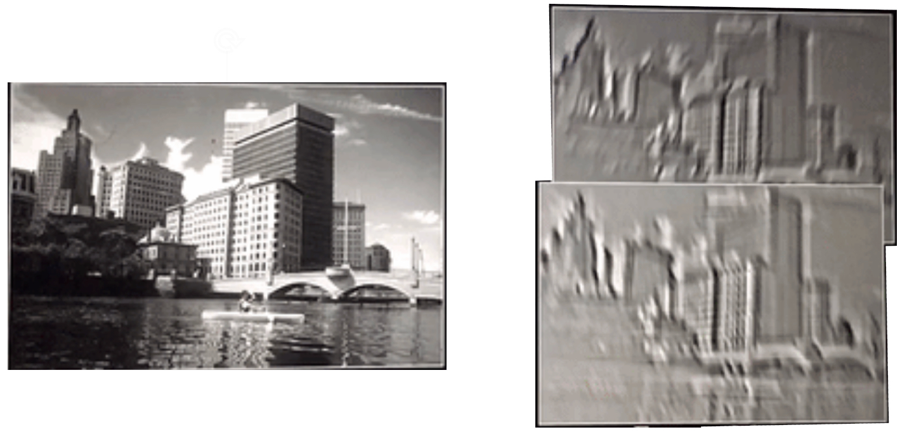
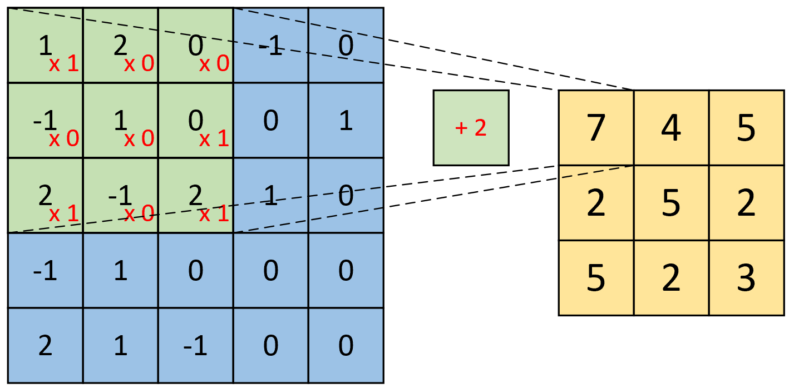
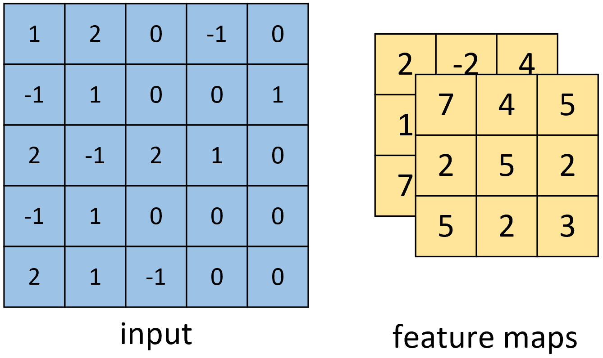

# 4.2 卷积的计算过程

在上一节内容中，笔者详细介绍了卷积操作的核心理念与思想，并通过对比全连接操作与卷积操作在识别同一元素的不同方式，进一步介绍了卷积操作的核心思想。但这仅仅只是对卷积操作有了一个总体的认识，其中仍有许多细节的地方没有进行介绍。例如：什么是多卷积核卷积？卷积操作具体是怎么计算的？什么是深度卷积？哪些场景下可以运用卷积操作，仅仅只是图片吗？因此，在接下来的这节内容中，笔者将主要从这四个方面来继续卷积操作的工作原理。

## 4.2.1 多卷积核

**1\. 卷积**

从本质上讲，卷积的计算过程其实同全连接一样也是各个神经元之间的线性组合并进行非线性变换，只是卷积操作在进行线性组合时选择的是特定位置上的神经元。下面我们首先通过几张示意图来直观感受一下整个卷积的过程，如图4-12所示。

  图 4-12. 卷积计算示意图

如图4-12所示从左往右为整个卷积的计算过程，可以发现卷积操作其实就是每次取一个特定大小的矩阵$F$（$5\times5$矩阵中的的阴影部分），然后将其对输入$X$（图中$5\times5$的矩阵）依次扫描并进行内积的运算过程。在图4-12中，阴影部分每移动一个位置就会计算得到一个卷积值（$3\times3$矩阵中的阴影部分），当$F$扫描完成后就得到了整个卷积后的结果$Y$（矩阵）。

同时，我们将这个特定大小的矩阵$F$称为卷积核（Convolutional Kernel）或过滤器（Filter）亦或是探测器（Detector），它可以是一个也可以是多个，并且卷积核也可以是一个矩形；将卷积后的结果$Y$称为特征图（Feature Map），并且每一个卷积核卷积后都会得到一个对应的特征图；最后，对于输入$X$的形状，都会用3个维度来进行表示，即宽（Width）、高（High）和通道（Channel），例如图4-12中输入$X$的形状为`[7,7,1]`。

**2\. 多卷积核**

在上面笔者提到了卷积核的个数还可以是多个，那我们为什么需要多个卷积核进行卷积呢？在第4.1节内容中笔者介绍到，对于一个卷积核可以认为是具有识别某一类元素（特征）的能力，而对于一些复杂结构的数据来说仅仅只是通过一类特征来进行辨识往往是不够的，因此，通常来说我们都会通过多个不同的卷积核来对输入进行特征提取得到多个特征图，然再输入到后续的网络中进行后续任务。

  图 4-13. 多卷积核特征图

如图4-13所示，左边为原始的输入图片，右边为通过两个卷积核卷积之后得到的特征图，可以发现对于同一个输入通过两个不同的卷积核对其进行卷积特征提取，最后便能得到两个不同的特征图。从图4-13右侧的特征图可以发现，上面的特征图在锐利度方面明显会强于下面的特征图，而这这也是使用多卷积核进行卷积的意义，探测到多种特征属性以有利于后续的下游任务。

## 4.2.2 卷积的计算

到此为止， 对于卷积的原理和意义就算是交待完了，并且通过上面这些图示我们也有了更为直观的了解。但所谓数无形时少直觉，形少数时难入微，因此，下面笔者就以单通道（灰度图）和三通道的输入来实际示例一下整个卷积的计算过程。

**1\. 单通道单卷积核**

如图4-14所示，现在有一张形状为`[5,5,1]`的灰度图，我们需要用图4-14右边的卷积核对其进行卷积处理，同时再考虑到偏置的作用。那么其计算过程是怎么样的呢？

  图 4-14. 输入与卷积

如图4-15所示，右边为卷积后的特征图，左边为卷积核对输入图片左上方进行卷积时的示意图，其计算过程变为卷积核与对应输入位置上的内积和再加上偏置。

  图 4-15. 单通道单卷积（一）

因此，对于这个部分的计算过程有
$$
\underbrace{1\cdot0+2\cdot0+0\cdot1-1\cdot0+1\cdot1+0\cdot1+2\cdot1-1\cdot0-2\cdot1}_{\text{kernel}}\underbrace{\;\;+1\;\;}_{\text{bias}}=2\tag{4-1}
$$
同理，对于最右下角部分的卷积计算过程为

  图 4-16. 单通道单卷积（二）

$$
2\cdot0+1\cdot0+0\cdot1+0\cdot0+0\cdot1+0\cdot1-1\cdot1+0\cdot0-0\cdot1+1=0\tag{4-2}
$$
因此，对于最后卷积的结果我们得到的将是一个如图4-16右侧所示形状为`[3,3,1]`的特征图。到此我们就把单通道单卷积的计算过程介绍完了。下面再来看单通道多卷积核的例子。

**2\. 单通道多卷积核**

如图4-17所示，左边依旧为输入矩阵，现在要用右边所示的两个卷积核对其进行卷积处理。

  图 4-17. 单通道多卷积（一）

同时可以看出，在图4-17中右边的第1个卷积核就是图4-14里的卷积核，因此其计算结果同图4-16中的计算结果。对于旁边的卷积核，其计算过程如图4-18所示。

  图 4-18. 单通道多卷积（二）

从图4-18可以看出，其计算过程与图4-15中的计算过程并无差异。最后我们便能得到如图4-19右侧所示形状为`[3,3,2]`的卷积特征图，其中2表示两个特征通道。

  图 4-19. 单通道多卷积结果

到此，对于单通道的卷积计算过程就介绍完了。但通常情况下，我们遇到更多的是对多通道输入进行卷积处理，例如包含有RGB三个通道的彩色图片等。接下来，笔者就开始介绍多通道的卷积计算过程。

**3\. 多通道单卷积核**

对于多通道的卷积过程，总体上还是还是同之前的一样，都是每次选取特定位置上的神经元进行卷积，然后依次移动直到卷积结束。下面先来看看多通道单卷积核的计算过程。

  图 4-20. 多通道单卷积输入

如图4-20所示，左边为包含有三个通道的输入，右边为一个卷积核和一个偏置。同时，需要强调的是图4-20右侧仅仅只是一个卷积核，而不是三个，不少读者会初学时会产生误解。这是因为输入是三个通道，所以在进行卷积的时候对应的每一个卷积核都必须要有三个通道才能进行卷积。下面我们就来看看具体的计算过程。

  图 4-21. 多通道单卷积核图

如图4-21所示，右边为卷积后的特征图，左边为一个三通道的卷积核对输入图片的左上方进行卷积时的示意图。因此，对于这个部分的计算过程有

$$
\begin{aligned}
&\underbrace{(0\cdot2+2\cdot0+0\cdot0+0\cdot1+2\cdot0+0\cdot1+2\cdot0+1\cdot3+2\cdot0)}_{\text{channel 1}}\\
+& \underbrace{(0\cdot1+0\cdot0+0\cdot1+1\cdot0+0\cdot0+0\cdot0+1\cdot1+0\cdot1+0\cdot1)}_{\text{channel 2}}\\
+& \underbrace{(1\cdot0+1\cdot0+0\cdot1+0\cdot1+1\cdot1+0\cdot1+0\cdot1+1\cdot1+1\cdot0)}_{\text{channel  3}}\\
+&\underbrace{\;\;1\;\;}_{\text{bias}}=3+1+2+1=7
\end{aligned}\tag{4-3}
$$

同理，对于其它部分的卷积计算过程也类似于上述计算步骤。由此我们便能得到如图4-21右边所示卷积后的形状为`[3,3,1]`的特征图。

**4\. 多通道多卷积核**

在介绍完多通道单卷积核的计算过程后，我们再来看看多通道多卷积核的计算过程。

  图 4-22. 多通道多卷积核图

如图4-22所示，左边依旧为输入矩阵，现在要用右边所示的两个卷积核对其进行卷积处理。同时可以看到，第1个卷积核就是图4-20中所示的卷积核，其结果如图4-21所示。对于第2个卷积核，其计算过程也和式(4-3)类似，都是将每个通道上的卷积结果进行相加，最后再加上偏置。因此，最后便能得到如图4-23右边所示形状为`[3,3,2]`的卷积特征图，其中2表示两个特征通道。

  图 4-23. 多通道多卷积核结果图

最后，从上面单通道卷积核多通道卷积的计算过程可以发现

（1）原始输入有多少个通道，其对应的一个卷积核就必须要有多少个通道，这样才能与输入通道数匹配并完成卷积操作。换句话说，如果输入数据的形状为`[n,n,c]`，那么对应每个卷积核的通道数也必须为`c`。

（2）用`k`个卷积核对输入进行卷积处理，那么最后得到的特征图一定就会包含有`k`个通道。例如，输入形状为`[n,n,c]`，且用`k`个卷积核对其进行卷积，则卷积核的形状必定为`[w1,w2,c,k]`，最终得到的特征图形状必定为`[h1,h2,k]`；其中`w1,w2`为卷积核的宽度，`h1,h2`为卷积后特征图的宽度。

以上所有图示中计算过程实现代码可以参见[Code/Chapter04/C01_CNNOP](https://github.com/moon-hotel/DeepLearningWithMe/blob/master/Code/Chapter04/C01_CNNOP)文件。

## 4.2.3 深度卷积

到此，对于不同情况下的卷积计算过程就介绍完了。接下来我们再来探索本节内容的最后两个问题：为什么需要深度卷积以及什么样的场景下可以使用卷积。

**1\. 深度卷积的作用**

所谓深度卷积就是卷积之后再卷积，并且卷积的次数可以是几次，也可以是几十次、甚至可以是几百次。因此，这就带来了一个问题，为什么需要深度卷积？在第4.1节内容中，笔者介绍了全连接网络中我们可以通过更深的隐藏层来获取到更高级和更抽象的特征，以此来提高下游任务的精度。因此，采用深度卷积也是处于同样的目的。

在上一节内容中笔者介绍到，卷积操作可以看作是对输入的特征提取，即用来刻画输入中是否包含有某一类型的特征。但是，通常情况下输入图像都是由一系列特征纵横交错叠加起来的。因此，对于同一层的特征输入我们需要通过多个卷积核对输入进行特征提取，而对于不同层的特征我们需要通过卷积的叠加来进行特征提取。

  图 4-24. 深度卷积图

如图4-24所示[1]，对于输入的一张图片，我们可以通过取深度卷积后的特征输出来进行物体分类任务。从图中可以发现，对于一开始的几次卷积还能看到一些汽车的轮廓，但是在后续的多次叠加卷积处理后，我们人眼也就再也看不所谓汽车的影子了。但是，这些更高级的、更抽象的特征却真实的能够提高模型最终任务的精度。因此，在一定的条件下甚至可以认为卷积的次数越多越好。在后续章节中，笔者也会通过实验来进行对比。

**2\. 卷积的使用场景**

由于大部分介绍卷积的资料都是从图像识别说起，因此大多数读者对这一技术也就存在着一个固有思维，那就是仅仅只能用于图像数据的特征提取。尽管卷积的由来的确是为了用于对图像数据进行特征提取，但它同样能够被用于一些非图像数据的场合中。那既然如此，什么样的场景下可以使用卷积呢？

简单一句话总结就是，在相邻空间位置上具有依赖关系的数据均可以通过卷积操作来进行特征提取。为什么？回顾一下图像数据最重要的属性是什么？不就是相邻位置上的像素之存在着空间上的依赖（Spatial Correlation  ）关系吗？对于任意位置上的像素值来说，其周围的像素值或多或少都与其有着一定的关系，例如颜色或轮廓的渐变过程等。

因此，对于在相邻空间位置存在着依赖关系的数据类型，我们都可以通过卷积操作来对其进行特征提取。例如网格流量数据[2]、词向量垂直堆叠而成的文本数据[3]、汽车道路构成的车速矩阵[4]等。

## 4.2.4 小结

在本节内容中，笔者首先引入了卷积中常见的4个问题；然后围绕着这4个问题依次详细介绍了什么是多卷积核卷积以及卷积的具体计算过程等；最后介绍了什么又是深度卷积以及什么样的场景下可以使用卷积操作。

# 引用

[1] https://cs231n.github.io/convolutional-networks/#norm

[2] Deep Spatio-Temporal Residual Networks for Citywide Crowd Flows Prediction

[3] Convolutional Neural Networks for Sentence Classification

[4] LC-RNN: A Deep Learning Model for Traffic Speed Prediction

