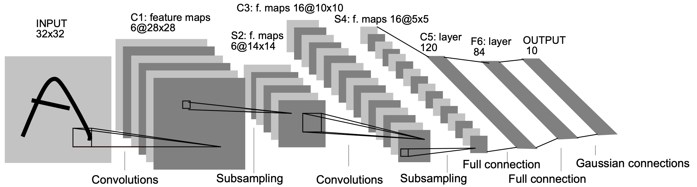

# 4.4 LeNet5网络

在介绍完卷积、池化技术的基本思想和原理后，下面开始介绍本书中第一个基于卷积运算的卷积神经网络LeNet5网络模型[1]。

## 4.4.1 动机

LeNet5网络模型是20世纪90年代AT&T神经网络小组中Yann LeCun等人所提出的，其最初的目的是用于读取支票上的手写体数字[2]。在第3.7节内容中，笔者介绍过如何通过多层感知机来完成手写体识别这一分类任务，但这样做的缺点在于利用全连接层来对图片进行特征提取会严重丢失其在相邻位置上的空间信息。在第4.2节内容中笔者也谈到，利用全连接层来对图像进行特征提取一是不能满足平移不变性、旋转不变性等，二是模型中会包含有大量的冗余参数。基于这样的问题，人们开始尝试通过卷积神经网络来进行解决，而LeNet5模型在当时达到了手写字数字识别的最先进水平[3]。

## 4.4.2 模型结构

如图4-29所示便是LeNet5网络的模型结构图，需要注意的是这里的5是指包含有5个网络权重层（不含参数的层不计算在内，这一点笔者在第3.1.7节中也提到过）的网络层，即2个卷积层和3个全连接层。

<div align=center>

</div>
<div style="text-align: center;">
    图 4-29. LeNet5网络结构图
</div>

由图4-29可知，原始输入的形状为`[1,32,32]`，经过第1个卷积层处理后的形状为`[6,28,28]`，接着经过最大池化处理后的形状为`[6,14,14]`，进一步第2次卷积处理的形状为`[16,10,10]`，然后再最大池化后的形状为`[16,5,5]`，最后是连续的3个全连接层，其维度分别是120、84和10。虽然图4-29最后一层写的是高斯层，即对最后输出的每个类别采用了欧式径向基函数来衡量其与真实标签之间的损失，但是这里我们直接使用一个全连接层并通过交叉熵损失来代替即可。

进一步，根据图4-29中各层输出的结果，我们可以推算得到其各层对应的超参数及卷积核形状应如表1所示。

<div style="text-align: center;">
    表 4-1. LeNet5模型参数表
</div>


| 网络层     | 输入形状       | 参数                                 | 输出形状       | 参数量                         |
| ---------- | -------------- | ------------------------------------ | -------------- | ------------------------------ |
| 卷积层P1   | `[1,1,32,32]`  | `kernel_size=[1,5,5,6]`，`stride=1`  | `[1,6,28,28]`  | $1\times5\times5\times6=150$   |
| 池化层S1   | `[1,6,28,28]`  | `kernel_size=[2,2]`，`stride=2`      | `[1,6,14,14]`  | $0$                            |
| 卷积层P2   | `[1,6,14,14]`  | `kernel_size=[6,5,5,16]`，`stride=1` | `[1,16,10,10]` | $6\times5\times5\times16=2400$ |
| 池化层S2   | `[1,16,10,10]` | `kernel_size=[2,2]`，`stride=2`      | `[1,16,5,5]`   | $0$                            |
| 全连接层P3 | `[1,400]`      | `weight_shape=[400,120]`             | `[1,120]`      | $400\times120=48000$           |
| 全连接层P4 | `[1,120]`      | `weight_shape=[120,84]`              | `[1,84]`       | $120\times84=10080$            |
| 输出层P5   | `[1,84]`       | `weight_shape=[84,10]`               | `[1,10]`       | $84\times10=840$               |

从表4-1可以看出每层权重参数的具体情况，包括参数的形状和数量等。因此，对于整个LeNet5网络来说，其参数为$150+2400+48000+10080+840=61470\approx62\text{k}$。

LeNet5的网络结构总体上来说比较简单，它通过多次卷积和池化的组合来对输入进行特征提取，最后再以全连接网络进行分类。这种多次卷积加池化的组合看似简单粗暴，但在实际问题中却有着不错的效果，以至于后续出现了比它更深的卷积网络，后续笔者也将会陆续进行介绍。

## 4.4.3 模型实现

在介绍完了LeNet5的网络结构后，下面笔者开始介绍如何通过PyTorch框架来快速对其进行实现。首先需要明白的是在利用框架实现一个网络模型时，只需要写出网络对应的前向传播过程即可，剩余其它部分的编码基本上只需要按部就班大部分可以进行通用。以下完整示例代码可以参见[Code/Chapter04/C03_LeNet5/LeNet5.py](https://github.com/moon-hotel/DeepLearningWithMe/blob/master/Code/Chapter04/C03_LeNet5/LeNet5.py)文件。

**1\. 前向传播**

首先需要实现模型的整个前向传播过程。从图4-29可知，整个模型整体分为卷积和全连接两个部分，因此这里定义两个`Sequential()`来分别表示这两个部分，实现代码如下所示：

```python
 1 class LeNet5(nn.Module):
 2     def __init__(self, ):
 3         super(LeNet5, self).__init__()
 4         self.conv = nn.Sequential(
 5             nn.Conv2d(in_channels=1, out_channels=6, kernel_size=5, padding=2),
 6             nn.ReLU(),  
 7             nn.MaxPool2d(2, 2),  
 8             nn.Conv2d(in_channels=6, out_channels=16, kernel_size=5), 
 9             nn.ReLU(),
10             nn.MaxPool2d(2, 2))  # [n,16,5,5]
11         self.fc = nn.Sequential(
12             nn.Flatten(),
13             nn.Linear(in_features=16 * 5 * 5, out_features=120),
14             nn.ReLU(),
15             nn.Linear(in_features=120, out_features=84),
16             nn.ReLU(),
17             nn.Linear(in_features=84, out_features=10))
```

在上述代码中，第1行是申明定义的LeNet5类继承自PyTorch中的`nn.Module`类，其目的是方便后续直接使用PyTorch中的模块来快速计算模型的前向传播、反向传播和梯度更新等过程；第4~10行便是定义LeNet5模型卷积部分的计算；第11~17行便是定义后面全连接网络部分，当然也可以将所有的操作都放到一个`Sequential()`里面。同时，这里需要注意的是由于LeNet5模型原始输入图片的大小为$32\times32$，所以上述在进行第1次卷积时设置了`padding=2`，这样便能使得后面的输出形状与LeNet5保持相同。

可以看到通过PyTorch很容易就完成了模型结构的实现，进一步需要实现前向传播的计算过程，实现代码如下所示：

```python
1     def forward(self, img, labels=None):
2         output = self.conv(img)
3         logits = self.fc(output)
4         if labels is not None:
5             loss_fct = nn.CrossEntropyLoss(reduction='mean')
6             loss = loss_fct(logits, labels)
7             return loss, logits
8         else:
9             return logits
```

在上述代码中，第1行用来指定模型需要接收的两个参数，输入和标签；第2~3行则是分别计算卷积核全连接这两个部分；第4~7行是判断标签是否为空，不为空便是模型的训练过程，此时返回损失和预测概率分布；第8~9行则是模型的推理预测过程，只返回每个样本的预测概率分布。

**2\. 模型配置**

在定义好整个摸得想前向传播后还可以对整个网络（或者是其中一层）的参数设置情况输出查看，示例代码如下所示：

```python
1 if __name__ == '__main__':
2     model = LeNet5()
3     print(model)
4     print(model.conv[3])
```

最终便可以得到如下所示的输出结果：

```python
 1 LeNet5((conv): Sequential(
 2     (0): Conv2d(1, 6, kernel_size=(5, 5), stride=(1, 1), padding=(2, 2))
 3     (1): ReLU()
 4     (2): MaxPool2d(kernel_size=2, stride=2, padding=0, dilation=1, ceil_mode=False)
 5     (3): Conv2d(6, 16, kernel_size=(5, 5), stride=(1, 1))
 6     (4): ReLU()
 7     (5): MaxPool2d(kernel_size=2, stride=2, padding=0, dilation=1, ceil_mode=False))
 8   (fc): Sequential(
 9     (0): Flatten(start_dim=1, end_dim=-1)
10     (1): Linear(in_features=400, out_features=120, bias=True)
11     (2): ReLU()
12     (3): Linear(in_features=120, out_features=84, bias=True)
13     (4): ReLU()
14     (5): Linear(in_features=84, out_features=10, bias=True)))
15 
16 Conv2d(6, 16, kernel_size=(5, 5), stride=(1, 1))
```

在上述输出中，第1~14行便是整个网络结构的参数信息；第16行是`model.conv[3]`的输出结果，即第5行中的信息。

同时，若是需要查看每一层计算后输出的形状，那么只需要将如下定义的打印层出入到`nn.Sequential()`中的相应位置即可。

```python
class PrintLayer(nn.Module):
    def __init__(self):
        super(PrintLayer, self).__init__()

    def forward(self, x):
        print(x.shape)
        return x
```

最后，可以定义一个随机输出来测试模型是否能够正常运行，示例代码如下所示：

```python
1 if __name__ == '__main__':
2     model = LeNet5()
3     x = torch.rand(32, 1, 28, 28)
4     logits = model(x)
5     print(f"模型输出结果的形状为：{logits.shape}")
```

上述代码运行结束后便可以得到如下所示结果：

```python
1 模型输出结果的形状为：torch.Size([32, 10])
```

**3\. 模型训练**

在完成模型前向传播的代码实现之后，开始实现模型的训练部分，实现代码如下所示：

```python
 1 def train(mnist_train, mnist_test):
 2     batch_size,learning_rate, epochs = 64, 0.001, 5
 3     model = LeNet5()
 4     train_iter = DataLoader(mnist_train, batch_size=batch_size, shuffle=True)
 5     test_iter = DataLoader(mnist_test, batch_size=batch_size, shuffle=True)
 6     optimizer = torch.optim.Adam(model.parameters(), lr=learning_rate)  # 定义优化器
 7     model.train()
 8     for epoch in range(epochs):
 9         for i, (x, y) in enumerate(train_iter):
10             loss, logits = model(x, y)
11             optimizer.zero_grad()
12             loss.backward()
13             optimizer.step()  # 执行梯度下降
14             if i % 50 == 0:
15                 acc = (logits.argmax(1) == y).float().mean()
16                 print(f"Epochs[{epoch + 1}/{epochs}]--batch[{i}/{len(train_iter)}]"
17                       f"--Acc: {round(acc.item(), 4)}--loss: {round(loss.item(), 4)}")
18         print(f"Epochs[{epoch + 1}/{epochs}]--Acc on test {evaluate(test_iter, model)}")
19     return model
```

在上述代码中，第2行是定义各个超参数；第3行实例化LeNet5网络模型；第4~5返回得到训练集和测试集对应的样本迭代器；第6行定义模型优化器；第7行将模型切换到训练状态；第8~18行为模型的训练过程，在前面已经多次遇到不再赘述，在后续内容介绍中这部分代码也将不再列出，其中第18行中的`evaluate()`方法用于计算模型在测试集上的准确率，详见第3.11.3节内容；最后第19行则是将训练完成模型返回。不过在实际情况中， 一般会直接根据某种条件，例如保存当前时刻准确率最高时对应的模型到本地，关于模型持久化这部分介绍可以直接先阅读第6.1节内容。

**4\. 模型推理**

一般在模型训练结束后会得到持久化保存的模型，然后在对新数据进行预测时再载入模型进行推理。不过这里我们先直接将模型作为参数传入，并对新样本进行推理，实现代码如下所示：

```python
1 def inference(model, mnist_test):
2     y_true = mnist_test.targets[:5]
3     imgs = mnist_test.data[:5].unsqueeze(1).to(torch.float32)
4     with torch.no_grad():
5         logits = model(imgs)
6     y_pred = logits.argmax(1)
7     print(f"真实标签为：{y_true}")
8     print(f"预测标签为：{y_pred}")
```

在上述代码中，第2~3行是分别取测试集中的前5个样本和标签，其中`unsqueeze(1)`的目的是扩充维度，即此处将`[5,28,28]`扩充为`[5,1,28,28]`，且同时转换通过`to()`方法转换为浮点型；第4~6行则是分别进行前向传播和得到最终的预测标签。

最后，在上述所有代码实现结束后，便可以通过如下方式运行模型，实现代码如下所示：

```python
1 if __name__ == '__main__':
2     mnist_train, mnist_test = load_dataset()
3     model = train(mnist_train, mnist_test)
4     inference(model, mnist_test)
```

在上述代码中，第2行表示载入原始MNIST数据集，这部分内容在第3.11.3节中已做介绍不再赘述；第3~4行则是分别进行模型训练和推理。

输出结果如下所示：

```python
1 Epochs[1/3]--batch[0/938]--Acc: 0.0938--loss: 2.2998
2 Epochs[1/3]--batch[50/938]--Acc: 0.7344--loss: 0.9657
3 ......
4 Epochs[3/3]--batch[850/938]--Acc: 0.9688--loss: 0.0797
5 Epochs[3/3]--batch[900/938]--Acc: 1.0--loss: 0.0307
6 Epochs[3/3]--Acc on test 0.9812
7 真实标签为：tensor([7, 2, 1, 0, 4])
8 预测标签为：tensor([7, 2, 1, 0, 4])
```

从上述结果可以看出，大约在3个轮迭代之后后，模型在测试集上的准确率便达到了0.9812，其中第7~8两行表示模型推理预测得到的结果。

## 4.4.4 小结

在本节内容中，笔者首先介绍了LeNet5网络模型提出的动机；然后详细介绍了模型的网络结构及相关参数的详细信息和计算过程；最后一步步介绍了如何实现整个LeNet5网络模型，包括模型的前向传播、模型参数查看、模型训练和推理等。在下一节内容中，笔者将开始学习卷积网络中的第2个经典模型AlexNet。

# 引用

[1] LeCun, Y., Bottou, L., Bengio, Y., & Haffner, P. (1998). Gradient-based learning applied to document recognition. Proceedings of the IEEE, 86(11), 2278-2324.

[2] 赵申剑, 黎彧君, 符天凡, 李凯 译，深度学习 [M]. 北京：人民邮电出版社, 2017.

[3] 阿斯顿·张, 李沐, 扎卡里·C.立顿, 等. 动手学深度学习［M］.北京: 人民邮电出版社, 2019.